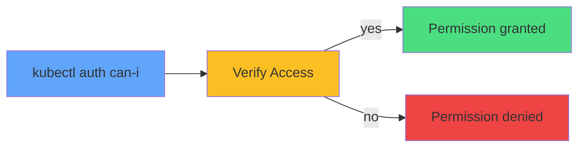

# Testing Permissions



<div class="mt-8 text-center">

### Test as ServiceAccount:

```bash
kubectl auth can-i list pods \
  --as=system:serviceaccount:default:app-sa
```

<div class="mt-4 opacity-80 text-sm">
Verify before deploying Pods to save debugging time
</div>

</div>
