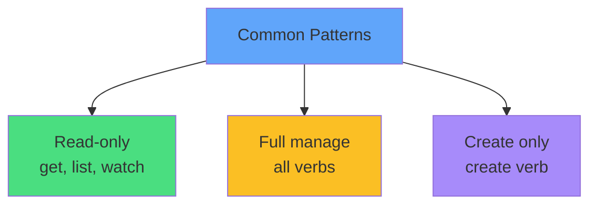

# Common Patterns

```mermaid
graph TB
    PATTERNS[<carbon-user-access/> Common Patterns]

    PATTERNS --> READ[<carbon-view/> Read-only<br/>get, list, watch]
    PATTERNS --> MANAGE[<carbon-edit/> Full manage<br/>all verbs]
    PATTERNS --> CREATE[<carbon-add/> Create only<br/>create verb]

    style PATTERNS fill:#60a5fa
    style READ fill:#4ade80
    style MANAGE fill:#fbbf24
    style CREATE fill:#a78bfa
```

### Read-only: get, list, watch
### Full access: get, list, watch, create, update, patch, delete
### Least privilege: Only what's needed

