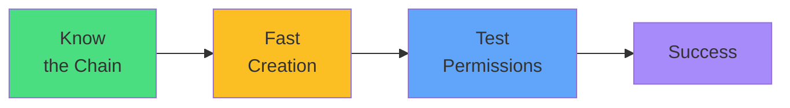

# Exam Mindset

<carbon-lightbulb class="text-yellow-400 text-4xl inline-block" />

### 1. Create ServiceAccount
### 2. Create Role with verbs+resources
### 3. Create RoleBinding
### 4. Configure Pod to use ServiceAccount

