# Role-Based Access Control

<div class="abs-br m-6 flex gap-2">
  <carbon-locked class="text-6xl text-blue-400" />
</div>

<div v-click class="mt-8 text-xl opacity-80">
Fine-grained security for Kubernetes resources
</div>

---
layout: center
---

# What is RBAC?

<div v-click="1">

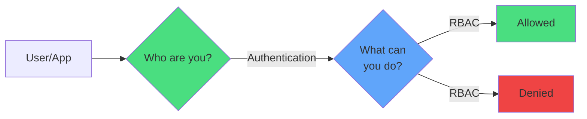

</div>

<div class="grid grid-cols-2 gap-6 mt-8">
<div v-click="2">
<carbon-user-identification class="text-5xl text-green-400 mb-2" />
<strong>Authentication</strong><br/>
<span class="text-sm opacity-80">Who are you?</span>
</div>
<div v-click="3">
<carbon-locked class="text-5xl text-blue-400 mb-2" />
<strong>Authorization</strong><br/>
<span class="text-sm opacity-80">What can you do?</span>
</div>
</div>

<div v-click="4" class="mt-8 text-center text-lg">
<carbon-security class="inline-block text-3xl text-yellow-400" /> Deny by default - least privilege
</div>

---
layout: center
---

# The Two Parts of RBAC

<div v-click="1">

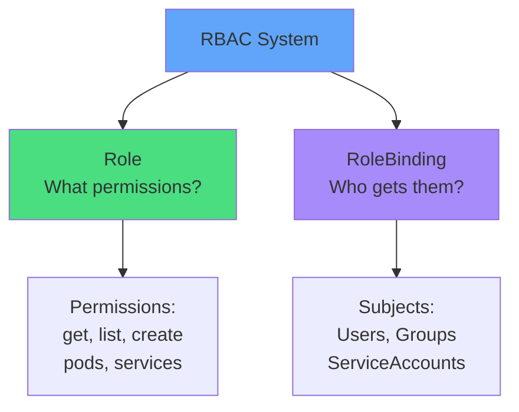

</div>

<div class="grid grid-cols-2 gap-8 mt-8">
<div v-click="2" class="text-center">
<carbon-document class="text-5xl text-green-400 mb-2" />
<strong>Role</strong><br/>
<span class="text-sm opacity-80">Job description</span>
</div>
<div v-click="3" class="text-center">
<carbon-connect class="text-5xl text-purple-400 mb-2" />
<strong>RoleBinding</strong><br/>
<span class="text-sm opacity-80">Assignment</span>
</div>
</div>

---
layout: center
---

# Roles - Defining Permissions

<div v-click="1">

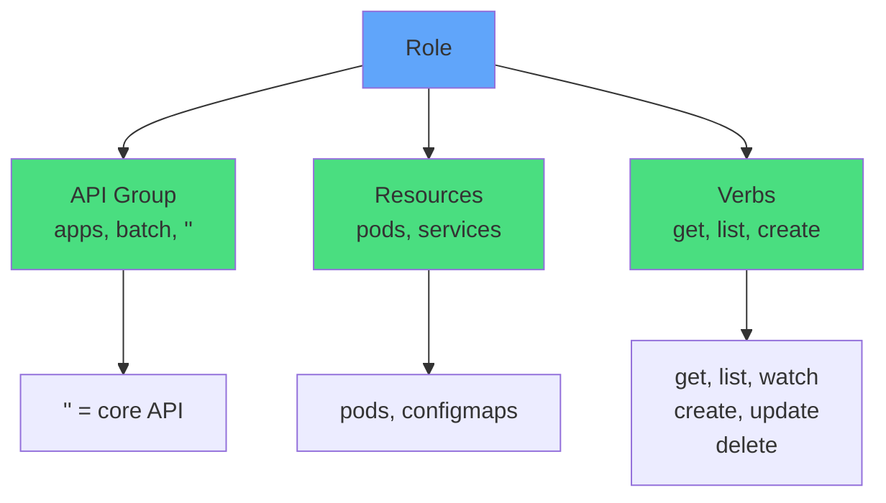

</div>

<div v-click="2" class="mt-6 text-sm">

```yaml
apiVersion: rbac.authorization.k8s.io/v1
kind: Role
metadata:
  name: pod-viewer
rules:
- apiGroups: [""]
  resources: ["pods"]
  verbs: ["get", "list"]
```

</div>

---
layout: center
---

# Common Verbs

<div class="grid grid-cols-3 gap-4 mt-8 text-sm">
<div v-click="1" class="text-center">
<carbon-view class="text-4xl text-blue-400 mb-2" />
<strong>get</strong><br/>
Read single resource
</div>
<div v-click="2" class="text-center">
<carbon-list class="text-4xl text-blue-400 mb-2" />
<strong>list</strong><br/>
Read all resources
</div>
<div v-click="3" class="text-center">
<carbon-view class="text-4xl text-blue-400 mb-2" />
<strong>watch</strong><br/>
Stream changes
</div>
<div v-click="4" class="text-center">
<carbon-add class="text-4xl text-green-400 mb-2" />
<strong>create</strong><br/>
Create new resources
</div>
<div v-click="5" class="text-center">
<carbon-edit class="text-4xl text-yellow-400 mb-2" />
<strong>update</strong><br/>
Modify existing
</div>
<div v-click="6" class="text-center">
<carbon-edit class="text-4xl text-yellow-400 mb-2" />
<strong>patch</strong><br/>
Partial updates
</div>
<div v-click="7" class="text-center">
<carbon-trash-can class="text-4xl text-red-400 mb-2" />
<strong>delete</strong><br/>
Remove resources
</div>
<div v-click="8" class="text-center">
<carbon-trash-can class="text-4xl text-red-400 mb-2" />
<strong>deletecollection</strong><br/>
Bulk delete
</div>
<div v-click="9" class="text-center">
<carbon-security class="text-4xl text-purple-400 mb-2" />
<strong>*</strong><br/>
All verbs
</div>
</div>

---
layout: center
---

# RoleBindings - Granting Permissions

<div v-click="1">

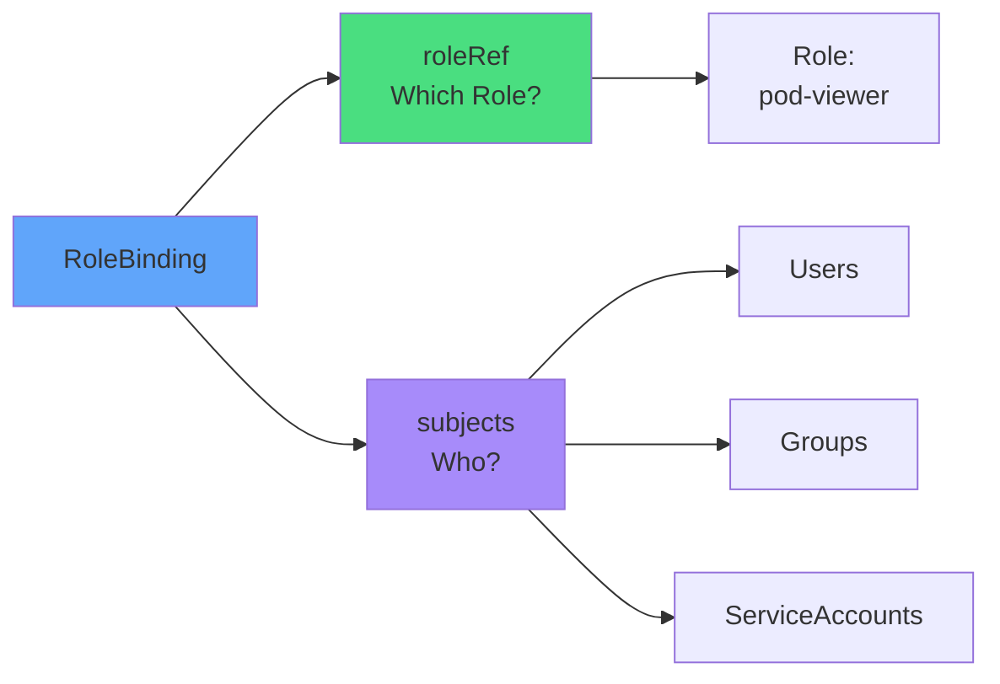

</div>

<div v-click="2" class="mt-6 text-sm">

```yaml
apiVersion: rbac.authorization.k8s.io/v1
kind: RoleBinding
metadata:
  name: viewer-binding
roleRef:
  kind: Role
  name: pod-viewer
subjects:
- kind: User
  name: student@courselabs.co
```

</div>

---
layout: center
---

# ServiceAccounts - App Identity

<div v-click="1">

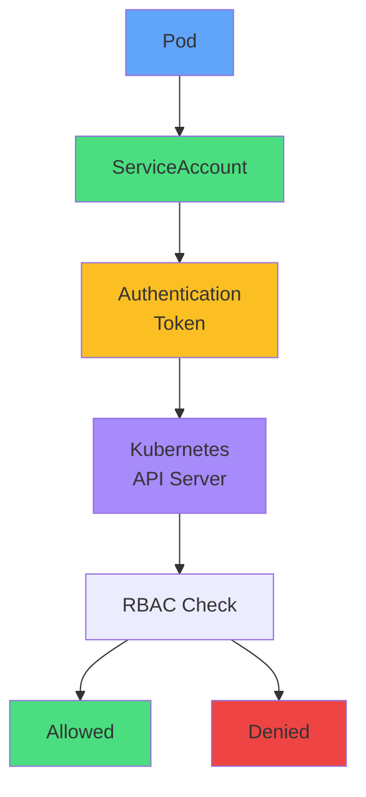

</div>

<div class="grid grid-cols-2 gap-6 mt-8">
<div v-click="2">
<carbon-user class="text-4xl text-green-400 mb-2" />
<strong>Identity for Pods</strong><br/>
<span class="text-sm opacity-80">Apps accessing API</span>
</div>
<div v-click="3">
<carbon-locked class="text-4xl text-blue-400 mb-2" />
<strong>Auto-generated token</strong><br/>
<span class="text-sm opacity-80">Mounted in Pod</span>
</div>
</div>

---
layout: center
---

# ServiceAccount Best Practices

<div class="grid grid-cols-2 gap-6 mt-6">
<div v-click="1">
<carbon-checkmark class="text-5xl text-green-400 mb-2" />
<strong>Dedicated per app</strong><br/>
<span class="text-sm opacity-80">One SA per application</span>
</div>
<div v-click="2">
<carbon-checkmark class="text-5xl text-green-400 mb-2" />
<strong>Least privilege</strong><br/>
<span class="text-sm opacity-80">Only required permissions</span>
</div>
<div v-click="3">
<carbon-close class="text-5xl text-red-400 mb-2" />
<strong>Don't share SAs</strong><br/>
<span class="text-sm opacity-80">Between different apps</span>
</div>
<div v-click="4">
<carbon-close class="text-5xl text-red-400 mb-2" />
<strong>Avoid default SA</strong><br/>
<span class="text-sm opacity-80">For apps using API</span>
</div>
</div>

<div v-click="5" class="mt-8 text-center">

```yaml
spec:
  serviceAccountName: my-app-sa
  automountServiceAccountToken: false  # If no API access
```

</div>

---
layout: center
---

# Namespace vs Cluster Scope

<div v-click="1">

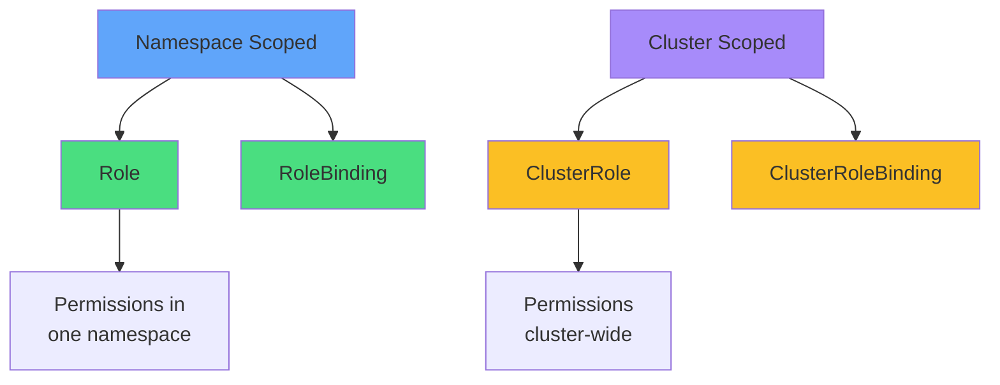

</div>

<div class="grid grid-cols-2 gap-6 mt-8">
<div v-click="2">
<carbon-document class="text-4xl text-blue-400 mb-2" />
<strong>Role + RoleBinding</strong><br/>
<span class="text-sm opacity-80">Single namespace</span>
</div>
<div v-click="3">
<carbon-network-3 class="text-4xl text-purple-400 mb-2" />
<strong>ClusterRole + CRB</strong><br/>
<span class="text-sm opacity-80">Entire cluster</span>
</div>
</div>

---
layout: center
---

# ClusterRole Patterns

<div v-click="1">

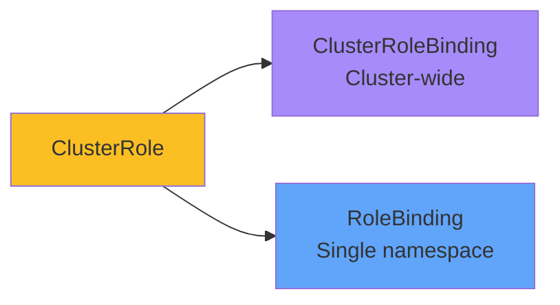

</div>

<div v-click="2" class="mt-8 text-center">
<carbon-idea class="inline-block text-4xl text-yellow-400" />
<strong class="ml-2">Pattern:</strong> Define once, apply selectively
</div>

<div v-click="3" class="mt-6 text-sm">

```yaml
# ClusterRole (reusable definition)
kind: ClusterRole
name: pod-reader
---
# Apply to specific namespace
kind: RoleBinding
roleRef:
  kind: ClusterRole  # Reference ClusterRole
  name: pod-reader
```

</div>

---
layout: center
---

# Built-in ClusterRoles

<div class="grid grid-cols-2 gap-6 mt-6">
<div v-click="1">
<carbon-view class="text-5xl text-blue-400 mb-2" />
<strong>view</strong><br/>
<span class="text-sm opacity-80">Read-only access<br/>(excludes Secrets)</span>
</div>
<div v-click="2">
<carbon-edit class="text-5xl text-green-400 mb-2" />
<strong>edit</strong><br/>
<span class="text-sm opacity-80">Create & modify resources<br/>(no RBAC)</span>
</div>
<div v-click="3">
<carbon-settings class="text-5xl text-yellow-400 mb-2" />
<strong>admin</strong><br/>
<span class="text-sm opacity-80">Full namespace access<br/>(includes RBAC)</span>
</div>
<div v-click="4">
<carbon-security class="text-5xl text-red-400 mb-2" />
<strong>cluster-admin</strong><br/>
<span class="text-sm opacity-80">Superuser<br/>(unrestricted)</span>
</div>
</div>

<div v-click="5" class="mt-8 text-center text-yellow-400">
<carbon-warning class="inline-block text-2xl" /> Use cluster-admin sparingly!
</div>

---
layout: center
---

# Common RBAC Patterns

<div v-click="1">

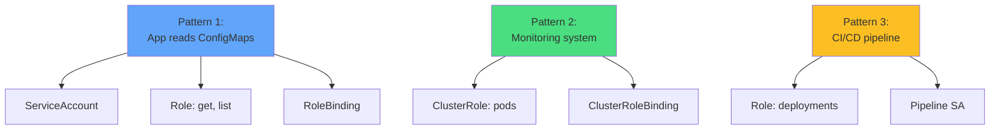

</div>

<div v-click="2" class="mt-6 text-sm">

```yaml
# Pattern 1: App accessing ConfigMaps
kind: Role
rules:
- apiGroups: [""]
  resources: ["configmaps", "secrets"]
  verbs: ["get", "list"]
```

</div>

---
layout: center
---

# Disabling API Access

<div v-click="1">

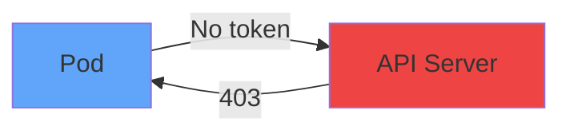

</div>

<div v-click="2" class="mt-8">

```yaml
apiVersion: v1
kind: Pod
spec:
  automountServiceAccountToken: false
  containers:
  - name: app
    image: myapp
```

</div>

<div v-click="3" class="mt-6 text-center">
<carbon-security class="inline-block text-4xl text-green-400" />
<strong class="ml-2">Security best practice:</strong> Disable if not needed
</div>

---
layout: center
---

# Troubleshooting RBAC

<div v-click="1">

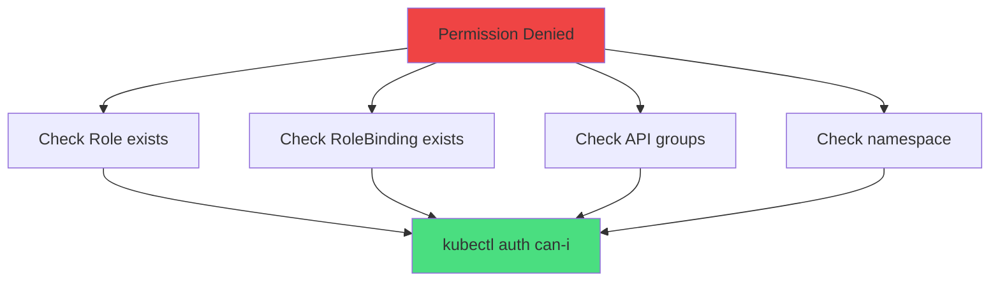

</div>

<div v-click="2" class="mt-6 text-sm">

```bash
# Test permissions
kubectl auth can-i get pods

# Test as another user
kubectl auth can-i create deployments --as=system:serviceaccount:default:myapp

# List permissions
kubectl auth can-i --list
```

</div>

---
layout: center
---

# Common RBAC Issues

<div class="grid grid-cols-2 gap-6 mt-6">
<div v-click="1">
<carbon-warning class="text-4xl text-red-400 mb-2" />
<strong>Missing Role</strong><br/>
<span class="text-sm opacity-80">RoleBinding references non-existent Role</span>
</div>
<div v-click="2">
<carbon-warning class="text-4xl text-yellow-400 mb-2" />
<strong>Wrong API group</strong><br/>
<span class="text-sm opacity-80">"" vs "apps" vs "batch"</span>
</div>
<div v-click="3">
<carbon-warning class="text-4xl text-orange-400 mb-2" />
<strong>Wrong namespace</strong><br/>
<span class="text-sm opacity-80">Role and RoleBinding must match</span>
</div>
<div v-click="4">
<carbon-warning class="text-4xl text-purple-400 mb-2" />
<strong>SA doesn't exist</strong><br/>
<span class="text-sm opacity-80">Create before binding</span>
</div>
</div>

<div v-click="5" class="mt-8 text-center text-lg">
<carbon-terminal class="inline-block text-3xl text-blue-400" /> kubectl auth can-i is your friend!
</div>

---
layout: center
---

# Security Best Practices

<div class="grid grid-cols-2 gap-6 mt-4">
<div v-click="1">
<carbon-locked class="text-5xl text-green-400 mb-2" />
<strong>Least privilege</strong><br/>
<span class="text-sm opacity-80">Minimum required permissions</span>
</div>
<div v-click="2">
<carbon-user class="text-5xl text-blue-400 mb-2" />
<strong>Dedicated SAs</strong><br/>
<span class="text-sm opacity-80">One per application</span>
</div>
<div v-click="3">
<carbon-close class="text-5xl text-yellow-400 mb-2" />
<strong>Disable tokens</strong><br/>
<span class="text-sm opacity-80">When API access not needed</span>
</div>
<div v-click="4">
<carbon-network-3 class="text-5xl text-purple-400 mb-2" />
<strong>Use namespaces</strong><br/>
<span class="text-sm opacity-80">Isolate environments</span>
</div>
<div v-click="5">
<carbon-view class="text-5xl text-orange-400 mb-2" />
<strong>Audit regularly</strong><br/>
<span class="text-sm opacity-80">Review permissions</span>
</div>
<div v-click="6">
<carbon-rule class="text-5xl text-red-400 mb-2" />
<strong>Use resourceNames</strong><br/>
<span class="text-sm opacity-80">Restrict to specific resources</span>
</div>
</div>

---
layout: center
---

# CKAD Exam Tips

<div v-click="1" class="text-center mb-6">
<carbon-certificate class="inline-block text-6xl text-blue-400" />
</div>

<div class="grid grid-cols-2 gap-4 text-sm">
<div v-click="2">
<carbon-user class="inline-block text-2xl text-green-400" /> Create ServiceAccounts
</div>
<div v-click="3">
<carbon-document class="inline-block text-2xl text-green-400" /> Create Roles
</div>
<div v-click="4">
<carbon-connect class="inline-block text-2xl text-green-400" /> Create RoleBindings
</div>
<div v-click="5">
<carbon-terminal class="inline-block text-2xl text-green-400" /> Use kubectl auth can-i
</div>
<div v-click="6">
<carbon-settings class="inline-block text-2xl text-green-400" /> Assign SA to Pods
</div>
<div v-click="7">
<carbon-debug class="inline-block text-2xl text-green-400" /> Troubleshoot permissions
</div>
</div>

<div v-click="8" class="mt-8 text-sm">

```bash
# Speed commands
kubectl create serviceaccount myapp
kubectl create role pod-reader --verb=get,list --resource=pods
kubectl create rolebinding read-pods --role=pod-reader --serviceaccount=default:myapp
```

</div>

---
layout: center
---

# Summary

<div v-click="1">

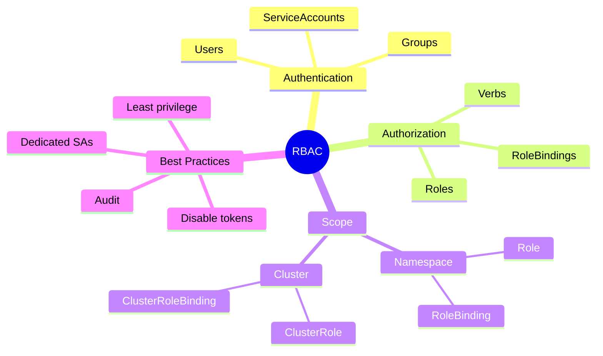

</div>

---
layout: center
---

# Key Takeaways

<div class="grid grid-cols-2 gap-6 mt-6">
<div v-click="1">
<carbon-document class="text-4xl text-green-400 mb-2" />
<strong>Role defines permissions</strong><br/>
<span class="text-sm opacity-80">What actions on which resources</span>
</div>
<div v-click="2">
<carbon-connect class="text-4xl text-blue-400 mb-2" />
<strong>RoleBinding grants access</strong><br/>
<span class="text-sm opacity-80">Connects Role to subjects</span>
</div>
<div v-click="3">
<carbon-user class="text-4xl text-purple-400 mb-2" />
<strong>ServiceAccounts for apps</strong><br/>
<span class="text-sm opacity-80">Identity for Pods</span>
</div>
<div v-click="4">
<carbon-terminal class="text-4xl text-yellow-400 mb-2" />
<strong>kubectl auth can-i</strong><br/>
<span class="text-sm opacity-80">Test permissions quickly</span>
</div>
</div>

<div v-click="5" class="mt-8 text-center text-xl">
Deny by default - grant minimum required <carbon-arrow-right class="inline-block text-2xl" />
</div>
