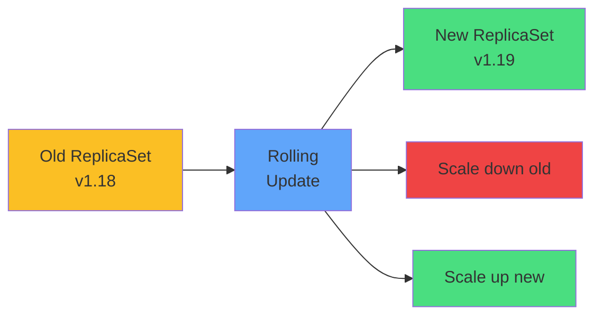

# Rolling Update Process

```mermaid
graph LR
    OLD[<carbon-layers/> Old ReplicaSet<br/>v1.18] --> UPDATE[<carbon-renew/> Rolling<br/>Update] --> NEW[<carbon-layers/> New ReplicaSet<br/>v1.19]

    UPDATE --> SCALE_DOWN[<carbon-arrow-down/> Scale down old]
    UPDATE --> SCALE_UP[<carbon-arrow-up/> Scale up new]

    style OLD fill:#fbbf24
    style UPDATE fill:#60a5fa
    style NEW fill:#4ade80
    style SCALE_DOWN fill:#ef4444
    style SCALE_UP fill:#4ade80
```

Zero-downtime updates by default

