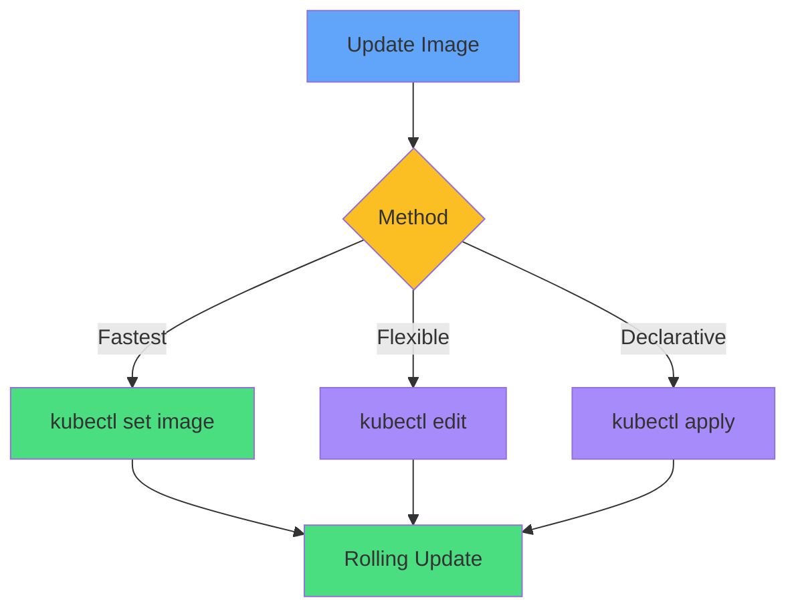

# Triggering Updates

```mermaid
graph TB
    REQ[<carbon-document-tasks/> Update Image] --> METHOD{<carbon-decision-tree/> Method}

    METHOD -->|Fastest| SET[<carbon-terminal/> kubectl set image]
    METHOD -->|Flexible| EDIT[<carbon-edit/> kubectl edit]
    METHOD -->|Declarative| APPLY[<carbon-document/> kubectl apply]

    SET --> ROLLOUT[<carbon-renew/> Rolling Update]
    EDIT --> ROLLOUT
    APPLY --> ROLLOUT

    style REQ fill:#60a5fa
    style METHOD fill:#fbbf24
    style SET fill:#4ade80
    style EDIT fill:#a78bfa
    style APPLY fill:#a78bfa
    style ROLLOUT fill:#4ade80
```

### `kubectl set image deployment/nginx nginx=nginx:1.19`
Fastest method for exam

