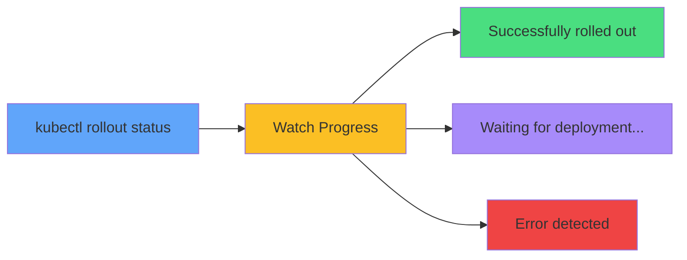

# Monitoring Rollout Status

```mermaid
graph LR
    CMD[<carbon-terminal/> kubectl rollout status] --> WATCH[<carbon-view/> Watch Progress]

    WATCH --> SUCCESS[<carbon-checkmark-filled/> Successfully rolled out]
    WATCH --> WAITING[<carbon-time/> Waiting for deployment...]
    WATCH --> ERROR[<carbon-warning-alt/> Error detected]

    style CMD fill:#60a5fa
    style WATCH fill:#fbbf24
    style SUCCESS fill:#4ade80
    style WAITING fill:#a78bfa
    style ERROR fill:#ef4444
```

### `kubectl rollout status deployment/nginx`
Always verify completion before moving on

Use `-w` flag for real-time watching

