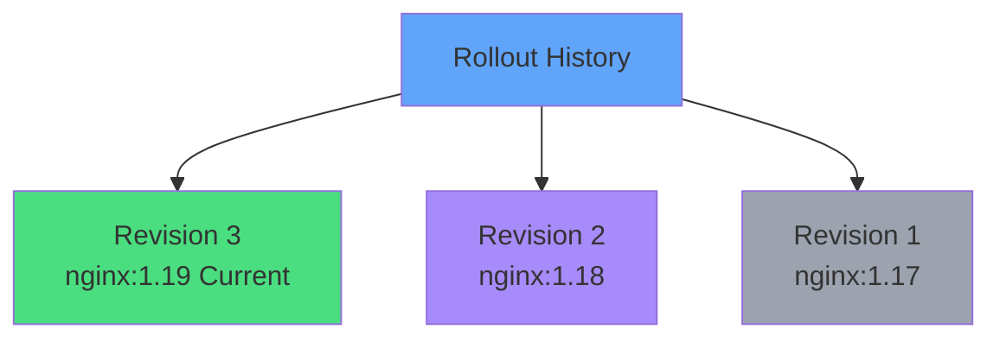

# Rollout History

```mermaid
graph TB
    HISTORY[<carbon-document-multiple-01/> Rollout History]

    HISTORY --> REV3[<carbon-document/> Revision 3<br/>nginx:1.19 Current]
    HISTORY --> REV2[<carbon-document/> Revision 2<br/>nginx:1.18]
    HISTORY --> REV1[<carbon-document/> Revision 1<br/>nginx:1.17]

    style HISTORY fill:#60a5fa
    style REV3 fill:#4ade80
    style REV2 fill:#a78bfa
    style REV1 fill:#9ca3af
```

### `kubectl rollout history deployment/nginx`
View all revisions

### `kubectl rollout history deployment/nginx --revision=2`
See specific revision details

