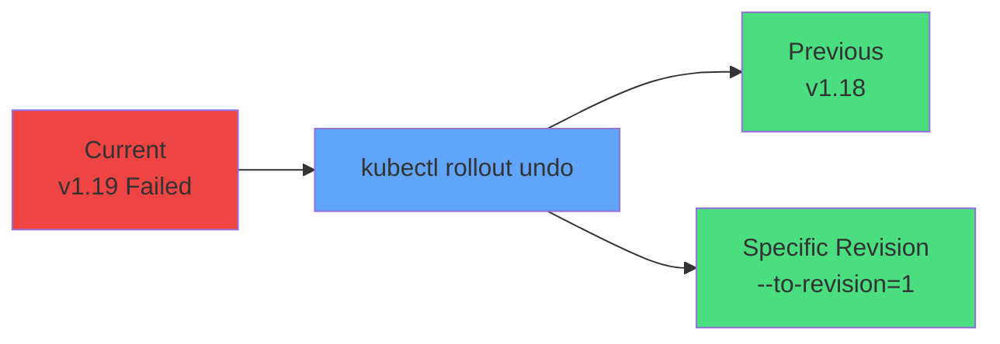

# Rollback Operations

```mermaid
graph LR
    CURRENT[<carbon-layers/> Current<br/>v1.19 Failed] --> UNDO[<carbon-undo/> kubectl rollout undo]

    UNDO --> PREVIOUS[<carbon-layers/> Previous<br/>v1.18]
    UNDO --> SPECIFIC[<carbon-layers/> Specific Revision<br/>--to-revision=1]

    style CURRENT fill:#ef4444
    style UNDO fill:#60a5fa
    style PREVIOUS fill:#4ade80
    style SPECIFIC fill:#4ade80
```

### `kubectl rollout undo deployment/nginx`
Revert to previous version (instant)

### `kubectl rollout undo deployment/nginx --to-revision=1`
Revert to specific revision

