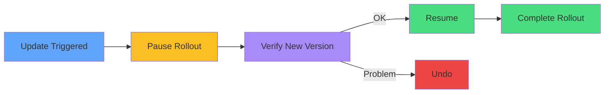

# Pause and Resume

```mermaid
graph LR
    UPDATE[<carbon-renew/> Update Triggered] --> PAUSE[<carbon-pause/> Pause Rollout]

    PAUSE --> VERIFY[<carbon-search/> Verify New Version]

    VERIFY -->|OK| RESUME[<carbon-play/> Resume]
    VERIFY -->|Problem| UNDO[<carbon-undo/> Undo]

    RESUME --> COMPLETE[<carbon-checkmark-filled/> Complete Rollout]

    style UPDATE fill:#60a5fa
    style PAUSE fill:#fbbf24
    style VERIFY fill:#a78bfa
    style RESUME fill:#4ade80
    style UNDO fill:#ef4444
    style COMPLETE fill:#4ade80
```

Control updates for careful validation

