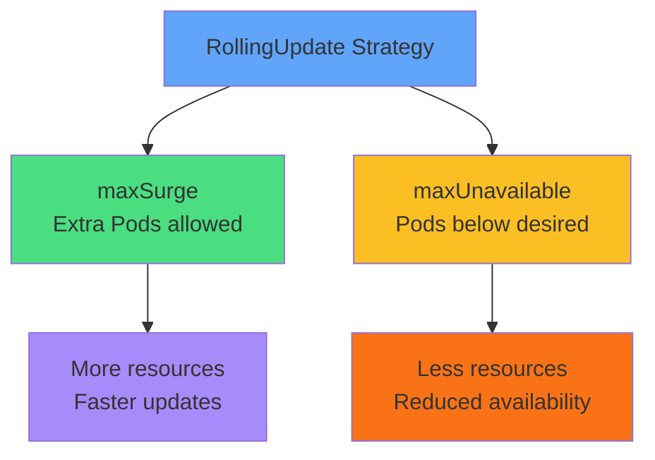

# Update Strategy Configuration

```mermaid
graph TB
    STRATEGY[<carbon-settings/> RollingUpdate Strategy]

    STRATEGY --> SURGE[<carbon-arrow-up/> maxSurge<br/>Extra Pods allowed]
    STRATEGY --> UNAVAIL[<carbon-arrow-down/> maxUnavailable<br/>Pods below desired]

    SURGE --> SURGEUSE[More resources<br/>Faster updates]
    UNAVAIL --> UNAVUSE[Less resources<br/>Reduced availability]

    style STRATEGY fill:#60a5fa
    style SURGE fill:#4ade80
    style UNAVAIL fill:#fbbf24
    style SURGEUSE fill:#a78bfa
    style UNAVUSE fill:#f97316
```

### maxSurge: 1 means 1 extra Pod during update
### maxUnavailable: 0 means no Pods go down (requires maxSurge)

