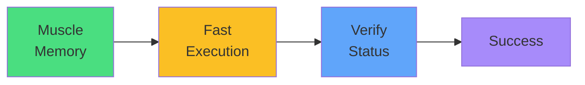

# Exam Mindset

<carbon-lightbulb class="text-yellow-400 text-4xl inline-block" />

### "Update deployment" → `kubectl set image`
### "Rollback" → `kubectl rollout undo`
### Always verify with `kubectl rollout status`

