# Deployment Strategies

<div class="abs-br m-6 flex gap-2">
  <carbon-deploy class="text-6xl text-blue-400" />
</div>

<div v-click class="mt-8 text-xl opacity-80">
Rolling out changes with zero downtime
</div>

---
layout: center
---

# The Update Challenge

<div v-click="1">

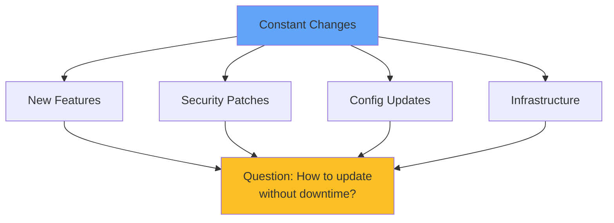

</div>

<div class="grid grid-cols-2 gap-8 mt-8">
<div v-click="2">
<carbon-close class="text-5xl text-red-400 mb-2" />
<strong>Traditional</strong><br/>
<span class="text-sm opacity-80">Downtime required</span>
</div>
<div v-click="3">
<carbon-checkmark class="text-5xl text-green-400 mb-2" />
<strong>Kubernetes</strong><br/>
<span class="text-sm opacity-80">Zero downtime updates</span>
</div>
</div>

---
layout: center
---

# Deployment Strategies Overview

<div v-click="1">

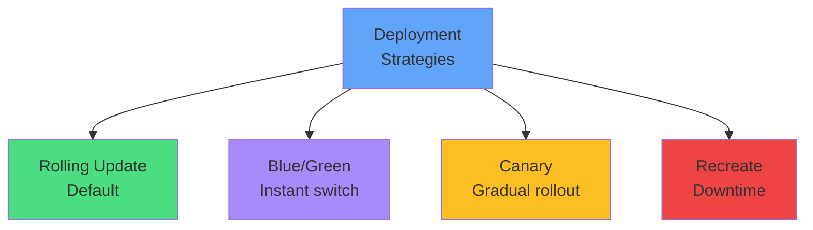

</div>

<div class="grid grid-cols-4 gap-2 mt-8 text-xs">
<div v-click="2" class="text-center">
<carbon-chart-line-smooth class="text-4xl text-green-400 mb-1" />
<strong>Rolling</strong><br/>
Low risk
</div>
<div v-click="3" class="text-center">
<carbon-switch class="text-4xl text-purple-400 mb-1" />
<strong>Blue/Green</strong><br/>
Very low risk
</div>
<div v-click="4" class="text-center">
<carbon-test-tool class="text-4xl text-yellow-400 mb-1" />
<strong>Canary</strong><br/>
Gradual
</div>
<div v-click="5" class="text-center">
<carbon-warning class="text-4xl text-red-400 mb-1" />
<strong>Recreate</strong><br/>
Downtime
</div>
</div>

---
layout: center
---

# Rolling Updates - Default Strategy

<div v-click="1">

```mermaid
graph LR
    V1A[v1] --> V2A[v2]
    V1B[v1] --> V2B[v2]
    V1C[v1] --> V2C[v2]
    V2A --> DONE[Complete]
    V2B --> DONE
    V2C --> DONE
    style V1A fill:#ef4444
    style V1B fill:#ef4444
    style V1C fill:#ef4444
    style V2A fill:#4ade80
    style V2B fill:#4ade80
    style V2C fill=#4ade80
    style DONE fill:#60a5fa
```

</div>

<div v-click="2" class="mt-8">

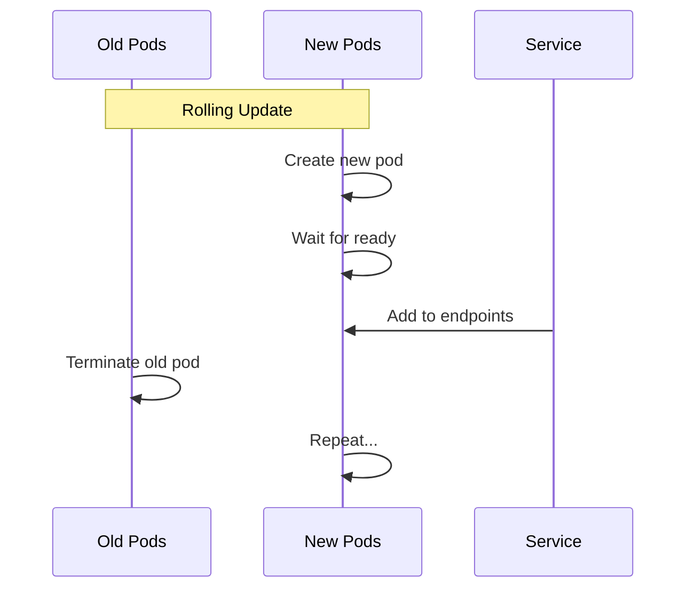

</div>

---
layout: center
---

# Rolling Update Configuration

<div v-click="1" class="mb-4">

```yaml
spec:
  strategy:
    type: RollingUpdate
    rollingUpdate:
      maxSurge: 25%          # Extra pods allowed
      maxUnavailable: 25%    # Pods that can be down
```

</div>

<div class="grid grid-cols-2 gap-6 mt-8">
<div v-click="2">
<carbon-arrow-up class="text-4xl text-green-400 mb-2" />
<strong>maxSurge</strong><br/>
<span class="text-sm opacity-80">Maximum extra pods during rollout</span>
</div>
<div v-click="3">
<carbon-arrow-down class="text-4xl text-red-400 mb-2" />
<strong>maxUnavailable</strong><br/>
<span class="text-sm opacity-80">Maximum pods that can be down</span>
</div>
</div>

<div v-click="4" class="mt-8 text-center text-yellow-400">
<carbon-warning class="inline-block text-2xl" /> Both versions run concurrently!
</div>

---
layout: center
---

# Rolling Update Examples

<div v-click="1">

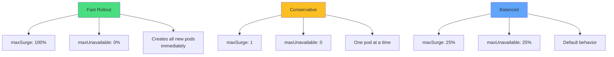

</div>

---
layout: center
---

# Rollback Capabilities

<div v-click="1">

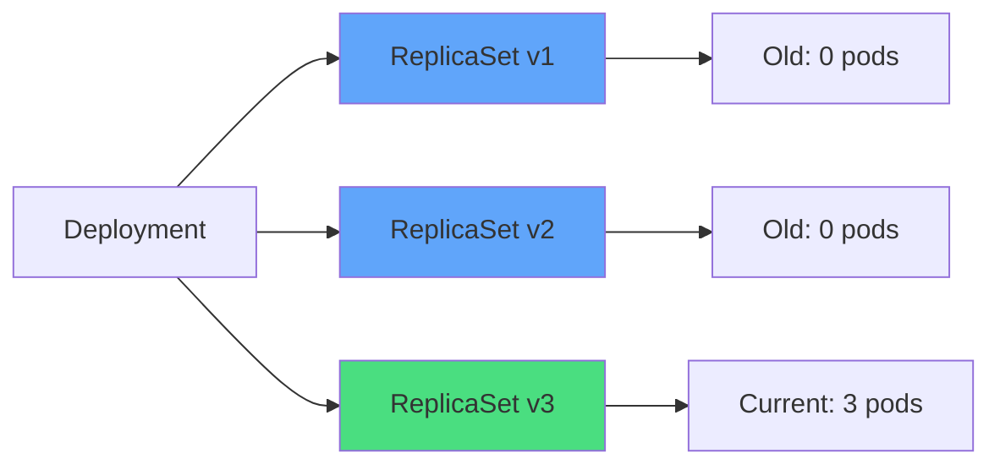

</div>

<div v-click="2" class="mt-6 text-sm">

```bash
# View history
kubectl rollout history deployment/myapp

# Rollback to previous version
kubectl rollout undo deployment/myapp

# Rollback to specific revision
kubectl rollout undo deployment/myapp --to-revision=3

# Monitor rollout
kubectl rollout status deployment/myapp
```

</div>

<div v-click="3" class="mt-6 text-center text-red-400">
<carbon-warning class="inline-block text-2xl" /> No automatic rollback!
</div>

---
layout: center
---

# Blue/Green Deployments

<div v-click="1">

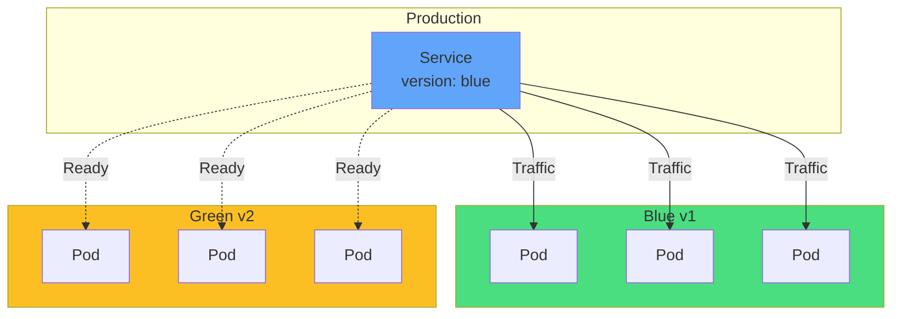

</div>

<div v-click="2" class="mt-6 text-center">
<carbon-switch class="inline-block text-4xl text-purple-400" />
<strong class="ml-2">Instant switchover by changing selector</strong>
</div>

---
layout: center
---

# Blue/Green Implementation

<div v-click="1" class="mb-4">

```yaml
# Two deployments
apiVersion: apps/v1
kind: Deployment
metadata:
  name: myapp-blue
spec:
  selector:
    matchLabels:
      app: myapp
      version: blue
---
apiVersion: apps/v1
kind: Deployment
metadata:
  name: myapp-green
spec:
  selector:
    matchLabels:
      app: myapp
      version: green
```

</div>

---
layout: center
---

# Switching Traffic

<div v-click="1">

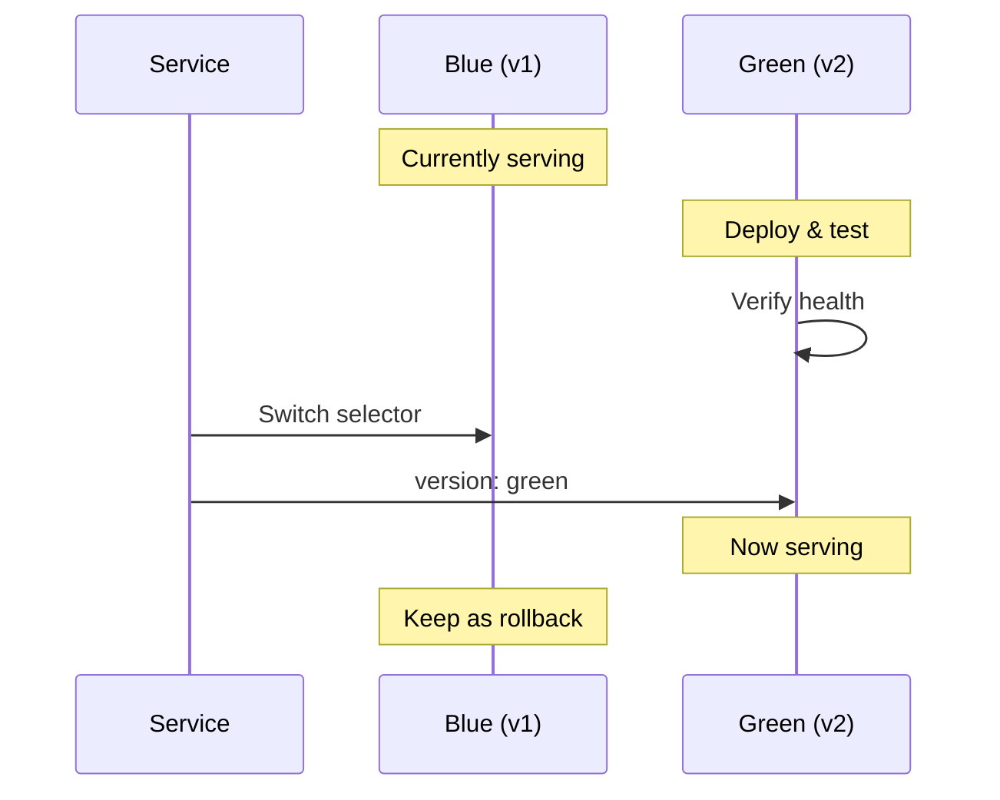

</div>

<div v-click="2" class="mt-6 text-sm">

```bash
# Switch to green
kubectl patch service myapp -p '{"spec":{"selector":{"version":"green"}}}'

# Instant rollback if needed
kubectl patch service myapp -p '{"spec":{"selector":{"version":"blue"}}}'
```

</div>

---
layout: center
---

# Blue/Green Trade-offs

<div class="grid grid-cols-2 gap-6 mt-6">
<div v-click="1">
<carbon-checkmark class="text-5xl text-green-400 mb-2" />
<strong>Advantages</strong><br/>
<div class="text-sm opacity-80 mt-2">
• Instant switchover<br/>
• Easy rollback<br/>
• Full testing first<br/>
• No mixed versions
</div>
</div>
<div v-click="2">
<carbon-close class="text-5xl text-red-400 mb-2" />
<strong>Drawbacks</strong><br/>
<div class="text-sm opacity-80 mt-2">
• 2x resources needed<br/>
• Complex with databases<br/>
• Not always practical
</div>
</div>
</div>

---
layout: center
---

# Canary Deployments

<div v-click="1">

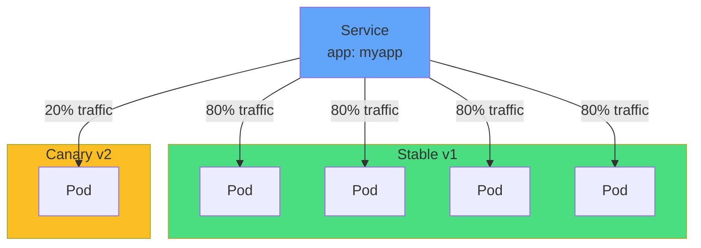

</div>

<div v-click="2" class="mt-6 text-center">
<carbon-test-tool class="inline-block text-4xl text-yellow-400" />
<strong class="ml-2">Gradual exposure to minimize risk</strong>
</div>

---
layout: center
---

# Canary Progression

<div v-click="1">

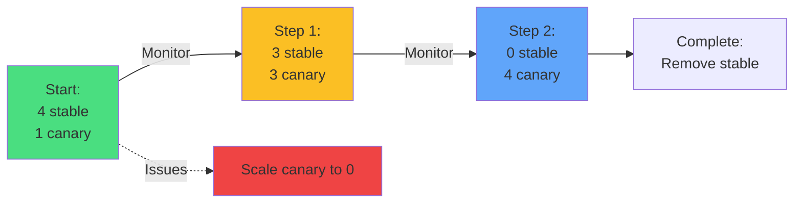

</div>

<div v-click="2" class="mt-8 text-center text-sm">
<carbon-chart-line-smooth class="inline-block text-3xl text-blue-400" />
Monitor metrics at each stage
</div>

---
layout: center
---

# Canary Implementation

<div v-click="1" class="text-sm">

```yaml
# Stable deployment
apiVersion: apps/v1
kind: Deployment
metadata:
  name: myapp-stable
spec:
  replicas: 4
  selector:
    matchLabels:
      app: myapp
  template:
    metadata:
      labels:
        app: myapp
        version: stable
---
# Canary deployment
apiVersion: apps/v1
kind: Deployment
metadata:
  name: myapp-canary
spec:
  replicas: 1
  selector:
    matchLabels:
      app: myapp
  template:
    metadata:
      labels:
        app: myapp
        version: canary
```

</div>

---
layout: center
---

# Canary Trade-offs

<div class="grid grid-cols-2 gap-6 mt-6">
<div v-click="1">
<carbon-checkmark class="text-5xl text-green-400 mb-2" />
<strong>Advantages</strong><br/>
<div class="text-sm opacity-80 mt-2">
• Minimal user impact<br/>
• Gradual rollout<br/>
• Easy rollback<br/>
• Data-driven decisions
</div>
</div>
<div v-click="2">
<carbon-close class="text-5xl text-red-400 mb-2" />
<strong>Drawbacks</strong><br/>
<div class="text-sm opacity-80 mt-2">
• More complex<br/>
• Needs good monitoring<br/>
• Uneven distribution
</div>
</div>
</div>

---
layout: center
---

# Recreate Strategy

<div v-click="1">

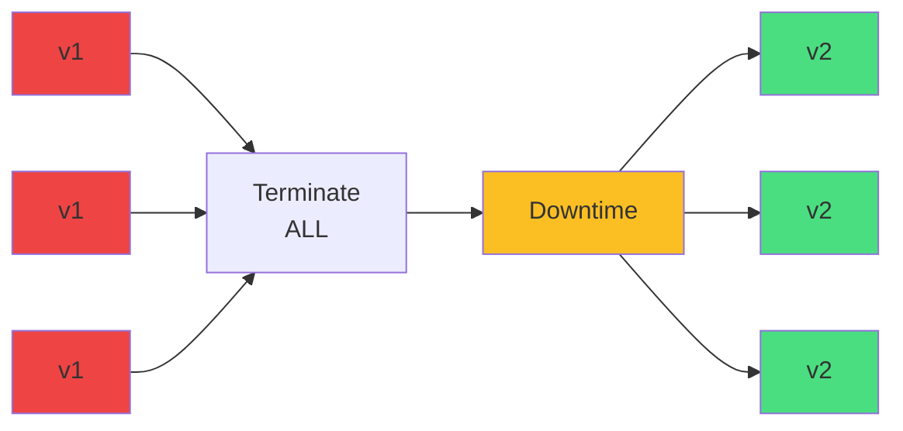

</div>

<div v-click="2" class="mt-8">

```yaml
spec:
  strategy:
    type: Recreate
```

</div>

<div v-click="3" class="mt-6 text-center text-red-400">
<carbon-warning class="inline-block text-2xl" /> Use with extreme caution in production!
</div>

---
layout: center
---

# When to Use Recreate

<div class="grid grid-cols-2 gap-6 mt-8">
<div v-click="1">
<carbon-checkmark class="text-5xl text-green-400 mb-2" />
<strong>Use when:</strong><br/>
<div class="text-sm opacity-80 mt-2">
• Development/testing<br/>
• Can't run multiple versions<br/>
• Database migrations<br/>
• Downtime acceptable
</div>
</div>
<div v-click="2">
<carbon-close class="text-5xl text-red-400 mb-2" />
<strong>Avoid when:</strong><br/>
<div class="text-sm opacity-80 mt-2">
• Production workloads<br/>
• Zero downtime required<br/>
• High availability needed
</div>
</div>
</div>

---
layout: center
---

# Choosing the Right Strategy

<div v-click="1">

```mermaid
graph TD
    Q1{Can run<br/>multiple versions?}
    Q1 -->|No| REC[Recreate]
    Q1 -->|Yes| Q2{Zero downtime<br/>critical?}
    Q2 -->|Very| Q3{Have 2x<br/>resources?}
    Q3 -->|Yes| BG[Blue/Green]
    Q3 -->|No| CAN[Canary]
    Q2 -->|Moderate| Q4{High risk<br/>change?}
    Q4 -->|Yes| CAN
    Q4 -->|No| ROLL[Rolling Update]
    style REC fill=#ef4444
    style BG fill:#a78bfa
    style CAN fill:#fbbf24
    style ROLL fill:#4ade80
```

</div>

---
layout: center
---

# CKAD Exam Tips

<div v-click="1" class="text-center mb-6">
<carbon-certificate class="inline-block text-6xl text-blue-400" />
</div>

<div class="grid grid-cols-2 gap-4 text-sm">
<div v-click="2">
<carbon-settings class="inline-block text-2xl text-green-400" /> Configure rolling updates
</div>
<div v-click="3">
<carbon-restart class="inline-block text-2xl text-green-400" /> Rollback deployments
</div>
<div v-click="4">
<carbon-view class="inline-block text-2xl text-green-400" /> Check rollout history
</div>
<div v-click="5">
<carbon-switch class="inline-block text-2xl text-green-400" /> Implement blue/green
</div>
<div v-click="6">
<carbon-test-tool class="inline-block text-2xl text-green-400" /> Create canary deployments
</div>
<div v-click="7">
<carbon-edit class="inline-block text-2xl text-green-400" /> Patch Service selectors
</div>
</div>

<div v-click="8" class="mt-8 text-sm">

```bash
# Quick image update
kubectl set image deployment/myapp myapp=myapp:v2

# Rollback
kubectl rollout undo deployment/myapp

# Monitor
kubectl rollout status deployment/myapp
```

</div>

---
layout: center
---

# Summary

<div v-click="1">

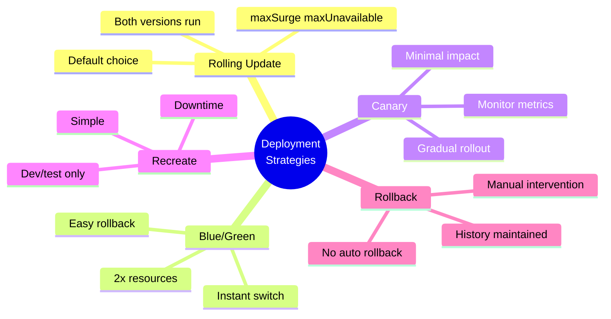

</div>

---
layout: center
---

# Key Takeaways

<div class="grid grid-cols-2 gap-6 mt-6">
<div v-click="1">
<carbon-chart-line-smooth class="text-4xl text-green-400 mb-2" />
<strong>Rolling Update</strong><br/>
<span class="text-sm opacity-80">Default for most cases</span>
</div>
<div v-click="2">
<carbon-switch class="text-4xl text-purple-400 mb-2" />
<strong>Blue/Green</strong><br/>
<span class="text-sm opacity-80">Instant switchover</span>
</div>
<div v-click="3">
<carbon-test-tool class="text-4xl text-yellow-400 mb-2" />
<strong>Canary</strong><br/>
<span class="text-sm opacity-80">Minimize risk exposure</span>
</div>
<div v-click="4">
<carbon-restart class="text-4xl text-blue-400 mb-2" />
<strong>No auto rollback</strong><br/>
<span class="text-sm opacity-80">Monitor and intervene</span>
</div>
</div>

<div v-click="5" class="mt-8 text-center text-xl">
Deployment strategy is about managing risk <carbon-arrow-right class="inline-block text-2xl" />
</div>

---
layout: center
---

# Next Steps

<div v-click="1" class="text-center mb-8">
<carbon-education class="inline-block text-6xl text-blue-400" />
</div>

<div v-click="2">

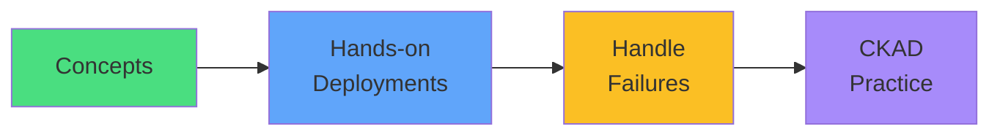

</div>

<div v-click="3" class="mt-8 text-center text-xl">
Let's deploy and rollback! <carbon-arrow-right class="inline-block text-2xl" />
</div>
