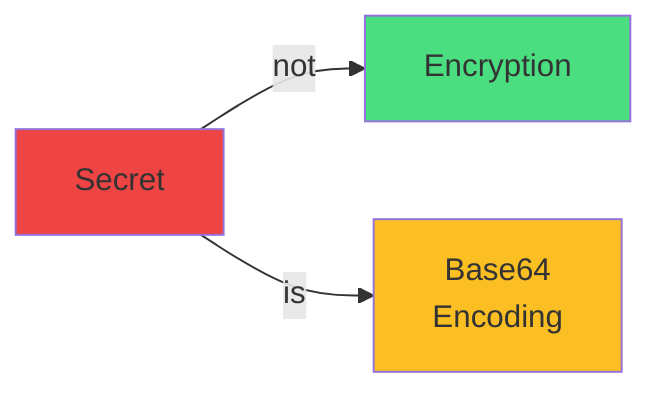

# Secure Configuration

```mermaid
graph LR
    S[<carbon-password/> Secret] -->|not| E[<carbon-locked/> Encryption]
    S -->|is| B[<carbon-text-link/> Base64<br/>Encoding]
    style S fill:#ef4444
    style E fill:#4ade80
    style B fill:#fbbf24
```

<carbon-warning class="text-4xl text-yellow-400 inline-block mb-4" />
 
Base64 encoding ≠ Encryption
 

Still better than plain ConfigMaps for sensitive data

