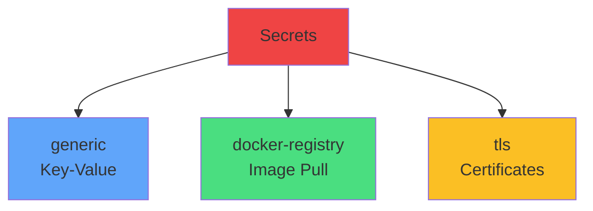

# Secret Types

<carbon-credentials class="text-3xl text-blue-400" />

Most common

<carbon-container-registry class="text-3xl text-green-400" />

Private images

<carbon-security class="text-3xl text-yellow-400" />

HTTPS/TLS

