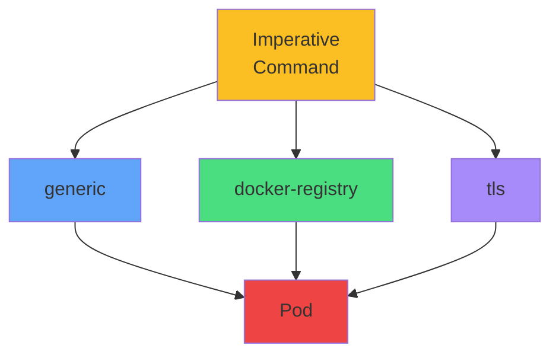

# Creation Commands

<carbon-terminal class="text-5xl text-green-400 mb-4" />

## Generic

```bash
kubectl create secret generic \
  db-creds \
  --from-literal=username=admin \
  --from-literal=password=secret
```

<carbon-docker class="text-5xl text-blue-400 mb-4 mt-6" />

## Docker Registry

```bash
kubectl create secret \
  docker-registry regcred \
  --docker-server=registry.io \
  --docker-username=user \
  --docker-password=pass
```

::right::

<div class="mt-16">



<div class="text-center mt-8 text-sm opacity-80">
<carbon-flash class="text-3xl text-yellow-400 inline-block" />
<br/>
Know all three creation commands
</div>

</div>
