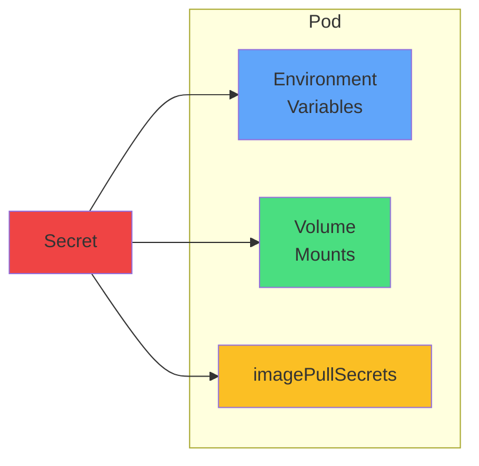

# Consumption Patterns

```mermaid
graph LR
    S[<carbon-password/> Secret]

    subgraph Pod
        E[<carbon-code/> Environment<br/>Variables]
        V[<carbon-data-volume/> Volume<br/>Mounts]
        I[<carbon-docker/> imagePullSecrets]
    end

    S --> E
    S --> V
    S --> I

    style S fill:#ef4444
    style E fill:#60a5fa
    style V fill:#4ade80
    style I fill:#fbbf24
```

Same patterns as ConfigMaps + imagePullSecrets

