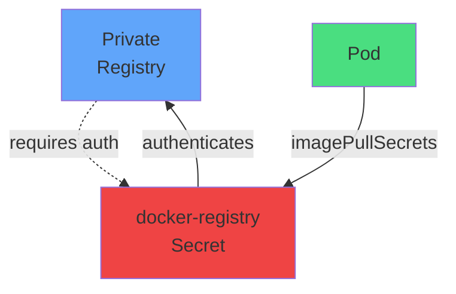

# Image Pull Secrets


```mermaid
graph TB
    R[<carbon-container-registry/> Private<br/>Registry]
    S[<carbon-password/> docker-registry<br/>Secret]
    P[<carbon-container-software/> Pod]

    R -.->|requires auth| S
    P -->|imagePullSecrets| S
    S -->|authenticates| R

    style R fill:#60a5fa
    style S fill:#ef4444
    style P fill:#4ade80
```

<div class="mt-8 text-center">

```yaml
spec:
  imagePullSecrets:
  - name: regcred
  containers:
  - name: app
    image: private-registry/app:v1
```

</div>
