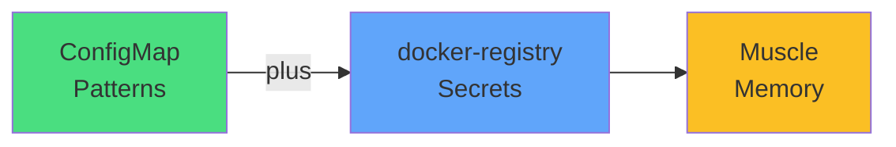

# Exam Mindset

<carbon-password class="text-red-400 text-4xl inline-block" />

### Patterns mirror ConfigMaps
### Know all three Secret types
### imagePullSecrets for private registries

Target: 3-4 minutes including verification

