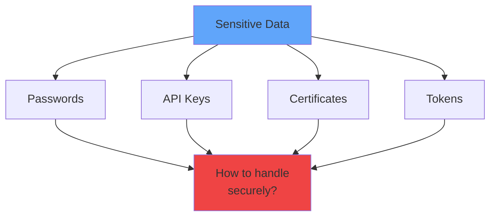
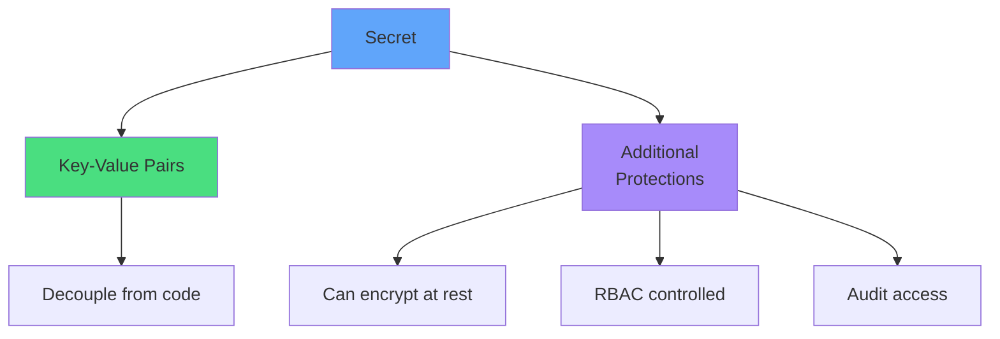
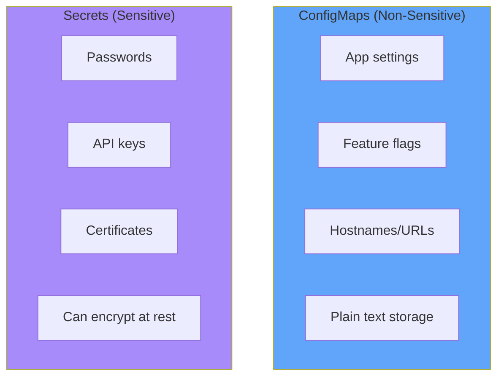
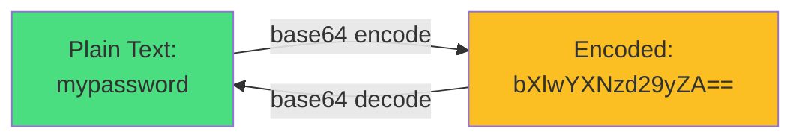
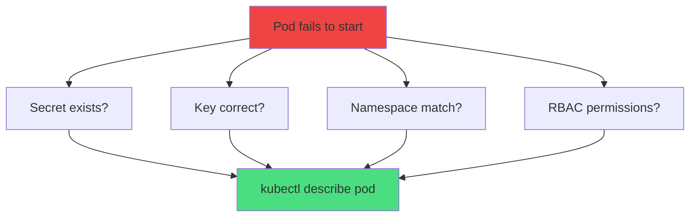
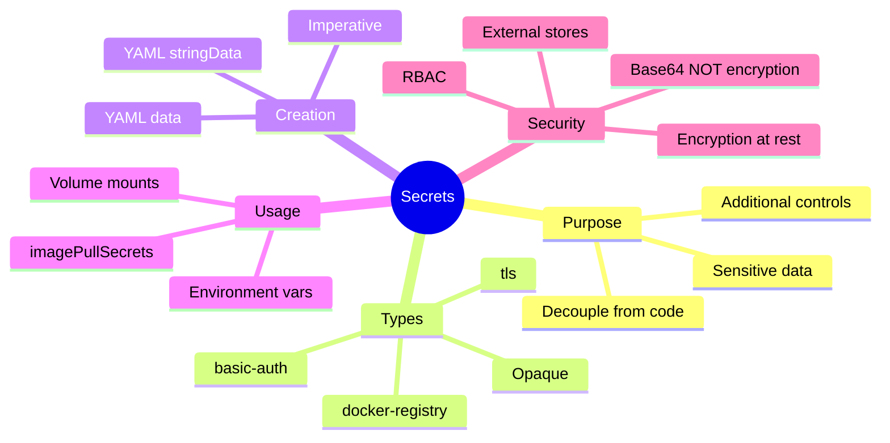
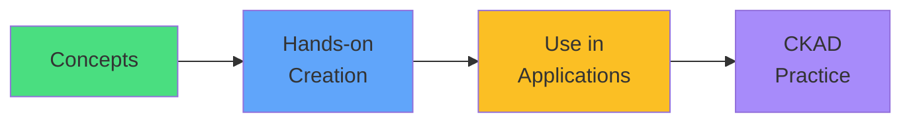

# Kubernetes Secrets

<div class="abs-br m-6 flex gap-2">
  <carbon-locked class="text-6xl text-blue-400" />
</div>

<div v-click class="mt-8 text-xl opacity-80">
Securing sensitive data in Kubernetes
</div>

---
layout: center
---

# The Sensitive Data Challenge

<div v-click="1">



</div>

<div class="grid grid-cols-3 gap-4 mt-8">
<div v-click="2">
<carbon-close class="text-4xl text-red-400 mb-2" />
<strong>Hardcode</strong><br/>
<span class="text-sm opacity-80">Visible in Git</span>
</div>
<div v-click="3">
<carbon-close class="text-4xl text-red-400 mb-2" />
<strong>In images</strong><br/>
<span class="text-sm opacity-80">Anyone can extract</span>
</div>
<div v-click="4">
<carbon-close class="text-4xl text-red-400 mb-2" />
<strong>Plain env vars</strong><br/>
<span class="text-sm opacity-80">Exposed in logs</span>
</div>
</div>

---
layout: center
---

# What Are Secrets?

<div v-click="1">



</div>

<div v-click="2" class="mt-8 text-center">
<carbon-locked class="inline-block text-4xl text-blue-400" />
<strong class="ml-2">Kubernetes API object for sensitive information</strong>
</div>

<div v-click="3" class="mt-6 text-center text-sm opacity-80">
Similar to ConfigMaps, but with extra security controls
</div>

---
layout: center
---

# Secrets vs ConfigMaps

<div v-click="1">



</div>

<div v-click="2" class="mt-8 text-center text-lg">
<carbon-rule class="inline-block text-3xl text-yellow-400" />
<strong class="ml-2">Golden Rule:</strong> If you wouldn't put it in public Git, use a Secret
</div>

---
layout: center
---

# Secret Types

<div class="grid grid-cols-2 gap-4 mt-4 text-sm">
<div v-click="1">
<carbon-document class="text-4xl text-blue-400 mb-2" />
<strong>Opaque</strong><br/>
<span class="text-xs opacity-80">Generic key-value data (default)</span>
</div>
<div v-click="2">
<carbon-user class="text-4xl text-green-400 mb-2" />
<strong>service-account-token</strong><br/>
<span class="text-xs opacity-80">Auto-created for ServiceAccounts</span>
</div>
<div v-click="3">
<carbon-container-software class="text-4xl text-purple-400 mb-2" />
<strong>dockerconfigjson</strong><br/>
<span class="text-xs opacity-80">Docker registry credentials</span>
</div>
<div v-click="4">
<carbon-certificate class="text-4xl text-yellow-400 mb-2" />
<strong>tls</strong><br/>
<span class="text-xs opacity-80">TLS certificates and keys</span>
</div>
<div v-click="5">
<carbon-password class="text-4xl text-orange-400 mb-2" />
<strong>basic-auth</strong><br/>
<span class="text-xs opacity-80">Username and password</span>
</div>
<div v-click="6">
<carbon-terminal class="text-4xl text-red-400 mb-2" />
<strong>ssh-auth</strong><br/>
<span class="text-xs opacity-80">SSH private keys</span>
</div>
</div>

<div v-click="7" class="mt-8 text-center text-sm opacity-80">
Type provides metadata and validation, not different storage
</div>

---
layout: center
---

# Base64 Encoding - NOT Encryption

<div v-click="1">



</div>

<div v-click="2" class="mt-8 text-center text-red-400 text-xl">
<carbon-warning class="inline-block text-4xl" />
<strong>Base64 is NOT encryption!</strong>
</div>

<div v-click="3" class="mt-6 text-sm">

```bash
# Anyone with kubectl access can decode
kubectl get secret my-secret -o jsonpath='{.data.password}' | base64 -d
```

</div>

<div v-click="4" class="mt-6 text-center text-sm opacity-80">
Base64 is encoding for binary data, not security
</div>

---
layout: center
---

# Real Security Measures

<div class="grid grid-cols-2 gap-6 mt-6">
<div v-click="1">
<carbon-locked class="text-5xl text-green-400 mb-2" />
<strong>Encryption at rest</strong><br/>
<span class="text-sm opacity-80">Encrypt in etcd</span>
</div>
<div v-click="2">
<carbon-security class="text-5xl text-blue-400 mb-2" />
<strong>RBAC</strong><br/>
<span class="text-sm opacity-80">Limit who can read</span>
</div>
<div v-click="3">
<carbon-network-3 class="text-5xl text-purple-400 mb-2" />
<strong>External stores</strong><br/>
<span class="text-sm opacity-80">Vault, cloud KMS</span>
</div>
<div v-click="4">
<carbon-view class="text-5xl text-yellow-400 mb-2" />
<strong>Audit logs</strong><br/>
<span class="text-sm opacity-80">Track access</span>
</div>
</div>

---
layout: center
---

# Creating Secrets - Multiple Methods

<div v-click="1">

```mermaid
graph TB
    CS[Create Secret]
    CS --> Y1[YAML with data<br/>base64-encoded]
    CS --> Y2[YAML with stringData<br/>plain text]
    CS --> I1[Imperative<br/>--from-literal]
    CS --> I2[Imperative<br/>--from-file]
    CS --> I3[Imperative<br/>--from-env-file]
    style CS fill:#60a5fa
    style Y1 fill:#4ade80
    style Y2 fill:#4ade80
    style I1 fill:#fbbf24
    style I2 fill:#fbbf24
    style I3 fill=#fbbf24
```

</div>

---
layout: center
---

# YAML with data (Base64)

<div v-click="1" class="text-sm">

```yaml
apiVersion: v1
kind: Secret
metadata:
  name: my-secret
type: Opaque
data:
  username: YWRtaW4=           # echo -n "admin" | base64
  password: cGFzc3dvcmQxMjM=   # echo -n "password123" | base64
```

</div>

<div v-click="2" class="mt-6 text-center">
<carbon-warning class="inline-block text-3xl text-yellow-400" />
<span class="ml-2">Values must be base64-encoded</span>
</div>

---
layout: center
---

# YAML with stringData (Plain Text)

<div v-click="1" class="text-sm">

```yaml
apiVersion: v1
kind: Secret
metadata:
  name: my-secret
type: Opaque
stringData:
  username: admin
  password: password123
```

</div>

<div v-click="2" class="mt-6 text-center">
<carbon-checkmark class="inline-block text-3xl text-green-400" />
<span class="ml-2">Kubernetes automatically encodes</span>
</div>

<div v-click="3" class="mt-4 text-center text-sm opacity-80">
More human-readable, but still shouldn't be in Git!
</div>

---
layout: center
---

# Imperative Creation

<div v-click="1" class="text-sm">

```bash
# From literal values
kubectl create secret generic my-secret \
  --from-literal=username=admin \
  --from-literal=password=password123

# From files
kubectl create secret generic app-config \
  --from-file=config.json \
  --from-file=certs/tls.crt

# From env file
kubectl create secret generic env-secrets \
  --from-env-file=.env
```

</div>

<div v-click="2" class="mt-6 text-center">
<carbon-timer class="inline-block text-3xl text-blue-400" />
<strong class="ml-2">Fast for CKAD exam!</strong>
</div>

---
layout: center
---

# Using Secrets - Environment Variables

<div v-click="1" class="text-sm">

```yaml
apiVersion: v1
kind: Pod
spec:
  containers:
  - name: app
    image: myapp
    env:
    # Single key
    - name: DB_PASSWORD
      valueFrom:
        secretKeyRef:
          name: my-secret
          key: password
    # All keys
    envFrom:
    - secretRef:
        name: my-secret
```

</div>

<div v-click="2" class="mt-6 text-center text-yellow-400">
<carbon-warning class="inline-block text-2xl" /> Static - no updates without restart
</div>

---
layout: center
---

# Using Secrets - Volume Mounts

<div v-click="1" class="text-sm">

```yaml
apiVersion: v1
kind: Pod
spec:
  containers:
  - name: app
    volumeMounts:
    - name: secret-vol
      mountPath: /etc/secrets
      readOnly: true
  volumes:
  - name: secret-vol
    secret:
      secretName: my-secret
```

</div>

<div v-click="2" class="mt-6">

```mermaid
graph LR
    S[Secret] --> V[Volume]
    V --> F1[/etc/secrets/username]
    V --> F2[/etc/secrets/password]
    style S fill:#60a5fa
    style V fill:#4ade80
```

</div>

---
layout: center
---

# Environment Variables vs Volume Mounts

<div class="grid grid-cols-2 gap-6 mt-6">
<div v-click="1">
<carbon-list class="text-5xl text-blue-400 mb-2" />
<strong>Environment Variables</strong><br/>
<div class="text-sm opacity-80 mt-2">
✅ Simple to use<br/>
✅ Direct access<br/>
❌ Static (no updates)<br/>
❌ Visible to all processes
</div>
</div>
<div v-click="2">
<carbon-data-volume class="text-5xl text-green-400 mb-2" />
<strong>Volume Mounts</strong><br/>
<div class="text-sm opacity-80 mt-2">
✅ Auto-update (cached)<br/>
✅ File permissions<br/>
✅ Multiple keys as files<br/>
❌ Slightly more complex
</div>
</div>
</div>

<div v-click="3" class="mt-8 text-center text-lg">
<carbon-checkmark class="inline-block text-3xl text-green-400" />
Prefer volume mounts for production
</div>

---
layout: center
---

# Docker Registry Secrets

<div v-click="1" class="text-sm">

```bash
# Create docker-registry secret
kubectl create secret docker-registry regcred \
  --docker-server=registry.example.com \
  --docker-username=user \
  --docker-password=pass \
  --docker-email=user@example.com
```

</div>

<div v-click="2" class="mt-6 text-sm">

```yaml
apiVersion: v1
kind: Pod
spec:
  containers:
  - name: app
    image: registry.example.com/myapp:v1
  imagePullSecrets:
  - name: regcred
```

</div>

<div v-click="3" class="mt-6 text-center">
<carbon-container-software class="inline-block text-3xl text-purple-400" />
<strong class="ml-2">Pull images from private registries</strong>
</div>

---
layout: center
---

# TLS Secrets

<div v-click="1" class="text-sm">

```bash
# Create TLS secret
kubectl create secret tls tls-secret \
  --cert=path/to/tls.crt \
  --key=path/to/tls.key
```

</div>

<div v-click="2" class="mt-6 text-sm">

```yaml
apiVersion: networking.k8s.io/v1
kind: Ingress
spec:
  tls:
  - hosts:
    - myapp.example.com
    secretName: tls-secret
  rules:
  - host: myapp.example.com
    http:
      paths:
      - path: /
        backend:
          service:
            name: myapp
            port:
              number: 80
```

</div>

---
layout: center
---

# Security Best Practices

<div class="grid grid-cols-2 gap-4 mt-4 text-sm">
<div v-click="1">
<carbon-close class="text-4xl text-red-400 mb-2" />
<strong>Never commit to Git</strong><br/>
<span class="text-xs opacity-80">Use .gitignore</span>
</div>
<div v-click="2">
<carbon-locked class="text-4xl text-green-400 mb-2" />
<strong>Enable encryption at rest</strong><br/>
<span class="text-xs opacity-80">Configure etcd encryption</span>
</div>
<div v-click="3">
<carbon-security class="text-4xl text-blue-400 mb-2" />
<strong>Use RBAC</strong><br/>
<span class="text-xs opacity-80">Limit read access</span>
</div>
<div v-click="4">
<carbon-network-3 class="text-4xl text-purple-400 mb-2" />
<strong>External secret stores</strong><br/>
<span class="text-xs opacity-80">Vault, cloud KMS</span>
</div>
<div v-click="5">
<carbon-restart class="text-4xl text-yellow-400 mb-2" />
<strong>Rotate regularly</strong><br/>
<span class="text-xs opacity-80">Automate rotation</span>
</div>
<div v-click="6">
<carbon-data-volume class="text-4xl text-orange-400 mb-2" />
<strong>Mount as volumes</strong><br/>
<span class="text-xs opacity-80">Not env vars when possible</span>
</div>
</div>

---
layout: center
---

# Troubleshooting Secrets

<div v-click="1">



</div>

<div v-click="2" class="mt-6 text-sm">

```bash
# Check Secret exists
kubectl get secret my-secret

# View Secret keys (not values)
kubectl describe secret my-secret

# Check Pod events
kubectl describe pod myapp
```

</div>

---
layout: center
---

# CKAD Exam Focus

<div v-click="1" class="text-center mb-6">
<carbon-certificate class="inline-block text-6xl text-blue-400" />
</div>

<div class="grid grid-cols-2 gap-4 text-sm">
<div v-click="2">
<carbon-add class="inline-block text-2xl text-green-400" /> Create Secrets quickly
</div>
<div v-click="3">
<carbon-list class="inline-block text-2xl text-green-400" /> Use as env variables
</div>
<div v-click="4">
<carbon-data-volume class="inline-block text-2xl text-green-400" /> Mount as volumes
</div>
<div v-click="5">
<carbon-container-software class="inline-block text-2xl text-green-400" /> Docker registry secrets
</div>
<div v-click="6">
<carbon-certificate class="inline-block text-2xl text-green-400" /> TLS secrets for Ingress
</div>
<div v-click="7">
<carbon-debug class="inline-block text-2xl text-green-400" /> Troubleshoot missing Secrets
</div>
</div>

<div v-click="8" class="mt-8 text-center text-lg">
<carbon-timer class="inline-block text-3xl text-red-400" /> Speed matters - practice imperative commands!
</div>

---
layout: center
---

# Summary

<div v-click="1">



</div>

---
layout: center
---

# Key Takeaways

<div class="grid grid-cols-2 gap-6 mt-6">
<div v-click="1">
<carbon-locked class="text-4xl text-blue-400 mb-2" />
<strong>For sensitive data only</strong><br/>
<span class="text-sm opacity-80">Use ConfigMaps for non-sensitive</span>
</div>
<div v-click="2">
<carbon-warning class="text-4xl text-red-400 mb-2" />
<strong>Base64 ≠ encryption</strong><br/>
<span class="text-sm opacity-80">Use real security measures</span>
</div>
<div v-click="3">
<carbon-data-volume class="text-4xl text-green-400 mb-2" />
<strong>Prefer volume mounts</strong><br/>
<span class="text-sm opacity-80">Support auto-updates</span>
</div>
<div v-click="4">
<carbon-timer class="text-4xl text-yellow-400 mb-2" />
<strong>Practice imperative</strong><br/>
<span class="text-sm opacity-80">Speed for CKAD exam</span>
</div>
</div>

<div v-click="5" class="mt-8 text-center text-xl">
Separate secrets from code, protect with RBAC and encryption
</div>

---
layout: center
---

# Next Steps

<div v-click="1" class="text-center mb-8">
<carbon-education class="inline-block text-6xl text-blue-400" />
</div>

<div v-click="2">



</div>

<div v-click="3" class="mt-8 text-center text-xl">
Let's create and use Secrets! <carbon-arrow-right class="inline-block text-2xl" />
</div>
