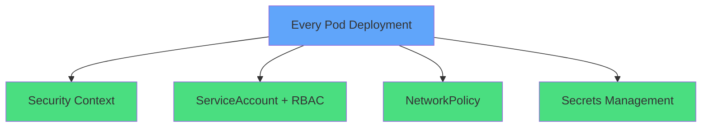

# Security Is Integrated

```mermaid
graph TB
    POD[<carbon-container-software/> Every Pod Deployment]

    POD --> SC[<carbon-security/> Security Context]
    POD --> SA[<carbon-user/> ServiceAccount + RBAC]
    POD --> NP[<carbon-network-overlay/> NetworkPolicy]
    POD --> SEC[<carbon-locked/> Secrets Management]

    style POD fill:#60a5fa
    style SC fill:#4ade80
    style SA fill:#4ade80
    style NP fill:#4ade80
    style SEC fill:#4ade80
```

Security isn't separate - it's part of every task

