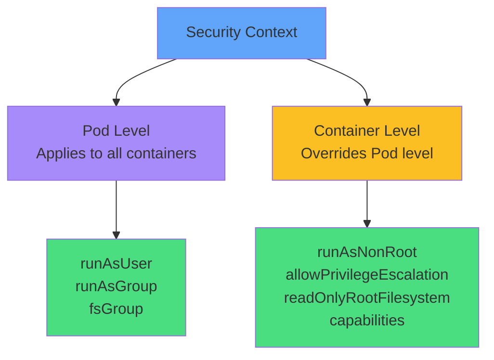

# Security Context Basics

```mermaid
graph TB
    SC[<carbon-security/> Security Context]

    SC --> POD_LEVEL[<carbon-cube/> Pod Level<br/>Applies to all containers]
    SC --> CONTAINER_LEVEL[<carbon-container-software/> Container Level<br/>Overrides Pod level]

    POD_LEVEL --> SETTINGS1[runAsUser<br/>runAsGroup<br/>fsGroup]
    CONTAINER_LEVEL --> SETTINGS2[runAsNonRoot<br/>allowPrivilegeEscalation<br/>readOnlyRootFilesystem<br/>capabilities]

    style SC fill:#60a5fa
    style POD_LEVEL fill:#a78bfa
    style CONTAINER_LEVEL fill:#fbbf24
    style SETTINGS1 fill:#4ade80
    style SETTINGS2 fill:#4ade80
```

Container level overrides Pod level

