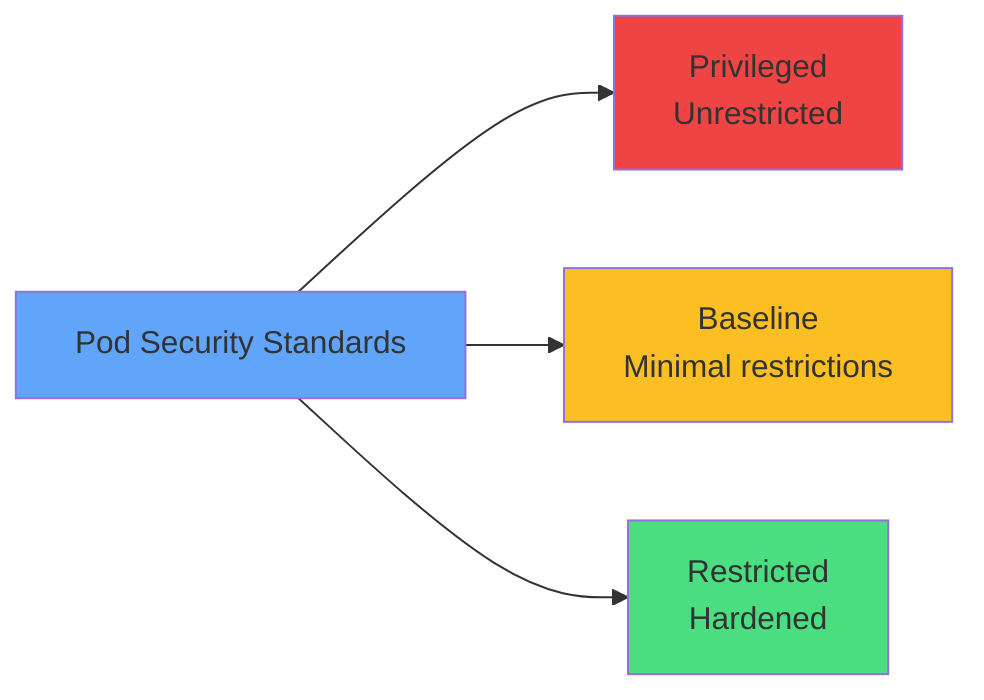

# Pod Security Standards

```mermaid
graph LR
    PSS[<carbon-security/> Pod Security Standards]

    PSS --> PRIV[<carbon-unlocked/> Privileged<br/>Unrestricted]
    PSS --> BASE[<carbon-shield/> Baseline<br/>Minimal restrictions]
    PSS --> REST[<carbon-locked/> Restricted<br/>Hardened]

    style PSS fill:#60a5fa
    style PRIV fill:#ef4444
    style BASE fill:#fbbf24
    style REST fill:#4ade80
```

### Namespaces enforce Pod Security policies

**Restricted** requires: runAsNonRoot, no privilege escalation, 
read-only root filesystem, dropped capabilities

