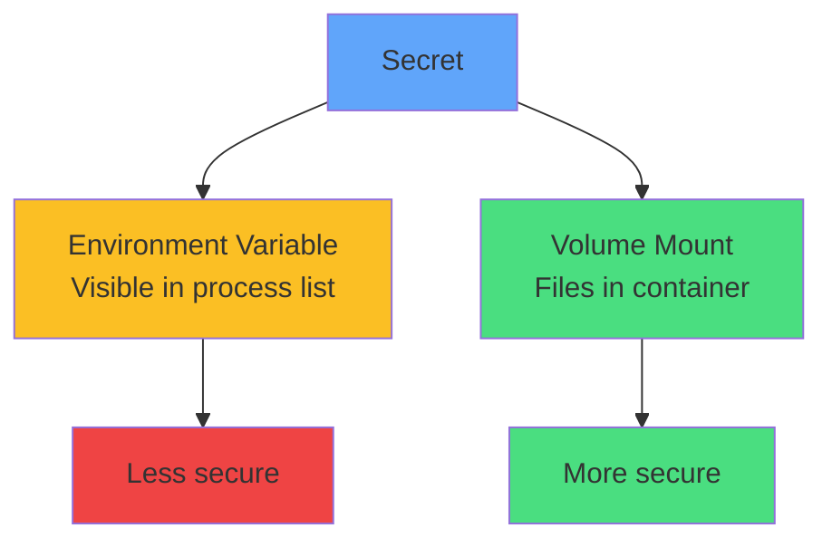

# Secret Handling

```mermaid
graph TB
    SECRET[<carbon-locked/> Secret]

    SECRET --> ENV[<carbon-terminal/> Environment Variable<br/>Visible in process list]
    SECRET --> VOL[<carbon-folder/> Volume Mount<br/>Files in container]

    ENV --> RISK[<carbon-warning-alt/> Less secure]
    VOL --> SAFE[<carbon-checkmark-filled/> More secure]

    style SECRET fill:#60a5fa
    style ENV fill:#fbbf24
    style VOL fill:#4ade80
    style RISK fill:#ef4444
    style SAFE fill:#4ade80
```

### Prefer volume mounts for sensitive data

Volume mounts don't appear in process listings

