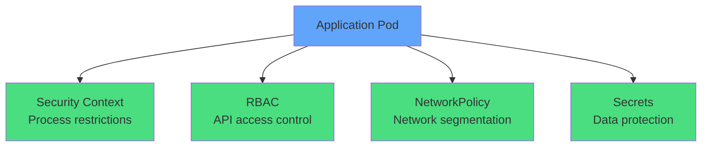

# Defense in Depth

```mermaid
graph TB
    APP[<carbon-container-software/> Application Pod]

    APP --> L1[<carbon-security/> Security Context<br/>Process restrictions]
    APP --> L2[<carbon-user-access/> RBAC<br/>API access control]
    APP --> L3[<carbon-network-overlay/> NetworkPolicy<br/>Network segmentation]
    APP --> L4[<carbon-locked/> Secrets<br/>Data protection]

    style APP fill:#60a5fa
    style L1 fill:#4ade80
    style L2 fill:#4ade80
    style L3 fill:#4ade80
    style L4 fill:#4ade80
```

Layer multiple security controls

