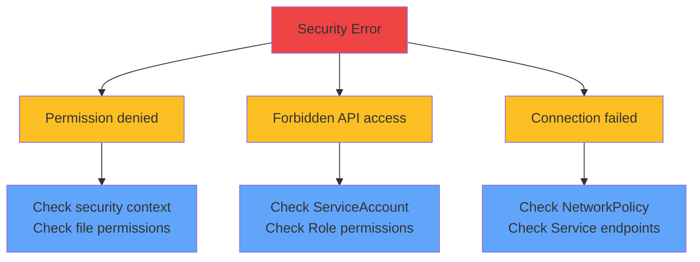

# Troubleshooting Security

```mermaid
graph TB
    ERROR[<carbon-warning-alt/> Security Error]

    ERROR --> PERM[<carbon-close/> Permission denied] --> SC[<carbon-search/> Check security context<br/>Check file permissions]
    ERROR --> FORBID[<carbon-close/> Forbidden API access] --> RBAC[<carbon-search/> Check ServiceAccount<br/>Check Role permissions]
    ERROR --> CONN[<carbon-close/> Connection failed] --> NP[<carbon-search/> Check NetworkPolicy<br/>Check Service endpoints]

    style ERROR fill:#ef4444
    style PERM fill:#fbbf24
    style FORBID fill:#fbbf24
    style CONN fill:#fbbf24
    style SC fill:#60a5fa
    style RBAC fill:#60a5fa
    style NP fill:#60a5fa
```

Systematic diagnosis saves time

