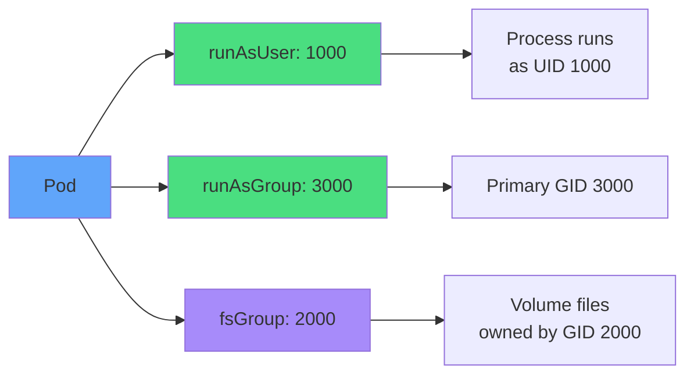
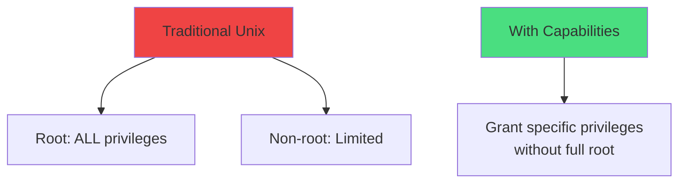
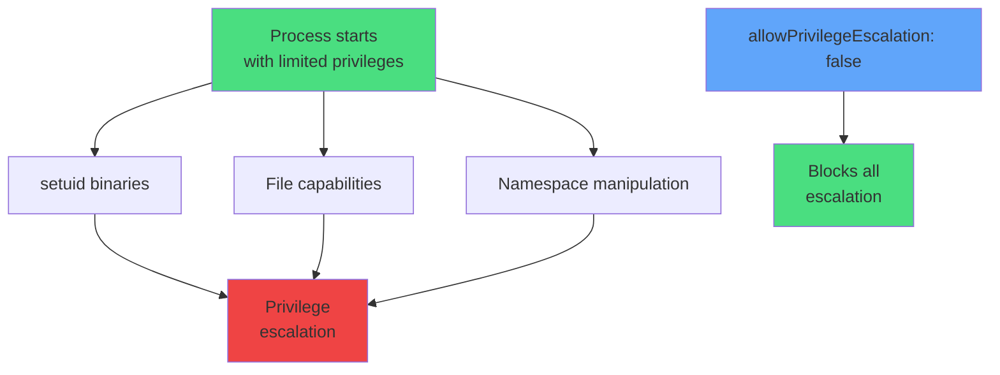
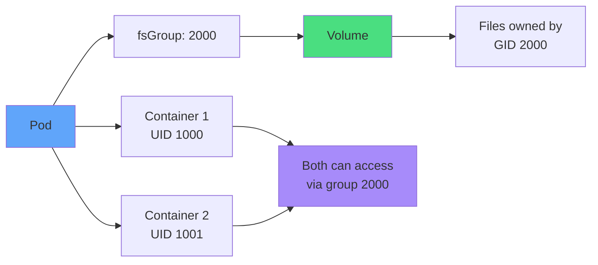
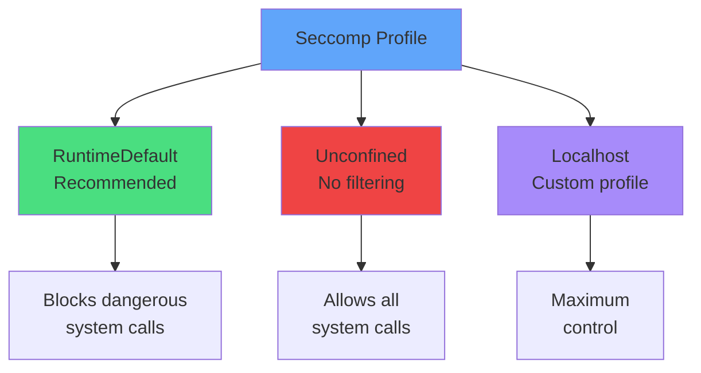
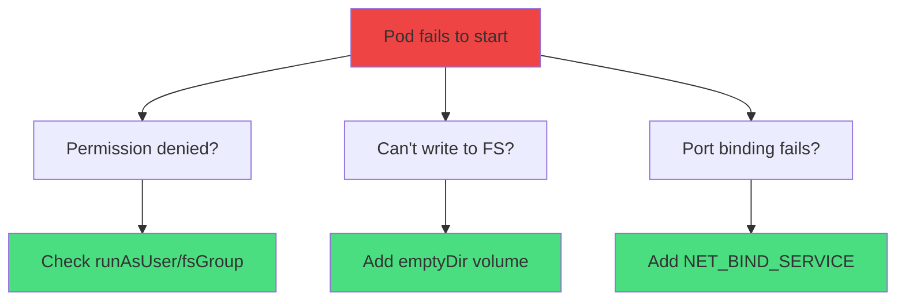
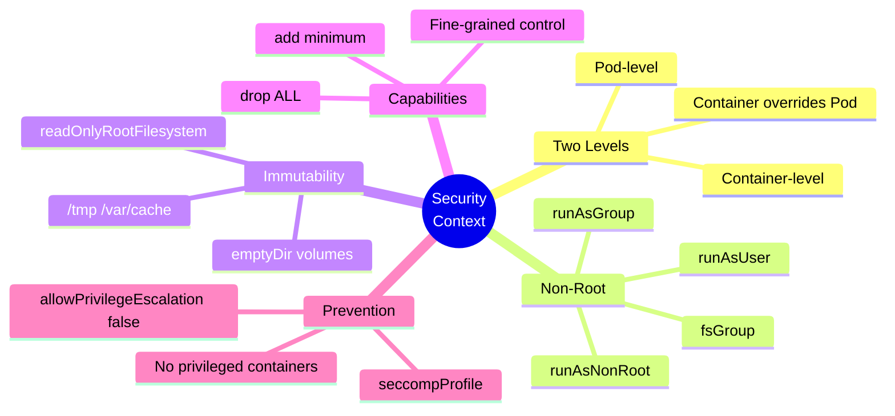
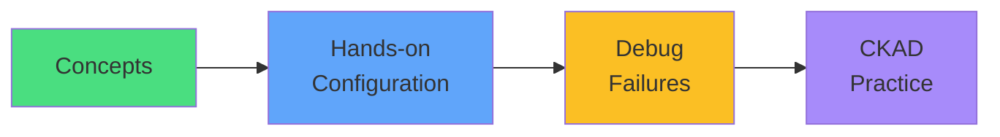

# Security Contexts

<div class="abs-br m-6 flex gap-2">
  <carbon-shield-security class="text-6xl text-blue-400" />
</div>

<div v-click class="mt-8 text-xl opacity-80">
Securing container execution in Kubernetes
</div>

---
layout: center
---

# The Security Problem

<div v-click="1">

```mermaid
graph TB
    D[Default Container]
    D --> R[Runs as root]
    D --> F[Full filesystem access]
    D --> C[All capabilities]
    D --> P[Can escalate privileges]
    ATK[Attacker exploits<br/>vulnerability]
    ATK --> COMP[Full container<br/>compromise]
    style D fill=#ef4444
    style ATK fill:#fbbf24
    style COMP fill:#ef4444
```

</div>

<div v-click="2" class="mt-8 text-center text-red-400 text-xl">
<carbon-warning class="inline-block text-4xl" />
<strong>Default = Insecure</strong>
</div>

<div v-click="3" class="mt-6 text-center text-sm opacity-80">
Containers often run as root with full privileges by default
</div>

---
layout: center
---

# Why Container Security Matters

<div v-click="1">

```mermaid
sequenceDiagram
    participant A as Attacker
    participant C as Container (root)
    participant H as Host
    A->>C: Exploit vulnerability
    C->>C: Shell access as root
    C->>C: Modify app code
    C->>C: Install malware
    C->>H: Attempt escape
    C->>H: Access host resources
    style C fill:#ef4444
    style H fill:#fbbf24
```

</div>

<div v-click="2" class="mt-6 text-center">
<carbon-security class="inline-block text-4xl text-blue-400" />
<strong class="ml-2">Principle of least privilege</strong>
</div>

---
layout: center
---

# SecurityContext Architecture

<div v-click="1">

```mermaid
graph TB
    SC[SecurityContext]
    SC --> POD[Pod-level<br/>spec.securityContext]
    SC --> CON[Container-level<br/>containers[].securityContext]
    POD --> PF[User/Group IDs<br/>fsGroup<br/>Volume permissions]
    CON --> CF[Capabilities<br/>Privilege escalation<br/>Read-only FS<br/>Overrides Pod settings]
    style SC fill:#60a5fa
    style POD fill:#4ade80
    style CON fill:#a78bfa
```

</div>

<div v-click="2" class="mt-6 text-center text-lg">
<carbon-rule class="inline-block text-3xl text-yellow-400" />
Container settings override Pod settings
</div>

---
layout: center
---

# Running as Non-Root

<div v-click="1" class="text-sm">

```yaml
apiVersion: v1
kind: Pod
spec:
  securityContext:
    runAsUser: 1000        # UID
    runAsGroup: 3000       # GID
    fsGroup: 2000          # Volume group
  containers:
  - name: app
    securityContext:
      runAsNonRoot: true   # Enforce non-root
```

</div>

<div class="grid grid-cols-2 gap-6 mt-8">
<div v-click="2">
<carbon-user class="text-4xl text-green-400 mb-2" />
<strong>runAsUser</strong><br/>
<span class="text-sm opacity-80">User ID (UID)</span>
</div>
<div v-click="3">
<carbon-user class="text-4xl text-blue-400 mb-2" />
<strong>runAsGroup</strong><br/>
<span class="text-sm opacity-80">Group ID (GID)</span>
</div>
</div>

---
layout: center
---

# User and Group Management

<div v-click="1">



</div>

<div v-click="2" class="mt-6 text-center">
<carbon-checkmark class="inline-block text-3xl text-green-400" />
<strong>runAsNonRoot: true</strong> enforces non-root execution
</div>

---
layout: center
---

# Read-Only Root Filesystem

<div v-click="1" class="text-sm">

```yaml
spec:
  containers:
  - name: app
    securityContext:
      readOnlyRootFilesystem: true
    volumeMounts:
    - name: tmp
      mountPath: /tmp
    - name: cache
      mountPath: /var/cache
  volumes:
  - name: tmp
    emptyDir: {}
  - name: cache
    emptyDir: {}
```

</div>

<div v-click="2" class="mt-6">

```mermaid
graph TB
    FS[Filesystem]
    FS --> RO[/ read-only]
    FS --> W1[/tmp writable<br/>emptyDir]
    FS --> W2[/var/cache writable<br/>emptyDir]
    style FS fill:#60a5fa
    style RO fill:#ef4444
    style W1 fill:#4ade80
    style W2 fill:#4ade80
```

</div>

---
layout: center
---

# Read-Only Filesystem Benefits

<div class="grid grid-cols-2 gap-6 mt-6">
<div v-click="1">
<carbon-checkmark class="text-5xl text-green-400 mb-2" />
<strong>Benefits</strong><br/>
<div class="text-sm opacity-80 mt-2">
• Can't modify app code<br/>
• Can't install malware<br/>
• Can't create backdoors<br/>
• Immutable containers
</div>
</div>
<div v-click="2">
<carbon-warning class="text-5xl text-yellow-400 mb-2" />
<strong>Solution</strong><br/>
<div class="text-sm opacity-80 mt-2">
• Mount emptyDir volumes<br/>
• For /tmp, /var/cache<br/>
• For logs, temp files<br/>
• App works normally
</div>
</div>
</div>

---
layout: center
---

# Linux Capabilities

<div v-click="1">



</div>

<div v-click="2" class="mt-8 text-center">
<carbon-rule class="inline-block text-4xl text-blue-400" />
<strong class="ml-2">Fine-grained privilege control</strong>
</div>

---
layout: center
---

# Capability Management

<div v-click="1" class="text-sm">

```yaml
securityContext:
  capabilities:
    drop: ["ALL"]              # Drop everything
    add: ["NET_BIND_SERVICE"]  # Add only what's needed
```

</div>

<div class="grid grid-cols-2 gap-6 mt-8 text-xs">
<div v-click="2">
<carbon-close class="text-4xl text-red-400 mb-2" />
<strong>drop: ["ALL"]</strong><br/>
<span class="text-xs opacity-80">Start with zero privileges</span>
</div>
<div v-click="3">
<carbon-add class="text-4xl text-green-400 mb-2" />
<strong>add: [...]</strong><br/>
<span class="text-xs opacity-80">Grant minimum required</span>
</div>
</div>

<div v-click="4" class="mt-8 text-center text-lg">
<carbon-checkmark class="inline-block text-3xl text-blue-400" />
Best practice: Drop all, add only what's necessary
</div>

---
layout: center
---

# Common Capabilities

<div class="grid grid-cols-2 gap-4 mt-4 text-xs">
<div v-click="1">
<carbon-network-3 class="text-3xl text-blue-400 mb-1" />
<strong>NET_BIND_SERVICE</strong><br/>
Bind to ports < 1024
</div>
<div v-click="2">
<carbon-network-3 class="text-3xl text-purple-400 mb-1" />
<strong>NET_ADMIN</strong><br/>
Configure network
</div>
<div v-click="3">
<carbon-document class="text-3xl text-green-400 mb-1" />
<strong>CHOWN</strong><br/>
Change file ownership
</div>
<div v-click="4">
<carbon-locked class="text-3xl text-yellow-400 mb-1" />
<strong>DAC_OVERRIDE</strong><br/>
Bypass file permissions
</div>
<div v-click="5">
<carbon-time class="text-3xl text-orange-400 mb-1" />
<strong>SYS_TIME</strong><br/>
Change system clock
</div>
<div v-click="6">
<carbon-user class="text-3xl text-red-400 mb-1" />
<strong>SETUID/SETGID</strong><br/>
Change user/group
</div>
</div>

<div v-click="7" class="mt-8 text-center text-sm opacity-80">
Grant only the minimum capabilities needed for your application
</div>

---
layout: center
---

# Preventing Privilege Escalation

<div v-click="1">



</div>

<div v-click="2" class="mt-6 text-sm">

```yaml
securityContext:
  allowPrivilegeEscalation: false
```

</div>

---
layout: center
---

# Privileged Containers

<div v-click="1">

```mermaid
graph TB
    PRIV[privileged: true]
    PRIV --> D[Access all host devices]
    PRIV --> K[Modify kernel parameters]
    PRIV --> M[Mount host filesystems]
    PRIV --> B[Bypass security constraints]
    PRIV --> ROOT[Essentially root<br/>on host]
    style PRIV fill:#ef4444
    style ROOT fill=#ef4444
```

</div>

<div v-click="2" class="mt-8 text-center text-red-400 text-xl">
<carbon-warning class="inline-block text-4xl" />
<strong>Treat as red flag - almost always a better way!</strong>
</div>

---
layout: center
---

# When to Use Privileged

<div class="grid grid-cols-2 gap-6 mt-6">
<div v-click="1">
<carbon-checkmark class="text-5xl text-yellow-400 mb-2" />
<strong>Rarely needed for:</strong><br/>
<div class="text-sm opacity-80 mt-2">
• System monitoring tools<br/>
• Container runtime mgmt<br/>
• Network plugins (CNI)<br/>
• Storage plugins (CSI)
</div>
</div>
<div v-click="2">
<carbon-close class="text-5xl text-red-400 mb-2" />
<strong>Avoid for:</strong><br/>
<div class="text-sm opacity-80 mt-2">
• Application workloads<br/>
• Web services<br/>
• APIs<br/>
• Most use cases
</div>
</div>
</div>

<div v-click="3" class="mt-8 text-center text-lg">
<carbon-rule class="inline-block text-3xl text-blue-400" />
Use specific capabilities instead
</div>

---
layout: center
---

# Filesystem Group (fsGroup)

<div v-click="1">



</div>

<div v-click="2" class="mt-6 text-center">
<carbon-data-volume class="inline-block text-4xl text-green-400" />
<strong class="ml-2">Shared volume access for non-root containers</strong>
</div>

---
layout: center
---

# Seccomp Profiles

<div v-click="1">



</div>

<div v-click="2" class="mt-6 text-sm">

```yaml
securityContext:
  seccompProfile:
    type: RuntimeDefault
```

</div>

---
layout: center
---

# Complete Security Baseline

<div v-click="1" class="text-sm">

```yaml
apiVersion: v1
kind: Pod
spec:
  securityContext:
    runAsNonRoot: true
    runAsUser: 1000
    fsGroup: 2000
  containers:
  - name: app
    image: myapp
    securityContext:
      allowPrivilegeEscalation: false
      readOnlyRootFilesystem: true
      capabilities:
        drop: ["ALL"]
      seccompProfile:
        type: RuntimeDefault
    volumeMounts:
    - name: tmp
      mountPath: /tmp
  volumes:
  - name: tmp
    emptyDir: {}
```

</div>

---
layout: center
---

# Security Best Practices

<div class="grid grid-cols-2 gap-4 mt-4 text-sm">
<div v-click="1">
<carbon-checkmark class="text-4xl text-green-400 mb-2" />
<strong>Always run as non-root</strong><br/>
<span class="text-xs opacity-80">Use runAsNonRoot: true</span>
</div>
<div v-click="2">
<carbon-checkmark class="text-4xl text-green-400 mb-2" />
<strong>Read-only filesystem</strong><br/>
<span class="text-xs opacity-80">With emptyDir for writes</span>
</div>
<div v-click="3">
<carbon-checkmark class="text-4xl text-green-400 mb-2" />
<strong>Drop all capabilities</strong><br/>
<span class="text-xs opacity-80">Add only what's needed</span>
</div>
<div v-click="4">
<carbon-checkmark class="text-4xl text-green-400 mb-2" />
<strong>Prevent escalation</strong><br/>
<span class="text-xs opacity-80">allowPrivilegeEscalation: false</span>
</div>
<div v-click="5">
<carbon-checkmark class="text-4xl text-green-400 mb-2" />
<strong>Use RuntimeDefault seccomp</strong><br/>
<span class="text-xs opacity-80">Block dangerous syscalls</span>
</div>
<div v-click="6">
<carbon-checkmark class="text-4xl text-green-400 mb-2" />
<strong>Set resource limits</strong><br/>
<span class="text-xs opacity-80">Defense in depth</span>
</div>
</div>

---
layout: center
---

# What NOT to Do

<div class="grid grid-cols-2 gap-6 mt-6">
<div v-click="1">
<carbon-close class="text-5xl text-red-400 mb-2" />
<strong>Run as root</strong><br/>
<span class="text-sm opacity-80">Major security risk</span>
</div>
<div v-click="2">
<carbon-close class="text-5xl text-red-400 mb-2" />
<strong>Use privileged containers</strong><br/>
<span class="text-sm opacity-80">Almost never needed</span>
</div>
<div v-click="3">
<carbon-close class="text-5xl text-red-400 mb-2" />
<strong>Add unnecessary capabilities</strong><br/>
<span class="text-sm opacity-80">Principle of least privilege</span>
</div>
<div v-click="4">
<carbon-close class="text-5xl text-red-400 mb-2" />
<strong>Allow privilege escalation</strong><br/>
<span class="text-sm opacity-80">Opens attack vectors</span>
</div>
<div v-click="5">
<carbon-close class="text-5xl text-red-400 mb-2" />
<strong>Skip security contexts</strong><br/>
<span class="text-sm opacity-80">Default is insecure</span>
</div>
<div v-click="6">
<carbon-close class="text-5xl text-red-400 mb-2" />
<strong>Writable root filesystem</strong><br/>
<span class="text-sm opacity-80">Allows code modification</span>
</div>
</div>

---
layout: center
---

# CKAD Exam Tips

<div v-click="1" class="text-center mb-6">
<carbon-certificate class="inline-block text-6xl text-blue-400" />
</div>

<div class="grid grid-cols-2 gap-4 text-sm">
<div v-click="2">
<carbon-user class="inline-block text-2xl text-green-400" /> Configure runAsUser/runAsGroup
</div>
<div v-click="3">
<carbon-locked class="inline-block text-2xl text-green-400" /> Set readOnlyRootFilesystem
</div>
<div v-click="4">
<carbon-rule class="inline-block text-2xl text-green-400" /> Drop all capabilities
</div>
<div v-click="5">
<carbon-warning class="inline-block text-2xl text-green-400" /> Prevent privilege escalation
</div>
<div v-click="6">
<carbon-data-volume class="inline-block text-2xl text-green-400" /> Add emptyDir for /tmp
</div>
<div v-click="7">
<carbon-debug class="inline-block text-2xl text-green-400" /> Troubleshoot permission errors
</div>
</div>

<div v-click="8" class="mt-8 text-center text-lg">
<carbon-timer class="inline-block text-3xl text-red-400" />
Practice the complete security baseline!
</div>

---
layout: center
---

# Troubleshooting Security Issues

<div v-click="1">



</div>

<div v-click="2" class="mt-6 text-sm">

```bash
# Check Pod events
kubectl describe pod myapp

# Check logs
kubectl logs myapp

# Common errors: Permission denied, Read-only file system
```

</div>

---
layout: center
---

# Summary

<div v-click="1">



</div>

---
layout: center
---

# Key Takeaways

<div class="grid grid-cols-2 gap-6 mt-6">
<div v-click="1">
<carbon-user class="text-4xl text-blue-400 mb-2" />
<strong>Always non-root</strong><br/>
<span class="text-sm opacity-80">Use runAsNonRoot: true</span>
</div>
<div v-click="2">
<carbon-locked class="text-4xl text-green-400 mb-2" />
<strong>Read-only filesystem</strong><br/>
<span class="text-sm opacity-80">Immutable containers</span>
</div>
<div v-click="3">
<carbon-rule class="text-4xl text-purple-400 mb-2" />
<strong>Drop all capabilities</strong><br/>
<span class="text-sm opacity-80">Add only what's needed</span>
</div>
<div v-click="4">
<carbon-warning class="text-4xl text-yellow-400 mb-2" />
<strong>Prevent escalation</strong><br/>
<span class="text-sm opacity-80">allowPrivilegeEscalation: false</span>
</div>
</div>

<div v-click="5" class="mt-8 text-center text-xl">
Security is not optional - it's essential for production
</div>

---
layout: center
---

# Next Steps

<div v-click="1" class="text-center mb-8">
<carbon-education class="inline-block text-6xl text-blue-400" />
</div>

<div v-click="2">



</div>

<div v-click="3" class="mt-8 text-center text-xl">
Let's secure our applications! <carbon-arrow-right class="inline-block text-2xl" />
</div>
