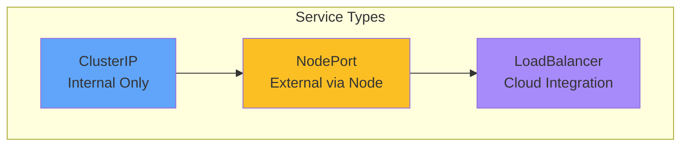

# Service Types

<carbon-locked class="text-2xl text-blue-400" />

Default

<carbon-unlocked class="text-2xl text-yellow-400" />

Simple External

<carbon-enterprise class="text-2xl text-purple-400" />

Production

