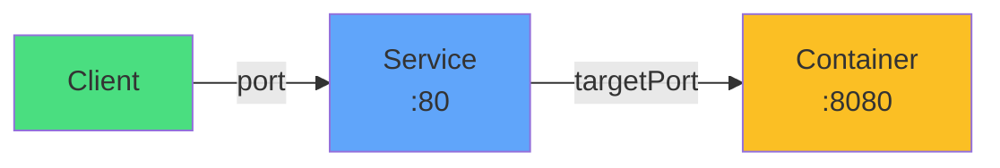

# Port Configuration

## --port
<carbon-arrow-right class="text-3xl text-blue-400" />

Service listener

## --target-port
<carbon-arrow-right class="text-3xl text-yellow-400" />

Container port

Getting this wrong means your Service won't work

