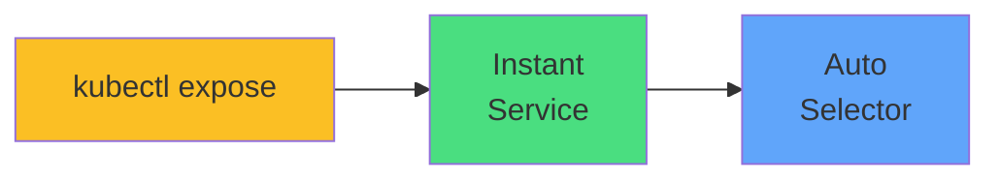

# kubectl expose



<div class="mt-8 text-center">

```bash
kubectl expose deployment app \
  --port=80 \
  --target-port=8080 \
  --type=ClusterIP
```

<div class="text-lg opacity-80 mt-6">
<carbon-flash class="text-3xl text-yellow-400 inline-block" />
<br/>
Fastest way to create Services
</div>

</div>
