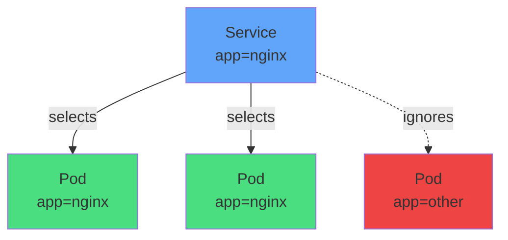

# Label Selectors

```mermaid
graph TB
    S[<carbon-network-3/> Service<br/>app=nginx]
    P1[<carbon-container-software/> Pod<br/>app=nginx]
    P2[<carbon-container-software/> Pod<br/>app=nginx]
    P3[<carbon-container-software/> Pod<br/>app=other]
    S -->|selects| P1
    S -->|selects| P2
    S -.->|ignores| P3
    style S fill:#60a5fa
    style P1 fill:#4ade80
    style P2 fill:#4ade80
    style P3 fill:#ef4444
```

Mismatched selectors = zero endpoints

