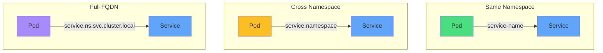

# DNS Naming

```mermaid
graph TB
    subgraph "Same Namespace"
        P1[<carbon-container-software/> Pod] -->|service-name| S1[<carbon-network-3/> Service]
    end
    subgraph "Cross Namespace"
        P2[<carbon-container-software/> Pod] -->|service.namespace| S2[<carbon-network-3/> Service]
    end
    subgraph "Full FQDN"
        P3[<carbon-container-software/> Pod] -->|service.ns.svc.cluster.local| S3[<carbon-network-3/> Service]
    end
    style P1 fill:#4ade80
    style P2 fill:#fbbf24
    style P3 fill:#a78bfa
    style S1 fill:#60a5fa
    style S2 fill:#60a5fa
    style S3 fill:#60a5fa
```
