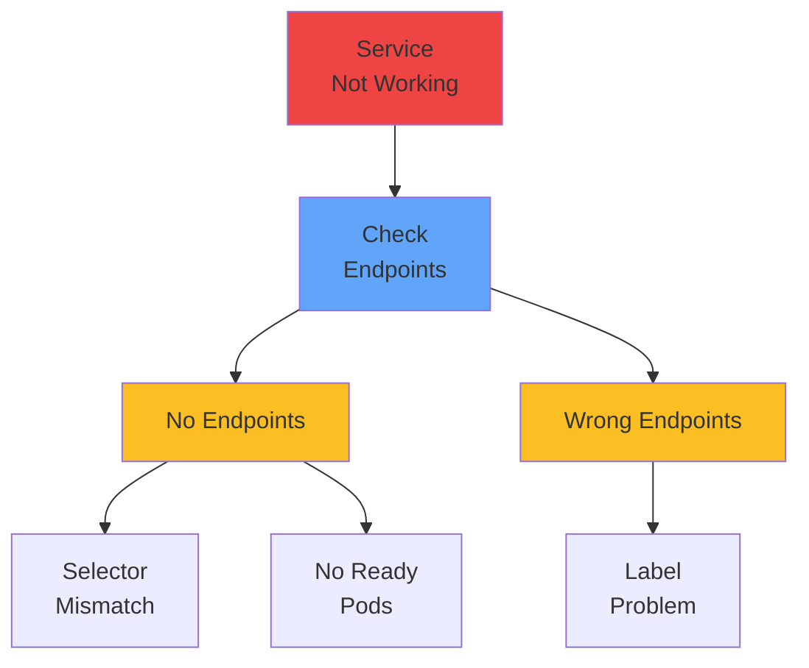

# Troubleshooting


```mermaid
graph TB
    S[<carbon-warning/> Service<br/>Not Working]
    S --> E[<carbon-search/> Check<br/>Endpoints]
    E --> N[<carbon-close/> No Endpoints]
    E --> W[<carbon-warning/> Wrong Endpoints]
    N --> SEL[<carbon-tag/> Selector<br/>Mismatch]
    N --> POD[<carbon-error/> No Ready<br/>Pods]
    W --> LAB[<carbon-label/> Label<br/>Problem]
    style S fill:#ef4444
    style E fill:#60a5fa
    style N fill:#fbbf24
    style W fill:#fbbf24
```

<div class="text-center mt-4">

```bash
kubectl get endpoints service-name
```

<div class="text-sm opacity-80 mt-4">
First step in Service troubleshooting
</div>

</div>
