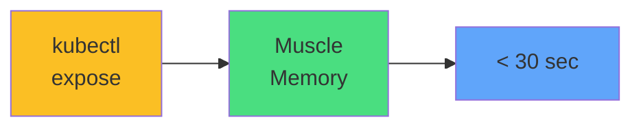

# Exam Mindset

<carbon-keyboard class="text-yellow-400 text-4xl inline-block" />

### When you see "expose the deployment"
### Your hands execute before conscious thought

<carbon-flash class="text-green-400 inline-block" /> kubectl expose handles 90% of scenarios

