# Kubernetes Services

<div class="abs-br m-6 flex gap-2">
  <carbon-network-3 class="text-6xl text-blue-400" />
</div>

<div v-click class="mt-8 text-xl opacity-80">
Stable networking for ephemeral Pods
</div>

---
layout: center
---

# The Pod Networking Challenge

<div v-click="1">

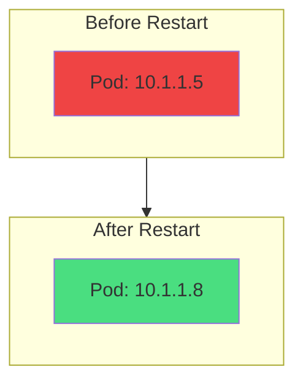

</div>

<div v-click="2" class="mt-8 text-center">
<carbon-warning class="inline-block text-4xl text-yellow-400" />
<strong class="ml-2">Pod IP addresses are ephemeral</strong>
</div>

<div class="grid grid-cols-2 gap-4 mt-6 text-sm">
<div v-click="3">
<carbon-restart class="inline-block text-2xl text-red-400" /> Pods restart → New IP
</div>
<div v-click="4">
<carbon-categories class="inline-block text-2xl text-blue-400" /> Multiple replicas → Different IPs
</div>
</div>

<div v-click="5" class="mt-6 text-center text-lg">
How do clients reliably connect to Pods?
</div>

---
layout: center
---

# What is a Service?

<div v-click="1">

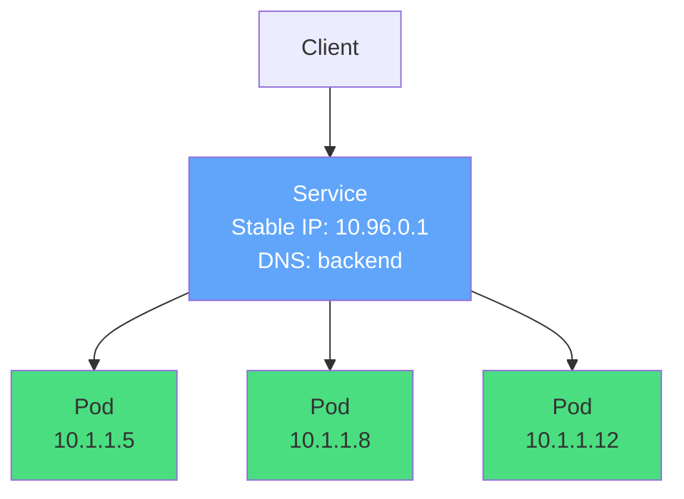

</div>

<div class="grid grid-cols-2 gap-6 mt-8">
<div v-click="2">
<carbon-network-3 class="text-4xl text-blue-400 mb-2" />
<strong>Stable IP & DNS</strong><br/>
<span class="text-sm opacity-80">Never changes</span>
</div>
<div v-click="3">
<carbon-flow class="text-4xl text-green-400 mb-2" />
<strong>Load Balancer</strong><br/>
<span class="text-sm opacity-80">Routes to healthy Pods</span>
</div>
</div>

<div v-click="4" class="mt-6 text-center text-lg">
<carbon-tag class="inline-block text-2xl text-purple-400" /> Loosely coupled via label selectors
</div>

---
layout: center
---

# Service Discovery Through DNS

<div v-click="1">

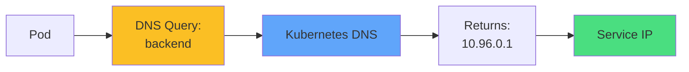

</div>

<div class="grid grid-cols-2 gap-6 mt-8 text-sm">
<div v-click="2">
<carbon-document class="inline-block text-3xl text-green-400" />
<strong>Same Namespace:</strong><br/>
<code>http://backend</code>
</div>
<div v-click="3">
<carbon-network-overlay class="inline-block text-3xl text-blue-400" />
<strong>Other Namespace:</strong><br/>
<code>http://backend.prod</code>
</div>
</div>

<div v-click="4" class="mt-8 text-center text-lg">
<carbon-checkmark class="inline-block text-2xl text-green-400" /> No IPs in application code!
</div>

<div v-click="5" class="mt-4 text-center text-sm opacity-80">
Same code works in dev, staging, and production
</div>

---
layout: center
---

# ClusterIP Services

<div v-click="1">

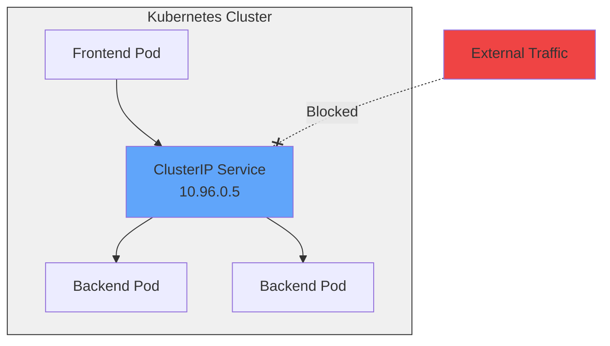

</div>

<div class="grid grid-cols-2 gap-6 mt-8">
<div v-click="2">
<carbon-locked class="text-4xl text-blue-400 mb-2" />
<strong>Internal Only</strong><br/>
<span class="text-sm opacity-80">Only accessible within cluster</span>
</div>
<div v-click="3">
<carbon-deployment-pattern class="text-4xl text-green-400 mb-2" />
<strong>Default Type</strong><br/>
<span class="text-sm opacity-80">Most common service type</span>
</div>
</div>

<div v-click="4" class="mt-6 text-center text-sm">
<carbon-database class="inline-block text-2xl text-purple-400" /> Perfect for: databases, internal APIs, backend services
</div>

---
layout: center
---

# NodePort Services

<div v-click="1">

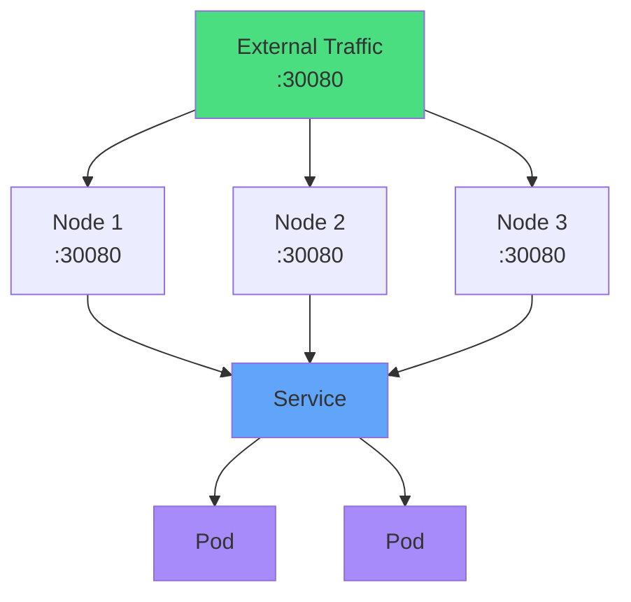

</div>

<div class="grid grid-cols-2 gap-6 mt-6 text-sm">
<div v-click="2">
<carbon-network-public class="inline-block text-3xl text-green-400" />
<strong>External Access</strong><br/>
Port 30000-32767 on every node
</div>
<div v-click="3">
<carbon-portable class="inline-block text-3xl text-blue-400" />
<strong>Universal</strong><br/>
Works on any Kubernetes cluster
</div>
</div>

<div v-click="4" class="mt-6 text-center text-yellow-400 text-sm">
<carbon-warning class="inline-block text-2xl" /> Users need to know node IPs and weird ports
</div>

---
layout: center
---

# LoadBalancer Services

<div v-click="1">

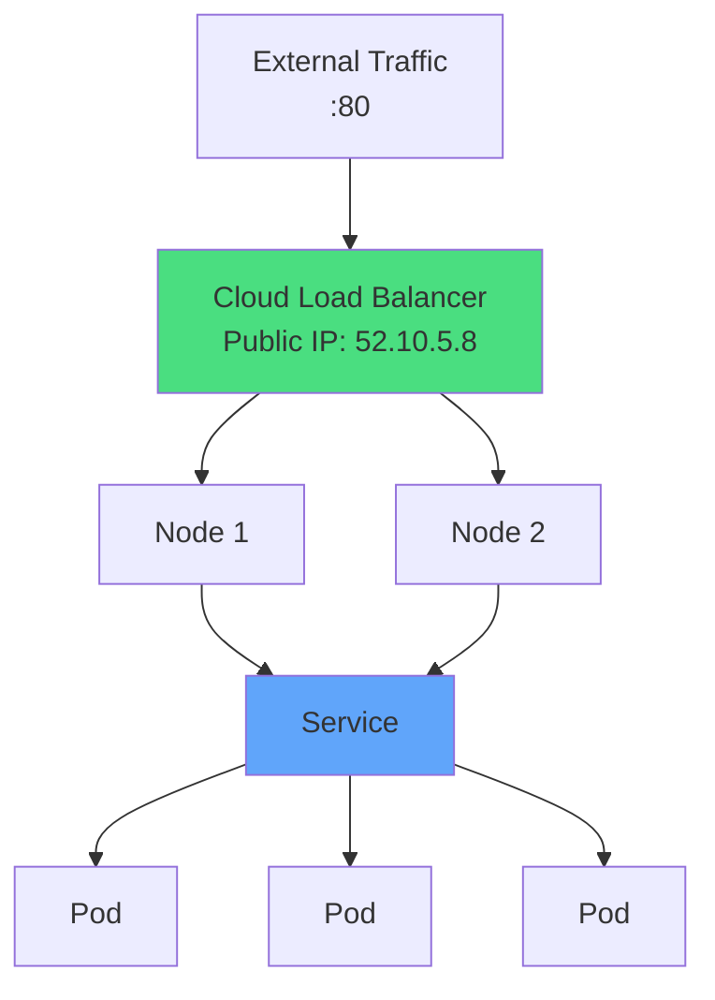

</div>

<div class="grid grid-cols-2 gap-6 mt-6 text-sm">
<div v-click="2">
<carbon-cloud class="text-4xl text-green-400 mb-2" />
<strong>Cloud Integration</strong><br/>
AWS ELB, Azure LB, GCP Load Balancer
</div>
<div v-click="3">
<carbon-user class="text-4xl text-blue-400 mb-2" />
<strong>User Friendly</strong><br/>
Standard ports, no node IPs
</div>
</div>

<div v-click="4" class="mt-6 text-center text-sm text-yellow-400">
<carbon-warning class="inline-block text-2xl" /> Each service gets its own IP (can be expensive)
</div>

---
layout: center
---

# ExternalName Services

<div v-click="1">

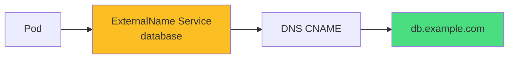

</div>

<div v-click="2" class="mt-8 text-center">
<carbon-link class="inline-block text-4xl text-purple-400" />
<strong class="ml-2">Creates DNS alias to external service</strong>
</div>

<div v-click="3" class="mt-6">

```yaml
kind: Service
spec:
  type: ExternalName
  externalName: db.example.com
```

</div>

<div v-click="4" class="mt-6 text-center text-sm">
<carbon-migration class="inline-block text-2xl text-blue-400" /> Useful for gradual migrations
</div>

<div v-click="5" class="text-center text-xs opacity-80">
Switch from external to internal without changing app code
</div>

---
layout: center
---

# How Services Work: Endpoints

<div v-click="1">

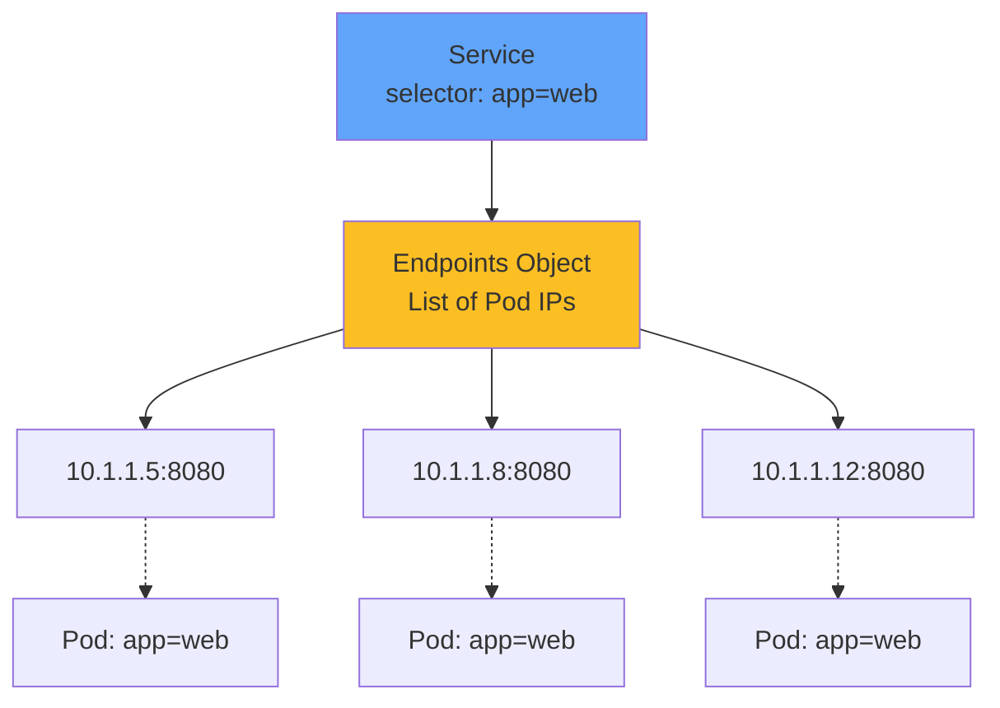

</div>

<div class="grid grid-cols-2 gap-6 mt-8 text-sm">
<div v-click="2">
<carbon-automatic class="inline-block text-3xl text-green-400" />
<strong>Automatic Updates</strong><br/>
Endpoints track matching Pods
</div>
<div v-click="3">
<carbon-search class="inline-block text-3xl text-blue-400" />
<strong>Troubleshooting</strong><br/>
Check endpoints to debug
</div>
</div>

<div v-click="4" class="mt-6 text-center">

```bash
kubectl get endpoints my-service
```

</div>

<div v-click="5" class="text-center text-sm opacity-80">
No endpoints? Check label selectors!
</div>

---
layout: center
---

# Label Selectors

<div v-click="1">

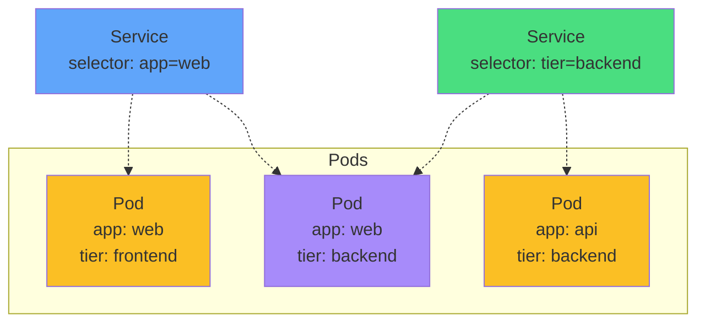

</div>

<div v-click="2" class="mt-8 text-center text-lg">
<carbon-tag class="inline-block text-3xl text-blue-400" /> Service → Pods via labels
</div>

<div v-click="3" class="mt-6 text-center text-yellow-400 text-sm">
<carbon-warning class="inline-block text-2xl" /> Most common issue: label mismatch!
</div>

<div v-click="4" class="mt-4 text-center text-xs opacity-80">
Service selector must match Pod labels exactly
</div>

---
layout: center
---

# Service Ports Configuration

<div v-click="1">

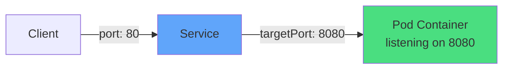

</div>

<div class="grid grid-cols-3 gap-4 mt-8 text-sm">
<div v-click="2" class="text-center">
<carbon-port class="text-4xl text-blue-400 mb-2" />
<strong>port</strong><br/>
Service listens on
</div>
<div v-click="3" class="text-center">
<carbon-container-software class="text-4xl text-green-400 mb-2" />
<strong>targetPort</strong><br/>
Pod container port
</div>
<div v-click="4" class="text-center">
<carbon-network-public class="text-4xl text-purple-400 mb-2" />
<strong>nodePort</strong><br/>
External port (30000+)
</div>
</div>

<div v-click="5" class="mt-8">

```yaml
ports:
- port: 80          # Service port
  targetPort: 8080  # Container port
  nodePort: 30080   # External port (optional)
```

</div>

---
layout: center
---

# Session Affinity

<div v-click="1">

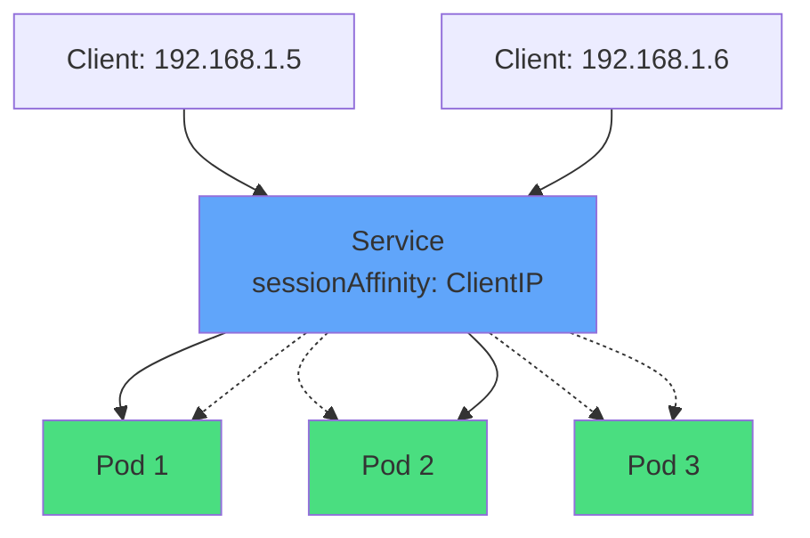

</div>

<div v-click="2" class="mt-8 text-center">
<carbon-user-identification class="inline-block text-4xl text-purple-400" />
<strong class="ml-2">Sticky Sessions</strong>
</div>

<div class="grid grid-cols-2 gap-6 mt-6 text-sm">
<div v-click="3">
<carbon-checkmark class="inline-block text-2xl text-green-400" /> Same client IP → same Pod
</div>
<div v-click="4">
<carbon-time class="inline-block text-2xl text-blue-400" /> Default timeout: 3 hours
</div>
</div>

<div v-click="5" class="mt-6">

```yaml
spec:
  sessionAffinity: ClientIP
```

</div>

<div v-click="6" class="mt-4 text-center text-xs opacity-80">
Use with caution - not ideal for truly stateful apps
</div>

---
layout: center
---

# Headless Services

<div v-click="1">

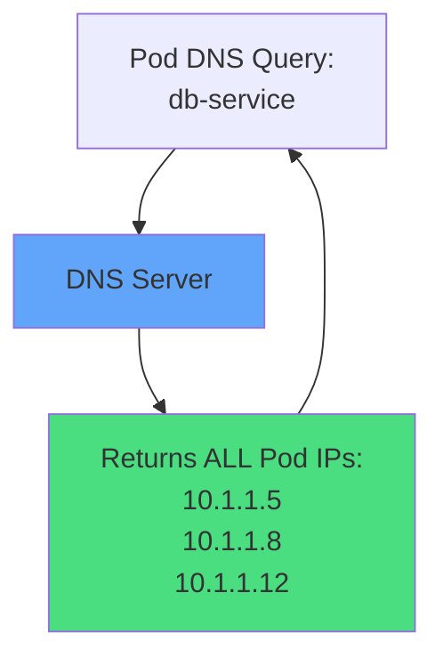

</div>

<div v-click="2" class="mt-8">

```yaml
spec:
  clusterIP: None  # Headless!
```

</div>

<div class="grid grid-cols-2 gap-6 mt-8 text-sm">
<div v-click="3">
<carbon-close class="text-4xl text-red-400 mb-2" />
<strong>No Load Balancing</strong><br/>
Client gets all Pod IPs
</div>
<div v-click="4">
<carbon-network-1 class="text-4xl text-blue-400 mb-2" />
<strong>Direct Pod Access</strong><br/>
Client chooses Pod
</div>
</div>

<div v-click="5" class="mt-6 text-center text-sm">
<carbon-data-base class="inline-block text-2xl text-purple-400" /> Used by StatefulSets for individual Pod DNS
</div>

---
layout: center
---

# Services Without Selectors

<div v-click="1">

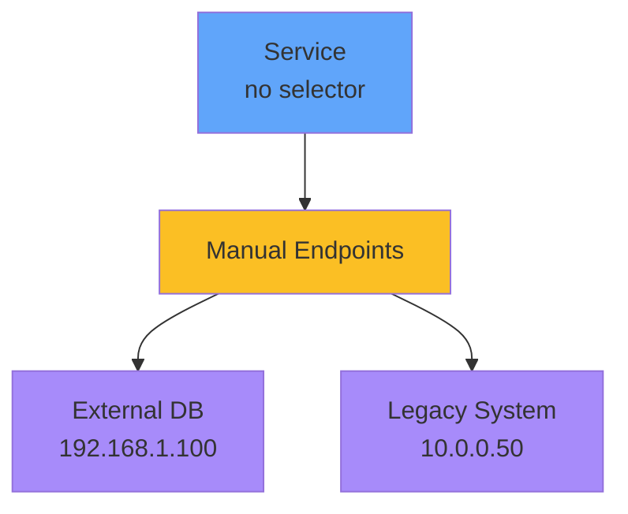

</div>

<div v-click="2" class="mt-8 text-center">
<carbon-edit class="inline-block text-4xl text-yellow-400" />
<strong class="ml-2">Manual endpoint management</strong>
</div>

<div class="grid grid-cols-2 gap-6 mt-8 text-sm">
<div v-click="3">
<carbon-data-base class="inline-block text-2xl text-blue-400" /> External databases
</div>
<div v-click="4">
<carbon-cloud class="inline-block text-2xl text-green-400" /> Services in other clusters
</div>
<div v-click="5">
<carbon-migration class="inline-block text-2xl text-purple-400" /> Gradual migrations
</div>
<div v-click="6">
<carbon-enterprise class="inline-block text-2xl text-yellow-400" /> Legacy systems
</div>
</div>

---
layout: center
---

# CKAD Exam Focus

<div v-click="1" class="text-center mb-6">
<carbon-certificate class="inline-block text-6xl text-blue-400" />
</div>

<div class="grid grid-cols-2 gap-4 text-sm">
<div v-click="2">
<carbon-flash class="inline-block text-2xl text-green-400" /> Create Services quickly
</div>
<div v-click="3">
<carbon-list class="inline-block text-2xl text-green-400" /> kubectl expose command
</div>
<div v-click="4">
<carbon-categories class="inline-block text-2xl text-green-400" /> All service types
</div>
<div v-click="5">
<carbon-debug class="inline-block text-2xl text-green-400" /> Check endpoints
</div>
<div v-click="6">
<carbon-tag class="inline-block text-2xl text-green-400" /> Label selector matching
</div>
<div v-click="7">
<carbon-port class="inline-block text-2xl text-green-400" /> Port configuration
</div>
<div v-click="8">
<carbon-search class="inline-block text-2xl text-green-400" /> DNS naming patterns
</div>
<div v-click="9">
<carbon-tools class="inline-block text-2xl text-green-400" /> Troubleshoot connectivity
</div>
</div>

<div v-click="10" class="mt-8 text-center text-lg">
<carbon-terminal class="inline-block text-3xl text-purple-400" /> Practice kubectl expose!
</div>

---
layout: center
---

# Summary

<div v-click="1">

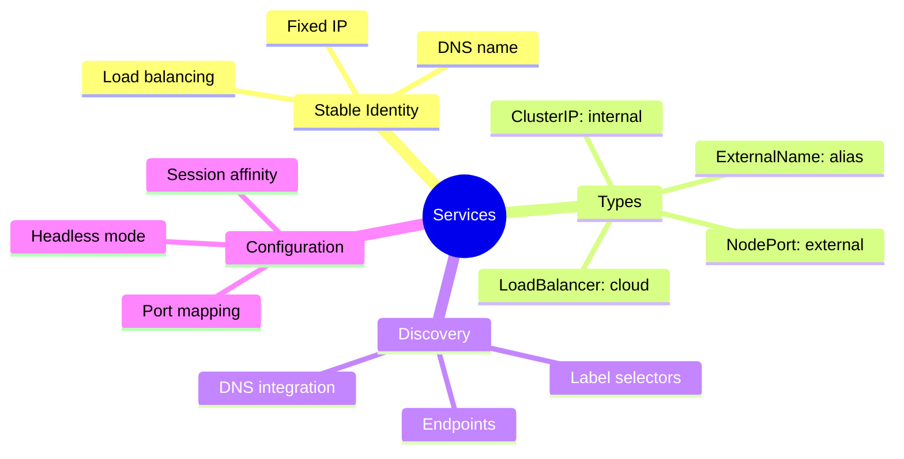

</div>

---
layout: center
---

# Key Takeaways

<div class="grid grid-cols-2 gap-6 mt-6">
<div v-click="1">
<carbon-network-3 class="text-4xl text-blue-400 mb-2" />
<strong>Stable networking</strong><br/>
<span class="text-sm opacity-80">For ephemeral Pods</span>
</div>
<div v-click="2">
<carbon-flow class="text-4xl text-green-400 mb-2" />
<strong>Label selectors</strong><br/>
<span class="text-sm opacity-80">Loose coupling with Pods</span>
</div>
<div v-click="3">
<carbon-dns-services class="text-4xl text-purple-400 mb-2" />
<strong>DNS integration</strong><br/>
<span class="text-sm opacity-80">Automatic service discovery</span>
</div>
<div v-click="4">
<carbon-debug class="text-4xl text-yellow-400 mb-2" />
<strong>Check endpoints</strong><br/>
<span class="text-sm opacity-80">First troubleshooting step</span>
</div>
</div>

<div v-click="5" class="mt-8 text-center text-lg">
Services are essential for CKAD - master them! <carbon-arrow-right class="inline-block text-2xl" />
</div>
