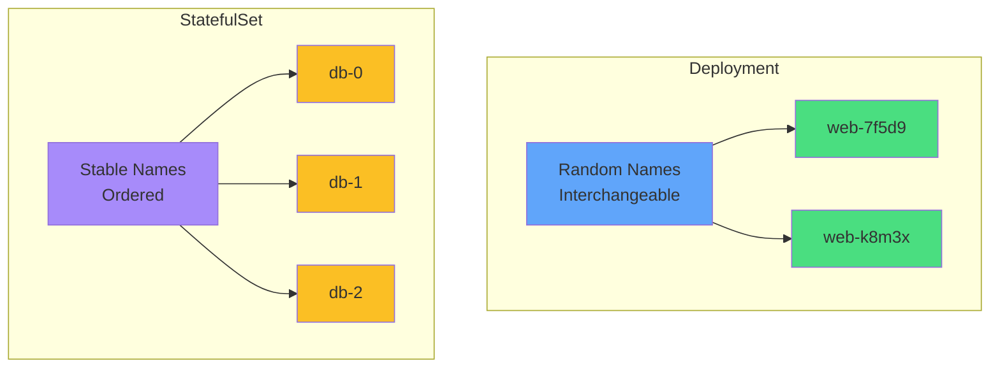

# StatefulSet vs Deployment

```mermaid
graph TB
    subgraph Deployment
        D[<carbon-deploy/> Random Names<br/>Interchangeable] --> DP1[<carbon-container-software/> web-7f5d9]
        D --> DP2[<carbon-container-software/> web-k8m3x]
    end

    subgraph StatefulSet
        SS[<carbon-data-base/> Stable Names<br/>Ordered] --> SP1[<carbon-container-software/> db-0]
        SS --> SP2[<carbon-container-software/> db-1]
        SS --> SP3[<carbon-container-software/> db-2]
    end

    style D fill:#60a5fa
    style SS fill:#a78bfa
    style DP1 fill:#4ade80
    style DP2 fill:#4ade80
    style SP1 fill:#fbbf24
    style SP2 fill:#fbbf24
    style SP3 fill:#fbbf24
```

Stable identities and ordered operations

