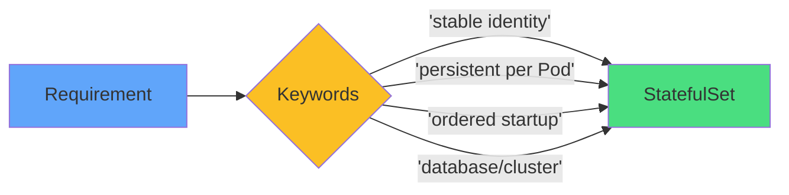

# Recognizing StatefulSet Use Cases

### StatefulSet Scenarios
<carbon-checkmark-filled class="text-4xl text-green-400" />

- Databases (PostgreSQL, MongoDB)
- Distributed systems (Kafka, Zookeeper)
- Applications needing stable storage
- Clustered apps with leader election

### Deployment Scenarios
<carbon-deploy class="text-4xl text-blue-400" />

- Stateless web apps
- APIs without state
- Workers processing queues
- Any interchangeable Pods

