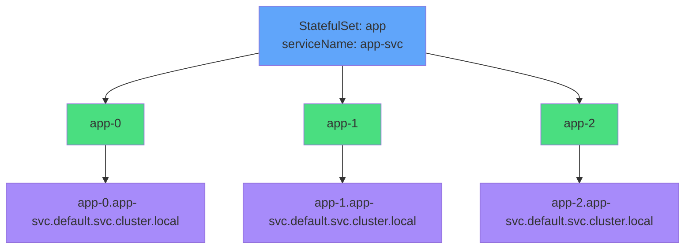

# Pod Naming and DNS

```mermaid
graph TB
    SS[<carbon-data-base/> StatefulSet: app<br/>serviceName: app-svc]

    POD0[<carbon-container-software/> app-0]
    POD1[<carbon-container-software/> app-1]
    POD2[<carbon-container-software/> app-2]

    DNS0[<carbon-network-3/> app-0.app-svc.default.svc.cluster.local]
    DNS1[<carbon-network-3/> app-1.app-svc.default.svc.cluster.local]
    DNS2[<carbon-network-3/> app-2.app-svc.default.svc.cluster.local]

    SS --> POD0 --> DNS0
    SS --> POD1 --> DNS1
    SS --> POD2 --> DNS2

    style SS fill:#60a5fa
    style POD0 fill:#4ade80
    style POD1 fill:#4ade80
    style POD2 fill:#4ade80
    style DNS0 fill:#a78bfa
    style DNS1 fill:#a78bfa
    style DNS2 fill:#a78bfa
```

Predictable naming: statefulset-name-ordinal

