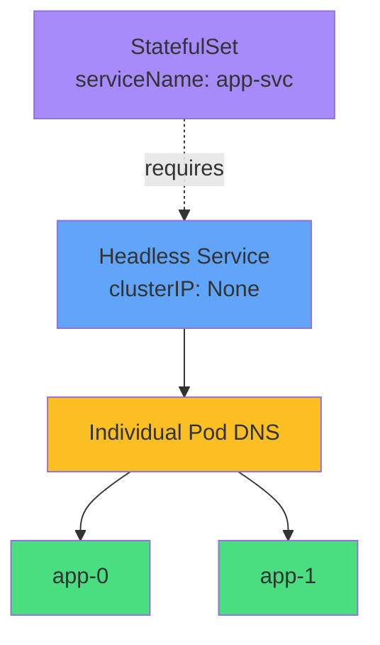

# Headless Service Required



<div class="mt-8 text-center">

### Create headless Service FIRST
```yaml
clusterIP: None
```

### Then reference in StatefulSet
```yaml
serviceName: app-svc
```

</div>
