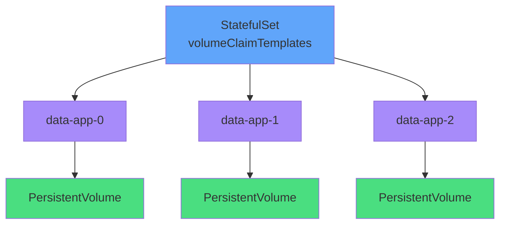

# VolumeClaimTemplates

```mermaid
graph TB
    SS[<carbon-data-base/> StatefulSet<br/>volumeClaimTemplates]

    SS --> PVC0[<carbon-data-volume/> data-app-0]
    SS --> PVC1[<carbon-data-volume/> data-app-1]
    SS --> PVC2[<carbon-data-volume/> data-app-2]

    PVC0 --> PV0[<carbon-storage-pool/> PersistentVolume]
    PVC1 --> PV1[<carbon-storage-pool/> PersistentVolume]
    PVC2 --> PV2[<carbon-storage-pool/> PersistentVolume]

    style SS fill:#60a5fa
    style PVC0 fill:#a78bfa
    style PVC1 fill:#a78bfa
    style PVC2 fill:#a78bfa
    style PV0 fill:#4ade80
    style PV1 fill:#4ade80
    style PV2 fill:#4ade80
```

### Automatic PVC per Pod
Each Pod gets its own persistent storage

Named: volumeClaimTemplate-name-pod-name

