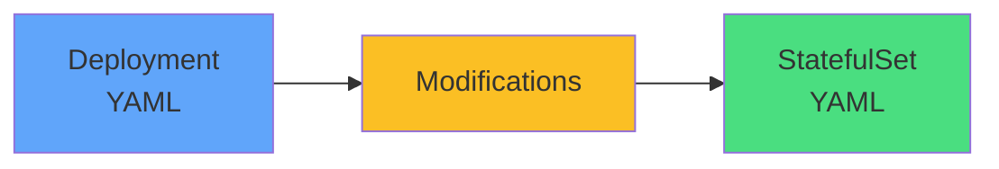

# Conversion from Deployment

### Key Changes
1. Change `kind: Deployment` → `kind: StatefulSet`
2. Add `serviceName: <headless-service>`
3. Add `volumeClaimTemplates` (if storage needed)
4. Keep `replicas`, `selector`, `template` unchanged

Most fields are identical

