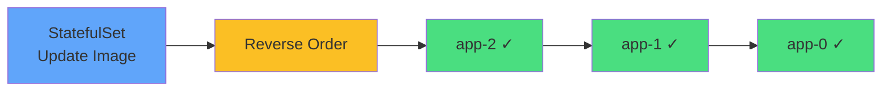

# Update Strategy

```mermaid
graph LR
    SS[<carbon-data-base/> StatefulSet<br/>Update Image] --> ORDER[<carbon-sort-descending/> Reverse Order]

    ORDER --> POD2[<carbon-container-software/> app-2 ✓]
    POD2 --> POD1[<carbon-container-software/> app-1 ✓]
    POD1 --> POD0[<carbon-container-software/> app-0 ✓]

    style SS fill:#60a5fa
    style ORDER fill:#fbbf24
    style POD2 fill:#4ade80
    style POD1 fill:#4ade80
    style POD0 fill:#4ade80
```

### RollingUpdate (default)
Updates highest ordinal first (app-2, app-1, app-0)

### OnDelete
Manual deletion required for updates

Partition field enables staged rollouts

