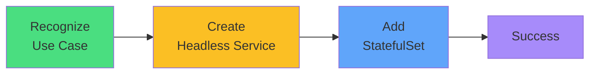

# Exam Mindset

<carbon-lightbulb class="text-yellow-400 text-4xl inline-block" />

### Look for: "stable identity", "persistent per Pod", "database"
### Always create headless Service first
### Use volumeClaimTemplates for storage

