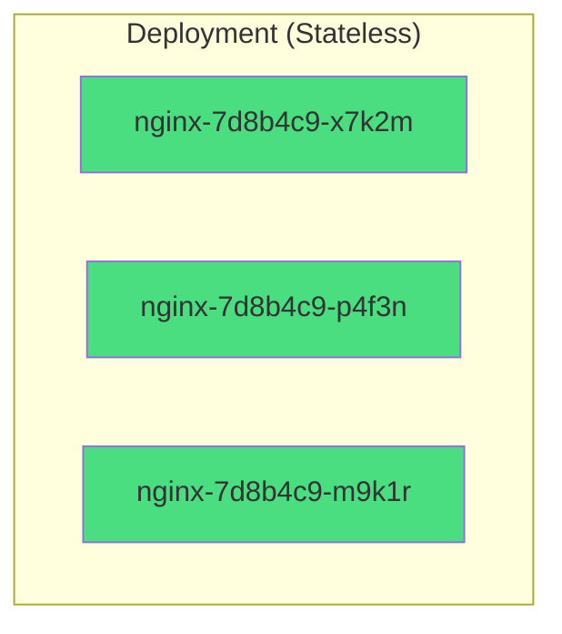
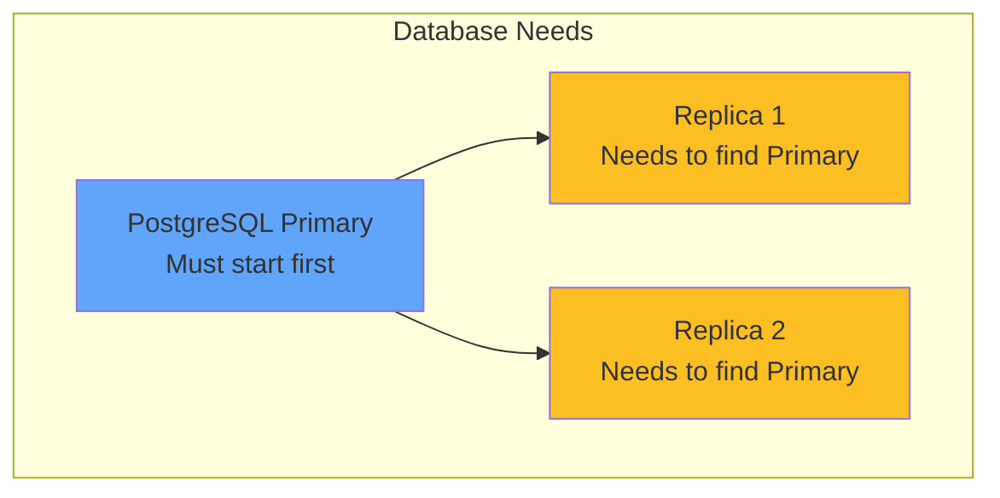
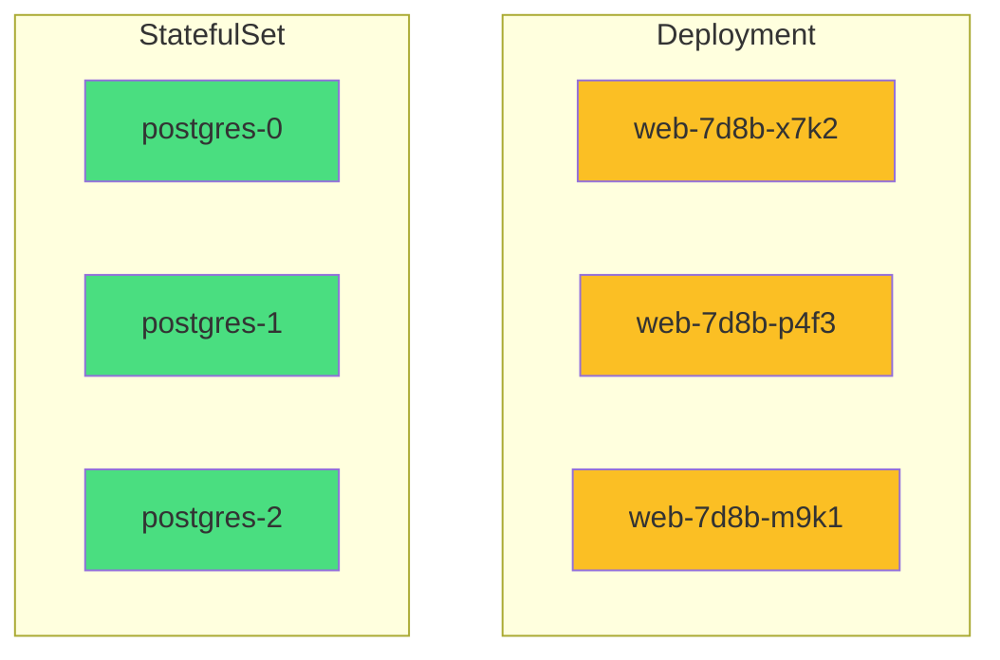
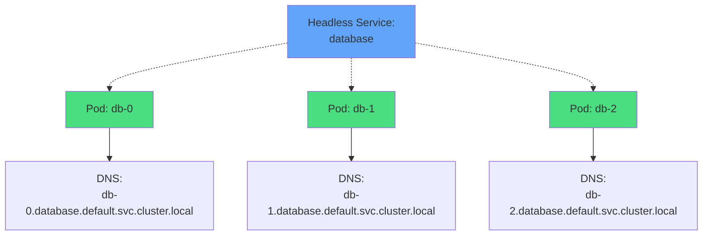
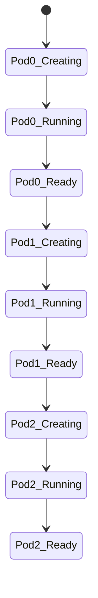
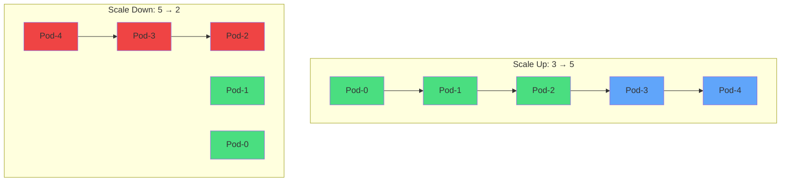
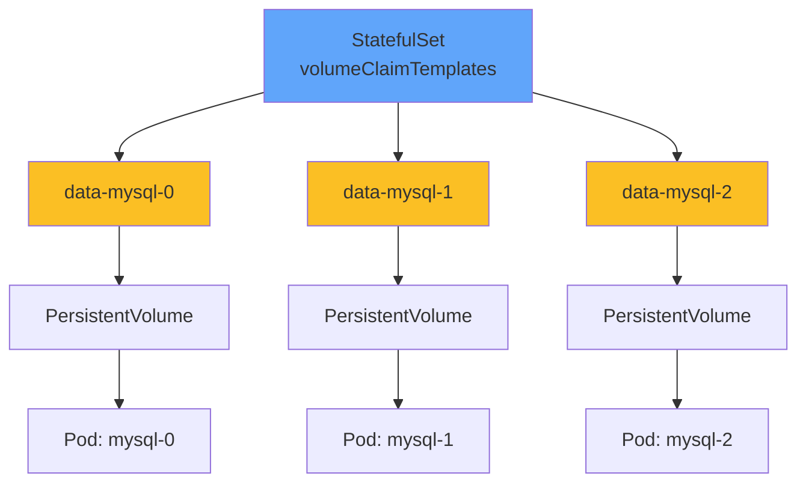
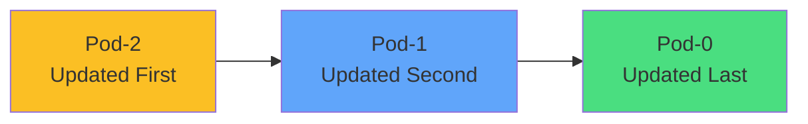
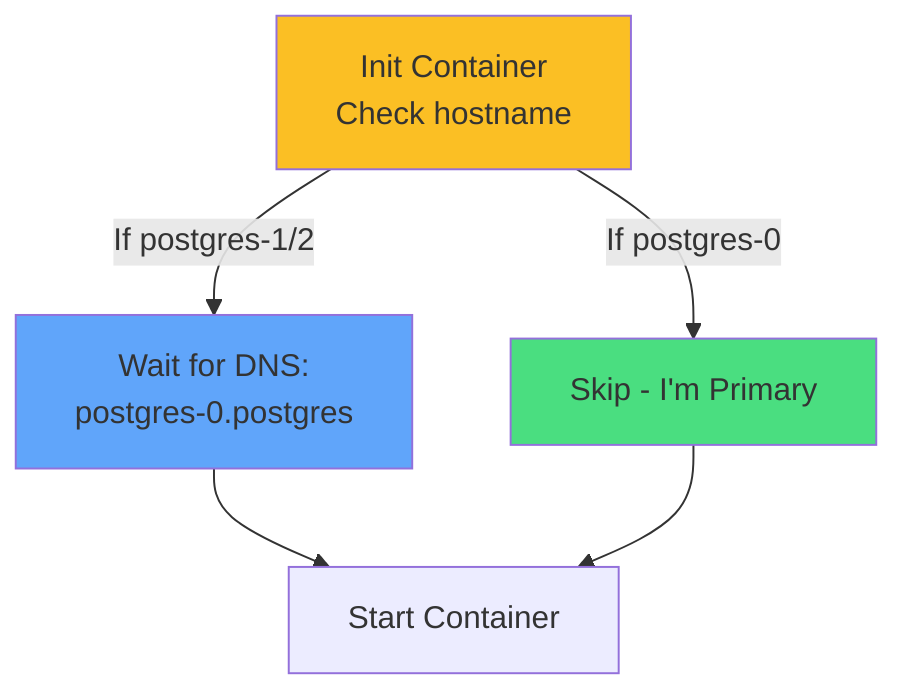
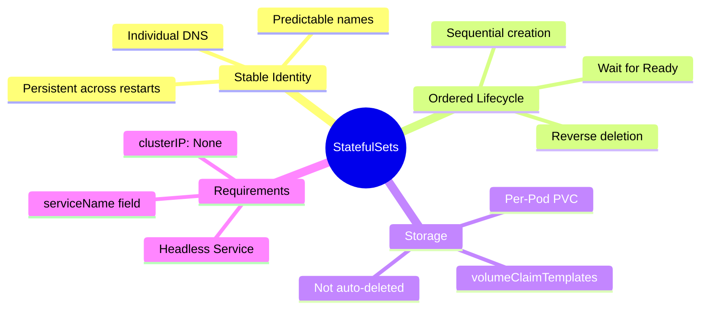

# Kubernetes StatefulSets

<div class="abs-br m-6 flex gap-2">
  <carbon-data-base class="text-6xl text-blue-400" />
</div>

<div v-click class="mt-8 text-xl opacity-80">
Stable identities for stateful applications
</div>

---
layout: center
---

# The Problem: Stateful Applications

<div v-click="1">



</div>

<div v-click="2" class="mt-6">



</div>

<div v-click="3" class="mt-6 text-center text-yellow-400">
<carbon-warning class="inline-block text-2xl" /> Random names and parallel start won't work!
</div>

---
layout: center
---

# StatefulSets vs Deployments

<div v-click="1">



</div>

<div class="grid grid-cols-2 gap-4 mt-6 text-xs">
<div v-click="2">
<carbon-cube class="inline-block text-2xl text-yellow-400" /> <strong>Deployment:</strong> Random names
</div>
<div v-click="3">
<carbon-order-details class="inline-block text-2xl text-green-400" /> <strong>StatefulSet:</strong> Predictable ordinals
</div>
<div v-click="4">
<carbon-flash class="inline-block text-2xl text-yellow-400" /> <strong>Deployment:</strong> Parallel creation
</div>
<div v-click="5">
<carbon-datastore class="inline-block text-2xl text-green-400" /> <strong>StatefulSet:</strong> Sequential creation
</div>
<div v-click="6">
<carbon-network-3 class="inline-block text-2xl text-yellow-400" /> <strong>Deployment:</strong> Load-balanced access
</div>
<div v-click="7">
<carbon-dns-services class="inline-block text-2xl text-green-400" /> <strong>StatefulSet:</strong> Individual DNS names
</div>
<div v-click="8">
<carbon-data-volume class="inline-block text-2xl text-yellow-400" /> <strong>Deployment:</strong> Shared volumes
</div>
<div v-click="9">
<carbon-data-volume-alt class="inline-block text-2xl text-green-400" /> <strong>StatefulSet:</strong> Dedicated PVC per Pod
</div>
</div>

---
layout: center
---

# Stable Network Identity

<div v-click="1">



</div>

<div class="grid grid-cols-2 gap-6 mt-8 text-sm">
<div v-click="2">
<carbon-dns-services class="text-4xl text-blue-400 mb-2" />
<strong>Individual DNS</strong><br/>
Each Pod gets unique name
</div>
<div v-click="3">
<carbon-restart class="text-4xl text-green-400 mb-2" />
<strong>Persistent Identity</strong><br/>
Name survives restarts
</div>
</div>

<div v-click="4" class="mt-6 text-center text-lg">
<carbon-requirement class="inline-block text-2xl text-purple-400" /> Requires headless Service (clusterIP: None)
</div>

---
layout: center
---

# Ordered Deployment

<div v-click="1">



</div>

<div class="grid grid-cols-3 gap-4 mt-8 text-sm text-center">
<div v-click="2">
<carbon-number-1 class="text-4xl text-green-400 mb-2" />
<strong>Pod-0 First</strong><br/>
Wait for Ready
</div>
<div v-click="3">
<carbon-number-2 class="text-4xl text-blue-400 mb-2" />
<strong>Then Pod-1</strong><br/>
Wait for Ready
</div>
<div v-click="4">
<carbon-number-3 class="text-4xl text-purple-400 mb-2" />
<strong>Then Pod-2</strong><br/>
Wait for Ready
</div>
</div>

<div v-click="5" class="mt-8 text-center text-lg">
<carbon-checkmark class="inline-block text-2xl text-green-400" /> Deletion happens in reverse order
</div>

---
layout: center
---

# Scaling Behavior

<div v-click="1">



</div>

<div class="grid grid-cols-2 gap-6 mt-8 text-sm">
<div v-click="2">
<carbon-add class="inline-block text-3xl text-green-400" />
<strong>Scale Up:</strong><br/>
Sequential from lowest ordinal
</div>
<div v-click="3">
<carbon-subtract class="inline-block text-3xl text-red-400" />
<strong>Scale Down:</strong><br/>
Reverse order protects Pod-0
</div>
</div>

<div v-click="4" class="mt-6 text-center text-sm opacity-80">
Can override with podManagementPolicy: Parallel
</div>

---
layout: center
---

# Persistent Storage

<div v-click="1">



</div>

<div class="grid grid-cols-2 gap-6 mt-8 text-sm">
<div v-click="2">
<carbon-automatic class="text-4xl text-green-400 mb-2" />
<strong>Auto-created</strong><br/>
One PVC per Pod
</div>
<div v-click="3">
<carbon-data-base class="text-4xl text-blue-400 mb-2" />
<strong>Stable Binding</strong><br/>
Pod-0 always uses data-mysql-0
</div>
</div>

<div v-click="4" class="mt-6 text-center text-yellow-400">
<carbon-warning class="inline-block text-2xl" /> PVCs are NOT deleted when StatefulSet is deleted!
</div>

---
layout: center
---

# The Mandatory Headless Service

<div v-click="1" class="mb-4">

```yaml
apiVersion: v1
kind: Service
metadata:
  name: database
spec:
  clusterIP: None  # Headless!
  selector:
    app: postgres
```

</div>

<div v-click="2" class="mb-4">

```yaml
apiVersion: apps/v1
kind: StatefulSet
metadata:
  name: postgres
spec:
  serviceName: database  # Must match Service name
```

</div>

<div class="grid grid-cols-2 gap-6 mt-6 text-sm">
<div v-click="3">
<carbon-dns-services class="text-4xl text-blue-400 mb-2" />
<strong>Individual DNS</strong><br/>
pod-0.database.default
</div>
<div v-click="4">
<carbon-network-1 class="text-4xl text-green-400 mb-2" />
<strong>Direct Access</strong><br/>
No load balancing
</div>
</div>

<div v-click="5" class="mt-6 text-center text-red-400 text-sm">
<carbon-close class="inline-block text-2xl" /> Forgetting headless Service is a common mistake!
</div>

---
layout: center
---

# Update Strategies

<div v-click="1">



</div>

<div v-click="2" class="mt-8 text-center">
<strong class="text-xl">RollingUpdate Strategy (Default)</strong>
</div>

<div class="grid grid-cols-2 gap-6 mt-6 text-sm">
<div v-click="3">
<carbon-update-now class="inline-block text-3xl text-yellow-400" />
<strong>Reverse Order</strong><br/>
Highest ordinal first
</div>
<div v-click="4">
<carbon-checkmark class="inline-block text-3xl text-green-400" />
<strong>Wait for Ready</strong><br/>
Before updating next
</div>
</div>

<div v-click="5" class="mt-8">

```yaml
updateStrategy:
  type: OnDelete  # Manual control
```

</div>

<div v-click="6" class="text-center text-xs opacity-80">
OnDelete: Pods updated only when manually deleted
</div>

---
layout: center
---

# Use Cases

<div class="grid grid-cols-2 gap-6 mt-4">
<div v-click="1">
<carbon-data-base class="text-5xl text-blue-400 mb-2" />
<strong>Relational Databases</strong><br/>
<span class="text-sm opacity-80">PostgreSQL, MySQL primary-replica</span>
</div>
<div v-click="2">
<carbon-document-multiple class="text-5xl text-green-400 mb-2" />
<strong>NoSQL Databases</strong><br/>
<span class="text-sm opacity-80">MongoDB, Cassandra, Elasticsearch</span>
</div>
<div v-click="3">
<carbon-network-3 class="text-5xl text-purple-400 mb-2" />
<strong>Message Queues</strong><br/>
<span class="text-sm opacity-80">RabbitMQ, Kafka with ordered IDs</span>
</div>
<div v-click="4">
<carbon-server class="text-5xl text-yellow-400 mb-2" />
<strong>Distributed Systems</strong><br/>
<span class="text-sm opacity-80">Zookeeper, etcd, Consul</span>
</div>
</div>

<div v-click="5" class="mt-8 text-center text-lg">
<carbon-warning class="inline-block text-2xl text-red-400" /> Don't use just because app has state!
</div>

<div v-click="6" class="text-center text-sm opacity-80">
Only when you need stable identities, ordered operations, per-Pod storage
</div>

---
layout: center
---

# Init Containers Pattern

<div v-click="1">



</div>

<div v-click="2" class="mt-6">

```yaml
initContainers:
- name: wait-for-primary
  command:
  - sh
  - -c
  - |
    if [ "$(hostname)" != "postgres-0" ]; then
      until nslookup postgres-0.postgres; do
        sleep 2
      done
    fi
```

</div>

<div v-click="3" class="mt-6 text-center text-sm">
<carbon-idea class="inline-block text-2xl text-yellow-400" /> Hostname matches StatefulSet ordinal name
</div>

---
layout: center
---

# CKAD Exam Relevance

<div v-click="1" class="text-center mb-6">
<carbon-certificate class="inline-block text-6xl text-blue-400" />
</div>

<div class="grid grid-cols-2 gap-4 text-sm">
<div v-click="2">
<carbon-checkmark class="inline-block text-2xl text-green-400" /> Core concepts
</div>
<div v-click="3">
<carbon-network-3 class="inline-block text-2xl text-green-400" /> Headless Service requirement
</div>
<div v-click="4">
<carbon-tag class="inline-block text-2xl text-green-400" /> Pod naming conventions
</div>
<div v-click="5">
<carbon-data-volume class="inline-block text-2xl text-green-400" /> volumeClaimTemplates
</div>
<div v-click="6">
<carbon-dns-services class="inline-block text-2xl text-green-400" /> DNS naming patterns
</div>
<div v-click="7">
<carbon-debug class="inline-block text-2xl text-green-400" /> Troubleshoot issues
</div>
<div v-click="8">
<carbon-enterprise class="inline-block text-2xl text-yellow-400" /> Deploy stateful app
</div>
<div v-click="9">
<carbon-time class="inline-block text-2xl text-yellow-400" /> Sequential startup takes time
</div>
</div>

<div v-click="10" class="mt-8 text-center text-sm opacity-80">
Approximately 1-2 exam questions may involve StatefulSets
</div>

---
layout: center
---

# Summary

<div v-click="1">



</div>

---
layout: center
---

# Key Takeaways

<div class="grid grid-cols-2 gap-6 mt-6">
<div v-click="1">
<carbon-order-details class="text-4xl text-blue-400 mb-2" />
<strong>Predictable names</strong><br/>
<span class="text-sm opacity-80">web-0, web-1, web-2</span>
</div>
<div v-click="2">
<carbon-datastore class="text-4xl text-green-400 mb-2" />
<strong>Sequential lifecycle</strong><br/>
<span class="text-sm opacity-80">Ordered creation and deletion</span>
</div>
<div v-click="3">
<carbon-dns-services class="text-4xl text-purple-400 mb-2" />
<strong>Individual DNS</strong><br/>
<span class="text-sm opacity-80">Requires headless Service</span>
</div>
<div v-click="4">
<carbon-data-volume-alt class="text-4xl text-yellow-400 mb-2" />
<strong>Dedicated storage</strong><br/>
<span class="text-sm opacity-80">One PVC per Pod</span>
</div>
</div>

<div v-click="5" class="mt-8 text-center text-lg">
For stateful apps requiring stable identities! <carbon-arrow-right class="inline-block text-2xl" />
</div>
