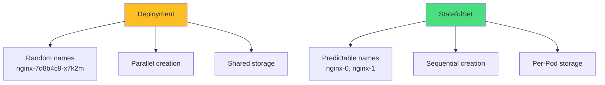
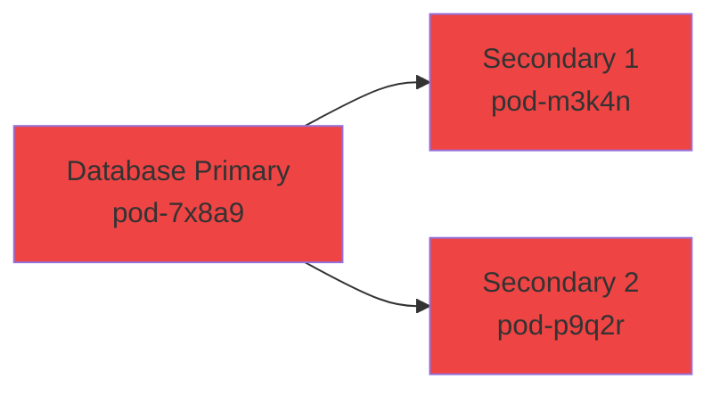
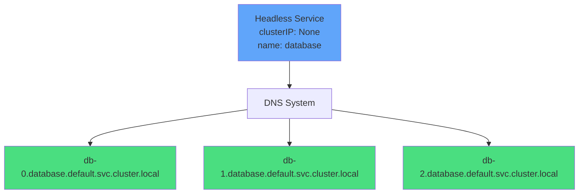
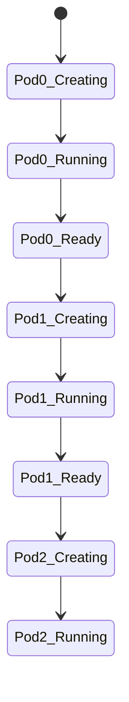
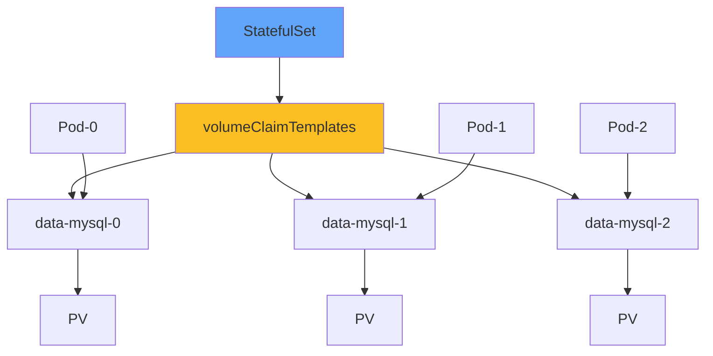
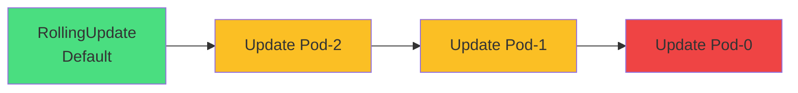
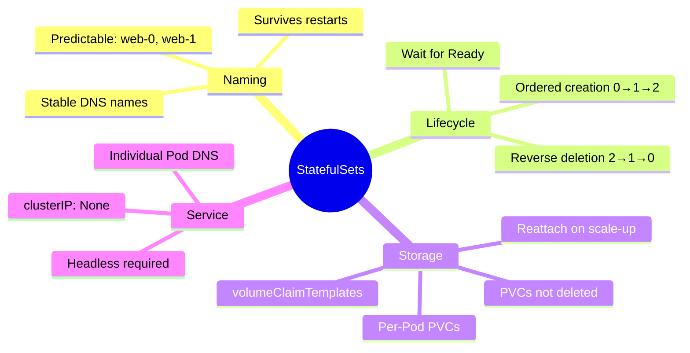

# StatefulSets

<div class="abs-br m-6 flex gap-2">
  <carbon-ordinal class="text-6xl text-blue-400" />
</div>

<div v-click class="mt-8 text-xl opacity-80">
Stable identities, ordered deployment, and persistent storage
</div>

---
layout: center
---

# What StatefulSets Solve

<div v-click="1">



</div>

<div class="grid grid-cols-2 gap-6 mt-8 text-sm">
<div v-click="2">
<carbon-deployment-pattern class="text-4xl text-yellow-400 mb-2" />
<strong>Deployment</strong><br/>
Dynamic, stateless applications
</div>
<div v-click="3">
<carbon-ordinal class="text-4xl text-green-400 mb-2" />
<strong>StatefulSet</strong><br/>
Stable, stateful applications
</div>
</div>

<div v-click="4" class="mt-8 text-center">
<carbon-checkmark class="inline-block text-2xl text-blue-400" /> Use when you need stability and predictability
</div>

---
layout: center
---

# The Problem

<div v-click="1">



</div>

<div v-click="2" class="mt-8 text-center text-red-400 text-xl">
<carbon-close class="inline-block text-3xl" /> Random names make it impossible to configure replication!
</div>

<div v-click="3" class="mt-6">

**Replicated database needs:**
- Primary starts first (ordered deployment)
- Secondaries know how to find primary (stable naming)
- Each replica has its own data (persistent storage per Pod)

</div>

<div v-click="4" class="mt-6 text-center text-green-400">
<carbon-checkmark class="inline-block text-2xl" /> StatefulSets provide stable names, ordered deployment, persistent storage
</div>

---
layout: center
---

# StatefulSets vs Deployments

<div class="text-xs">

| Aspect | Deployment | StatefulSet |
|--------|------------|-------------|
| <span v-click="1">**Pod Naming**</span> | <span v-click="1">nginx-7d8b4c9-x7k2m (random)</span> | <span v-click="1">nginx-0, nginx-1, nginx-2 (ordinal)</span> |
| <span v-click="2">**Creation Order**</span> | <span v-click="2">Parallel (all at once)</span> | <span v-click="2">Sequential (0→1→2)</span> |
| <span v-click="3">**Deletion Order**</span> | <span v-click="3">Parallel</span> | <span v-click="3">Reverse sequential (2→1→0)</span> |
| <span v-click="4">**Network Identity**</span> | <span v-click="4">Load-balanced via Service</span> | <span v-click="4">Individual DNS per Pod</span> |
| <span v-click="5">**Storage**</span> | <span v-click="5">Shared PVCs or emptyDir</span> | <span v-click="5">Dedicated PVC per Pod</span> |
| <span v-click="6">**Use Cases**</span> | <span v-click="6">Web servers, APIs</span> | <span v-click="6">Databases, message queues</span> |

</div>

<div v-click="7" class="mt-8 text-center text-lg">
<carbon-idea class="inline-block text-2xl text-yellow-400" /> StatefulSets = Deployments + Stability
</div>

---
layout: center
---

# Stable Network Identity

<div v-click="1">



</div>

<div v-click="2" class="mt-8">

**DNS Name Format:** `<pod-name>.<service-name>.<namespace>.svc.cluster.local`

</div>

<div class="grid grid-cols-2 gap-6 mt-6 text-sm">
<div v-click="3">
<carbon-dns-services class="text-4xl text-blue-400 mb-2" />
<strong>Individual DNS</strong><br/>
Each Pod has its own DNS name
</div>
<div v-click="4">
<carbon-renew class="text-4xl text-green-400 mb-2" />
<strong>Persistent Identity</strong><br/>
Name survives Pod restarts
</div>
</div>

<div v-click="5" class="mt-8 text-center text-red-400 text-sm">
<carbon-warning class="inline-block text-2xl" /> Requires headless Service (clusterIP: None)
</div>

---
layout: center
---

# The Mandatory Headless Service

<div v-click="1">

```yaml
# Standard Service (NOT for StatefulSets)
apiVersion: v1
kind: Service
spec:
  clusterIP: 10.96.0.10  # Gets a cluster IP
  selector:
    app: web
```

</div>

<div v-click="2">

```yaml
# Headless Service (REQUIRED for StatefulSets)
apiVersion: v1
kind: Service
metadata:
  name: web
spec:
  clusterIP: None  # Key difference!
  selector:
    app: web
```

</div>

<div v-click="3">

```yaml
# StatefulSet references it
apiVersion: apps/v1
kind: StatefulSet
spec:
  serviceName: web  # Must match headless Service
```

</div>

<div v-click="4" class="mt-6 text-center text-red-400">
<carbon-warning class="inline-block text-2xl" /> Forgetting headless Service is a common exam pitfall!
</div>

---
layout: center
---

# Ordered Deployment and Scaling

<div v-click="1">



</div>

<div v-click="2" class="mt-8">

**Initial Deployment (3 replicas):**
1. Pod-0 created → Wait for Running AND Ready
2. Pod-1 created → Wait for Running AND Ready
3. Pod-2 created

</div>

<div v-click="3" class="mt-6">

**Scaling Down (5→2):**
- Pod-4 deleted
- Pod-3 deleted
- Pod-2 deleted
- **Reverse order protects primary (Pod-0)**

</div>

<div v-click="4" class="mt-6 text-center text-sm opacity-80">
Override with podManagementPolicy: Parallel (less common)
</div>

---
layout: center
---

# Persistent Storage with volumeClaimTemplates

<div v-click="1">



</div>

<div class="grid grid-cols-2 gap-6 mt-8 text-sm">
<div v-click="2">
<carbon-automatic class="text-4xl text-green-400 mb-2" />
<strong>Automatic Creation</strong><br/>
One PVC per Pod created automatically
</div>
<div v-click="3">
<carbon-locked class="text-4xl text-blue-400 mb-2" />
<strong>Stable Binding</strong><br/>
Pod-0 always uses data-mysql-0
</div>
<div v-click="4">
<carbon-data-base class="text-4xl text-purple-400 mb-2" />
<strong>PVC Retention</strong><br/>
PVCs NOT deleted with StatefulSet
</div>
<div v-click="5">
<carbon-renew class="text-4xl text-yellow-400 mb-2" />
<strong>Reattachment</strong><br/>
Scale up reuses existing PVCs
</div>
</div>

---
layout: center
---

# Update Strategies

<div v-click="1">



</div>

<div v-click="2" class="mt-8">

**RollingUpdate (default):**
- Updates in reverse order (2→1→0)
- Waits for each Pod to be Ready
- Protects primary by updating it last

</div>

<div v-click="3" class="mt-6">

**OnDelete Strategy:**
- Update only when Pod manually deleted
- Complete control over timing and order

</div>

<div v-click="4" class="mt-6">

**Partition Updates (canary):**
```yaml
updateStrategy:
  rollingUpdate:
    partition: 2  # Only Pods >= 2 are updated
```

</div>

<div v-click="5" class="mt-6 text-center text-blue-400">
<carbon-idea class="inline-block text-2xl" /> Test updates on secondaries before primary
</div>

---
layout: center
---

# StatefulSet Use Cases

<div class="grid grid-cols-2 gap-6 mt-6">
<div v-click="1">
<carbon-data-base class="text-4xl text-blue-400 mb-2" />
<strong>Relational Databases</strong><br/>
<span class="text-sm opacity-80">PostgreSQL, MySQL with replication</span>
</div>
<div v-click="2">
<carbon-document-multiple-01 class="text-4xl text-green-400 mb-2" />
<strong>NoSQL Databases</strong><br/>
<span class="text-sm opacity-80">MongoDB, Cassandra, Elasticsearch</span>
</div>
<div v-click="3">
<carbon-data-share class="text-4xl text-purple-400 mb-2" />
<strong>Message Queues</strong><br/>
<span class="text-sm opacity-80">RabbitMQ, Kafka, Redis</span>
</div>
<div v-click="4">
<carbon-network-cluster class="text-4xl text-yellow-400 mb-2" />
<strong>Distributed Systems</strong><br/>
<span class="text-sm opacity-80">Zookeeper, etcd, Consul</span>
</div>
</div>

<div v-click="5" class="mt-8 text-center text-red-400">
<carbon-warning class="inline-block text-2xl" /> Don't use StatefulSets just because your app has state!
</div>

<div v-click="6" class="mt-6 text-center text-sm">
Use when you need: Stable identities • Ordered operations • Per-Pod storage
</div>

---
layout: center
---

# Init Containers with StatefulSets

<div v-click="1">

```yaml
initContainers:
- name: wait-for-primary
  image: busybox
  command:
  - sh
  - -c
  - |
    if [ "$(hostname)" != "postgres-0" ]; then
      until nslookup postgres-0.postgres; do
        echo "Waiting for primary..."
        sleep 2
      done
    fi
```

</div>

<div v-click="2" class="mt-8">

**How It Works:**
- **Pod-0**: hostname = postgres-0, exits immediately
- **Pod-1/2**: Wait for DNS resolution of postgres-0.postgres

</div>

<div v-click="3" class="mt-6">

**Other Init Container Uses:**
- Configure replication based on ordinal
- Download configuration for Pod's role
- Initialize schemas (Pod-0 only)
- Set up directories and permissions

</div>

<div v-click="4" class="mt-6 text-center text-blue-400">
<carbon-idea class="inline-block text-2xl" /> Pod hostname matches ordinal name for conditional logic
</div>

---
layout: center
---

# CKAD Exam Relevance

<div class="grid grid-cols-2 gap-6 mt-6">
<div v-click="1">
<carbon-education class="text-4xl text-blue-400 mb-2" />
<strong>Core Concepts</strong><br/>
<span class="text-sm opacity-80">Differences, headless Service, naming</span>
</div>
<div v-click="2">
<carbon-terminal class="text-4xl text-green-400 mb-2" />
<strong>Practical Skills</strong><br/>
<span class="text-sm opacity-80">Create from scratch, volumeClaimTemplates</span>
</div>
<div v-click="3">
<carbon-document class="text-4xl text-purple-400 mb-2" />
<strong>Exam Scenarios</strong><br/>
<span class="text-sm opacity-80">Stateful apps, multi-replica databases</span>
</div>
<div v-click="4">
<carbon-time class="text-4xl text-yellow-400 mb-2" />
<strong>Time Management</strong><br/>
<span class="text-sm opacity-80">Sequential startup takes longer</span>
</div>
</div>

<div v-click="5" class="mt-8 text-center">
<carbon-warning class="inline-block text-2xl text-yellow-400" /> Use --watch to monitor without re-running commands
</div>

<div v-click="6" class="mt-6 text-center text-sm opacity-80">
Exam weight: 1-2 questions, typically deployment or storage context
</div>

---
layout: center
---

# Summary

<div v-click="1">



</div>

---
layout: center
---

# Key Takeaways

<div class="grid grid-cols-2 gap-6 mt-6">
<div v-click="1">
<carbon-tag class="text-4xl text-blue-400 mb-2" />
<strong>Predictable names</strong><br/>
<span class="text-sm opacity-80">Ordinal indices: web-0, web-1, web-2</span>
</div>
<div v-click="2">
<carbon-order-details class="text-4xl text-green-400 mb-2" />
<strong>Ordered lifecycle</strong><br/>
<span class="text-sm opacity-80">Sequential creation, reverse deletion</span>
</div>
<div v-click="3">
<carbon-dns-services class="text-4xl text-purple-400 mb-2" />
<strong>Stable identities</strong><br/>
<span class="text-sm opacity-80">Individual Pod DNS names</span>
</div>
<div v-click="4">
<carbon-data-volume class="text-4xl text-yellow-400 mb-2" />
<strong>Per-Pod storage</strong><br/>
<span class="text-sm opacity-80">volumeClaimTemplates create PVCs</span>
</div>
</div>

<div v-click="5" class="mt-8 text-center text-xl">
<strong>Important Gotchas:</strong>
<div class="text-sm mt-4 opacity-80">
PVCs not deleted • Sequential = slower • Headless Service mandatory • Label selectors must match
</div>
</div>

<div v-click="6" class="mt-8 text-center">
<carbon-certificate class="inline-block text-3xl text-green-400" /> Next: Hands-on StatefulSet deployments <carbon-arrow-right class="inline-block text-2xl" />
</div>
