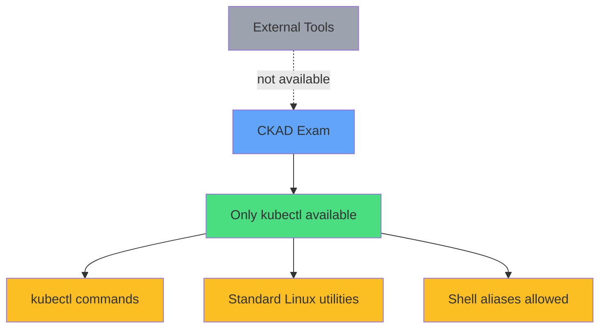

# Exam Environment Reality

```mermaid
graph TB
    EXAM[<carbon-certificate/> CKAD Exam] --> ONLY[<carbon-terminal/> Only kubectl available]

    TOOLS[<carbon-tools/> External Tools] -.->|not available| EXAM

    ONLY --> KUBECTL[kubectl commands]
    ONLY --> LINUX[Standard Linux utilities]
    ONLY --> ALIASES[Shell aliases allowed]

    style EXAM fill:#60a5fa
    style ONLY fill:#4ade80
    style TOOLS fill:#9ca3af
    style KUBECTL fill:#fbbf24
    style LINUX fill:#fbbf24
    style ALIASES fill:#fbbf24
```

No plugins, no kubectx, no k9s, no stern 
Just kubectl mastery

