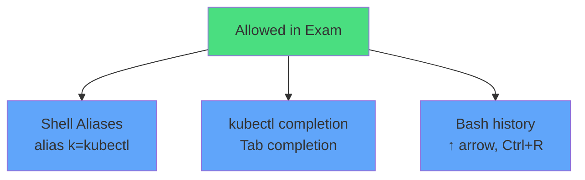

# Allowed Productivity Enhancements

```mermaid
graph TB
    ALLOWED[<carbon-checkmark-filled/> Allowed in Exam]

    ALLOWED --> ALIAS[<carbon-terminal/> Shell Aliases<br/>alias k=kubectl]
    ALLOWED --> COMPLETE[<carbon-flash/> kubectl completion<br/>Tab completion]
    ALLOWED --> HISTORY[<carbon-text-link-analysis/> Bash history<br/>↑ arrow, Ctrl+R]

    style ALLOWED fill:#4ade80
    style ALIAS fill:#60a5fa
    style COMPLETE fill:#60a5fa
    style HISTORY fill:#60a5fa
```

### Set up immediately at exam start
- `alias k=kubectl`
- `source <(kubectl completion bash)`
- `complete -F __start_kubectl k`

