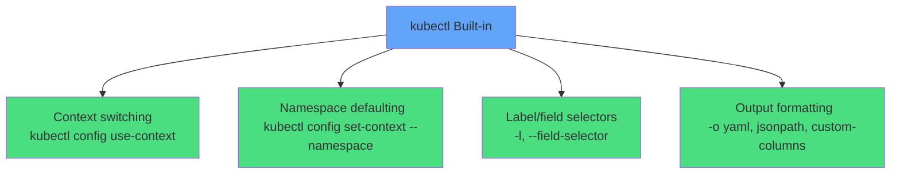

# Native kubectl Features

```mermaid
graph TB
    KUBECTL[<carbon-terminal/> kubectl Built-in]

    KUBECTL --> CTX[<carbon-network-3/> Context switching<br/>kubectl config use-context]
    KUBECTL --> NS[<carbon-folder/> Namespace defaulting<br/>kubectl config set-context --namespace]
    KUBECTL --> SELECT[<carbon-tag/> Label/field selectors<br/>-l, --field-selector]
    KUBECTL --> OUTPUT[<carbon-view/> Output formatting<br/>-o yaml, jsonpath, custom-columns]

    style KUBECTL fill:#60a5fa
    style CTX fill:#4ade80
    style NS fill:#4ade80
    style SELECT fill:#4ade80
    style OUTPUT fill:#4ade80
```

Powerful features without any plugins

