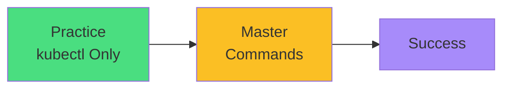

# Exam Mindset

<carbon-lightbulb class="text-yellow-400 text-4xl inline-block" />

### Don't practice with external tools
### Practice exactly as you'll perform
### kubectl mastery beats tool dependence
### Set up aliases immediately in exam
### Your practice environment = exam environment

