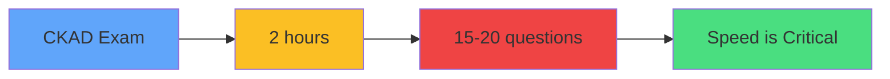
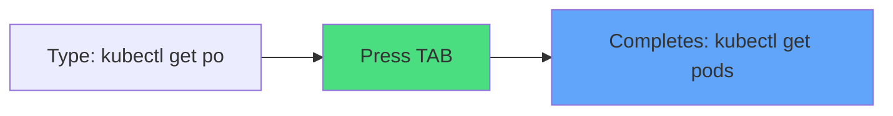
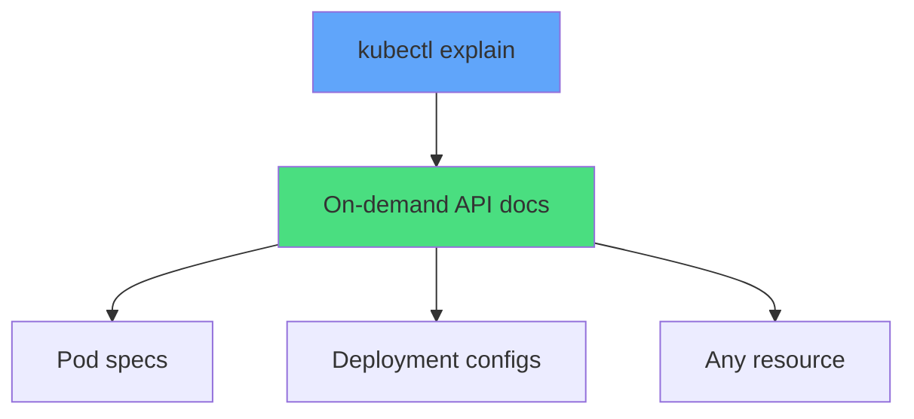
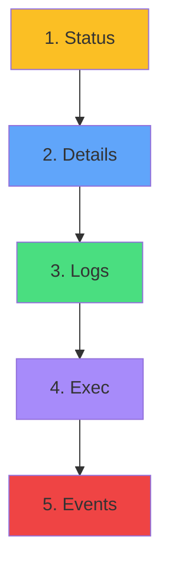
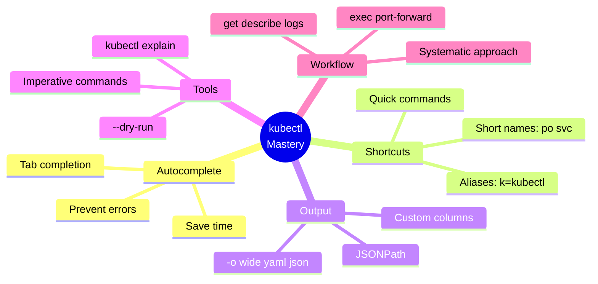

# kubectl Productivity

<div class="abs-br m-6 flex gap-2">
  <carbon-terminal class="text-6xl text-blue-400" />
</div>

<div v-click class="mt-8 text-xl opacity-80">
Master kubectl for CKAD exam success
</div>

---
layout: center
---

# Why kubectl Proficiency Matters

<div v-click="1">



</div>

<div class="grid grid-cols-2 gap-6 mt-8 text-sm">
<div v-click="2">
<carbon-flash class="text-4xl text-green-400 mb-2" />
<strong>Autocomplete</strong><br/>
Save 5-10 sec per command
</div>
<div v-click="3">
<carbon-keyboard class="text-4xl text-blue-400 mb-2" />
<strong>Aliases</strong><br/>
Save 2-3 sec per command
</div>
<div v-click="4">
<carbon-text-short-paragraph class="text-4xl text-purple-400 mb-2" />
<strong>Short Names</strong><br/>
Save 2-3 sec per command
</div>
<div v-click="5">
<carbon-view class="text-4xl text-yellow-400 mb-2" />
<strong>Output Formats</strong><br/>
Save 10-15 sec per query
</div>
</div>

<div v-click="6" class="mt-8 text-center text-xl">
<carbon-checkmark class="inline-block text-3xl text-green-400" /> Expert kubectl = 30-50% time savings
</div>

---
layout: center
---

# kubectl Autocomplete

<div v-click="1" class="mb-6">

```bash
# Enable bash completion
source <(kubectl completion bash)
echo "source <(kubectl completion bash)" >> ~/.bashrc
```

</div>

<div v-click="2">



</div>

<div class="grid grid-cols-3 gap-4 mt-8 text-sm">
<div v-click="3">
<carbon-cube class="inline-block text-3xl text-blue-400" />
<strong>Resource types</strong><br/>
<code>po&lt;TAB&gt;</code>
</div>
<div v-click="4">
<carbon-tag class="inline-block text-3xl text-green-400" />
<strong>Resource names</strong><br/>
<code>nginx-&lt;TAB&gt;</code>
</div>
<div v-click="5">
<carbon-folder class="inline-block text-3xl text-purple-400" />
<strong>Namespaces</strong><br/>
<code>kube-&lt;TAB&gt;</code>
</div>
</div>

<div v-click="6" class="mt-8 text-center text-lg">
<carbon-lightning class="inline-block text-2xl text-yellow-400" /> Essential for exam speed!
</div>

---
layout: center
---

# Short Names and Aliases

<div v-click="1" class="mb-4">

```bash
# Short resource names
po = pods
svc = services
deploy = deployments
rs = replicasets
cm = configmaps
ns = namespaces
```

</div>

<div v-click="2">

```bash
# Useful aliases
alias k=kubectl
alias kgp='kubectl get pods'
alias kgs='kubectl get svc'
alias kdp='kubectl describe pod'
alias kl='kubectl logs'
```

</div>

<div v-click="3" class="mt-8 text-center">

```bash
# Before
kubectl get pods -n production

# After
kgp -n production
```

</div>

<div v-click="4" class="mt-6 text-center text-yellow-400 text-sm">
<carbon-time class="inline-block text-2xl" /> Every keystroke saved adds up!
</div>

---
layout: center
---

# Output Formatting Mastery

<div v-click="1" class="mb-4">

```bash
kubectl get pods -o wide         # Extended info
kubectl get pods -o yaml         # Full YAML
kubectl get pods -o json         # JSON format
kubectl get pods -o name         # Just names
kubectl get pods --show-labels   # With labels
```

</div>

<div v-click="2" class="mb-4">

```bash
# JSONPath for specific fields
kubectl get pod nginx -o jsonpath='{.spec.containers[0].image}'
```

</div>

<div v-click="3">

```bash
# Custom columns
kubectl get pods -o custom-columns=\
NAME:.metadata.name,\
IMAGE:.spec.containers[0].image
```

</div>

<div class="grid grid-cols-3 gap-4 mt-6 text-sm">
<div v-click="4" class="text-center">
<carbon-view class="text-3xl text-blue-400 mb-1" />
<code>-o wide</code>
</div>
<div v-click="5" class="text-center">
<carbon-document class="text-3xl text-green-400 mb-1" />
<code>-o yaml</code>
</div>
<div v-click="6" class="text-center">
<carbon-filter class="text-3xl text-purple-400 mb-1" />
<code>-o jsonpath</code>
</div>
</div>

---
layout: center
---

# kubectl explain

<div v-click="1">



</div>

<div v-click="2" class="mt-6">

```bash
kubectl explain pod
kubectl explain pod.spec
kubectl explain pod.spec.containers
kubectl explain deployment.spec.strategy
```

</div>

<div class="grid grid-cols-2 gap-6 mt-8 text-sm">
<div v-click="3">
<carbon-document class="text-4xl text-blue-400 mb-2" />
<strong>Field descriptions</strong><br/>
Types and requirements
</div>
<div v-click="4">
<carbon-offline class="text-4xl text-green-400 mb-2" />
<strong>Works offline</strong><br/>
No internet needed
</div>
</div>

<div v-click="5" class="mt-6 text-center text-lg">
<carbon-idea class="inline-block text-2xl text-yellow-400" /> Invaluable when you forget syntax!
</div>

---
layout: center
---

# Imperative Commands

<div v-click="1" class="mb-4">

```bash
# Generate resources without YAML
kubectl run nginx --image=nginx
kubectl create deployment web --image=nginx --replicas=3
kubectl expose deployment web --port=80
kubectl create configmap app-config --from-literal=KEY=VALUE
kubectl create secret generic db-secret --from-literal=password=secret
```

</div>

<div v-click="2" class="mb-4">

```bash
# Generate YAML with --dry-run
kubectl run nginx --image=nginx --dry-run=client -o yaml > pod.yaml
kubectl create deployment web --image=nginx --replicas=3 \
  --dry-run=client -o yaml > deployment.yaml
```

</div>

<div v-click="3" class="text-center text-xl mt-8">
<carbon-flash class="inline-block text-3xl text-green-400" /> Much faster than writing from scratch!
</div>

---
layout: center
---

# Debugging Workflow

<div v-click="1">



</div>

<div v-click="2" class="mt-6">

```bash
# 1. Status
kubectl get pods

# 2. Details
kubectl describe pod <name>

# 3. Logs
kubectl logs <name>

# 4. Exec
kubectl exec -it <name> -- sh

# 5. Events
kubectl get events --sort-by=.metadata.creationTimestamp
```

</div>

<div v-click="3" class="mt-6 text-center text-lg">
<carbon-checkmark class="inline-block text-2xl text-blue-400" /> Most issues solved by describe!
</div>

---
layout: center
---

# Context and Namespace Management

<div v-click="1" class="mb-6">

```bash
# Set namespace context
kubectl config set-context --current --namespace=<namespace>
```

</div>

<div v-click="2" class="mb-6">

```bash
# Switch contexts
kubectl config use-context <context-name>
kubectl config get-contexts
```

</div>

<div v-click="3">

```bash
# Per-command namespace
kubectl get pods -n kube-system
kubectl get pods -A  # All namespaces
```

</div>

<div v-click="4" class="mt-8 text-center">
<carbon-idea class="inline-block text-3xl text-yellow-400" />
<strong class="ml-2">Set namespace once, avoid -n flags!</strong>
</div>

---
layout: center
---

# Summary

<div v-click="1">



</div>

---
layout: center
---

# Key Takeaways

<div class="grid grid-cols-2 gap-6 mt-6">
<div v-click="1">
<carbon-lightning class="text-4xl text-yellow-400 mb-2" />
<strong>Speed is critical</strong><br/>
<span class="text-sm opacity-80">Every second counts</span>
</div>
<div v-click="2">
<carbon-keyboard class="text-4xl text-blue-400 mb-2" />
<strong>Master shortcuts</strong><br/>
<span class="text-sm opacity-80">Aliases, short names, Tab</span>
</div>
<div v-click="3">
<carbon-document class="text-4xl text-green-400 mb-2" />
<strong>kubectl explain</strong><br/>
<span class="text-sm opacity-80">On-demand documentation</span>
</div>
<div v-click="4">
<carbon-debug class="text-4xl text-purple-400 mb-2" />
<strong>Systematic debugging</strong><br/>
<span class="text-sm opacity-80">Follow consistent workflow</span>
</div>
</div>

<div v-click="5" class="mt-8 text-center text-xl">
<carbon-certificate class="inline-block text-3xl text-green-400" /> Practice makes perfect! <carbon-arrow-right class="inline-block text-2xl" />
</div>
